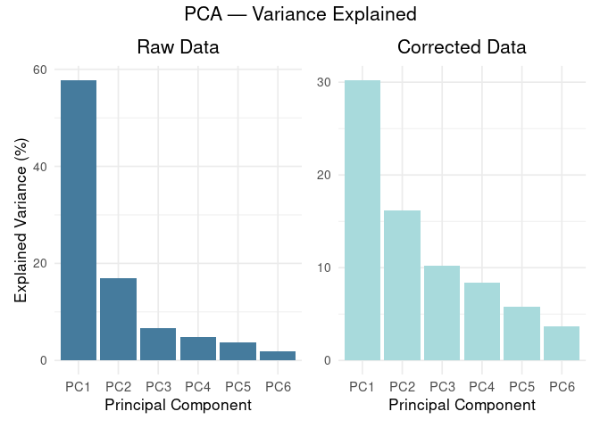

Comparison of Raw and Corrected GC-IMS Data
================
Tecla Duran Fort
2025-11-13

- <a href="#1-introduction" id="toc-1-introduction">1. Introduction</a>
- <a href="#2-apply-correction" id="toc-2-apply-correction">2. Apply
  Correction</a>
- <a href="#3-relative-standard-deviation-rsd"
  id="toc-3-relative-standard-deviation-rsd">3. Relative Standard
  Deviation (RSD)</a>
- <a href="#4-cluster-stability" id="toc-4-cluster-stability">4. Cluster
  Stability</a>
- <a href="#5-explained-variance-by-external-factors"
  id="toc-5-explained-variance-by-external-factors">5. Explained Variance
  by External Factors</a>
- <a href="#6-principal-component-analysis-pca"
  id="toc-6-principal-component-analysis-pca">6. Principal Component
  Analysis (PCA)</a>
  - <a href="#61-pca-of-raw-data" id="toc-61-pca-of-raw-data">6.1 PCA of Raw
    Data</a>
  - <a href="#62-pca-of-corrected-data"
    id="toc-62-pca-of-corrected-data">6.2. PCA of Corrected Data</a>
- <a href="#7-conclusion" id="toc-7-conclusion">7. Conclusion</a>

## 1. Introduction

This report compares the **raw** and **corrected** GC-IMS Peak Table
using the same evaluation metrics presented in the [Stability
Analysis](https://github.com/tecladuran/gcims-workflows/blob/main/docs/stability_analysis.md),
namely **Relative Standard Deviation (RSD)** and **variance explained by
external factors**.

The correction applied is based on the orthogonalization procedure
described in the [EPO Correction
Report](https://github.com/tecladuran/gcims-workflows/blob/main/docs/epo_correction.md).
Rather than repeating theoretical explanations, this document focuses on
quantifying the improvement in signal stability and reduction of
unwanted variability after correction.

## 2. Apply Correction

``` r
df <- read.csv("../../data/peak_table_var.csv")
intensities <- df %>% dplyr::select(starts_with("Cluster"))

intensities_final <- orthogonal_correction(
  intensities, 
  df %>% dplyr::select(elapsed_time, batch)
)$corrected
intensities_final <- as.data.frame(intensities_final)
```

------------------------------------------------------------------------

## 3. Relative Standard Deviation (RSD)

<!-- -->

------------------------------------------------------------------------

## 4. Cluster Stability

To evaluate how much the correction improves the technical robustness of
the dataset, we compute the number of clusters whose Relative Standard
Deviation (RSD) falls below the 20% threshold, both **before** and
**after** correction. This threshold is commonly used as an orientative
benchmark in metabolomics quality control.

<div class="figure" style="text-align: center">


<p class="caption">
Proportion of clusters with RSD below 20%, before and after correction
</p>

</div>

The correction process increases the proportion of stable clusters from
**22.6%** to **71%**, confirming that the removal of variance associated
with acquisition order and batch improves overall signal reliability.

------------------------------------------------------------------------

## 5. Explained Variance by External Factors

<!-- -->

------------------------------------------------------------------------

## 6. Principal Component Analysis (PCA)

We now perform a new PCA on the corrected data to explore whether the
dominant sources of variation are still aligned with external variables.
The PCA on raw data already showed strong trends related to
`elapsed_time` and `batch`, as shown in previous reports.

### 6.1 PCA of Raw Data

<div class="figure" style="text-align: center">


<p class="caption">
PCA of raw data colored by elapsed time (left) and by batch (right)
</p>

</div>

<div class="figure" style="text-align: center">


<p class="caption">
Explained variance by the first six PCA components (raw data)
</p>

</div>

------------------------------------------------------------------------

### 6.2. PCA of Corrected Data

<div class="figure" style="text-align: center">


<p class="caption">
PCA of corrected data colored by elapsed time (left) and by batch
(right)
</p>

</div>

<div class="figure" style="text-align: center">


<p class="caption">
Variance explained by the first six PCA components (corrected data)
</p>

</div>

Compared to the PCA of the raw data, the corrected data shows a more
homogeneous distribution of variance across components, and no evident
separation or gradient is observed when coloring by elapsed time or
batch. This suggests that external influences no longer dominate the
variance structure after correction.

``` r
library(patchwork)

# Data frames
var_df_corr <- data.frame(PC = paste0("PC", 1:6),
                          Variance = explained_corr[1:6])
var_df_raw <- data.frame(PC = paste0("PC", 1:6),
                         Variance = explained_var_raw[1:6])

# Plots
p_raw <- ggplot(var_df_raw, aes(x = PC, y = Variance)) +
  geom_col(fill = "#457B9D") +
  theme_minimal(base_size = 13) +
  labs(title = "Raw Data",
       x = "Principal Component", y = "Explained Variance (%)") +
  theme(axis.text.x = element_text(size = 11),
        plot.title = element_text(hjust = 0.5))

p_corr <- ggplot(var_df_corr, aes(x = PC, y = Variance)) +
  geom_col(fill = "#A8DADC") +
  theme_minimal(base_size = 13) +
  labs(title = "Corrected Data",
       x = "Principal Component", y = NULL) +
  theme(axis.text.x = element_text(size = 11),
        axis.title.y = element_blank(),
        plot.title = element_text(hjust = 0.5))

# Combine with generic title
final_plot <- (p_raw | p_corr) +
  plot_annotation(title = "PCA — Variance Explained") &
  theme(plot.title = element_text(size = 16, hjust = 0.5))

# Show in Rmd
final_plot
```

<!-- -->

``` r
# Save to PNG with high resolution
ggsave("pca_variance_comparison.png", final_plot,
       width = 9, height = 5, dpi = 300)
```

------------------------------------------------------------------------

## 7. Conclusion

The applied correction successfully reduces the influence of time and
batch effects. The PCA projection confirms that corrected data no longer
follows the acquisition order. This confirms the effectiveness of the
orthogonalization strategy when applied directly to the raw intensity
matrix.
