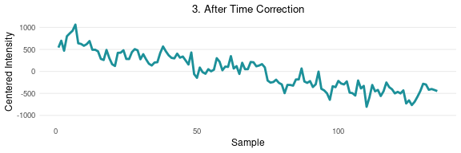
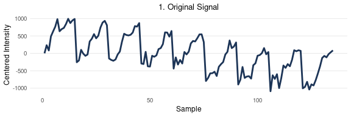

Removing External Variability from GC-IMS Data: Linear Orthogonalization
Approach
================
Tecla Duran Fort
2025-06-18

Load Peak Table

``` r
df <- read.csv("../../data/peak_table_var.csv")
```

## 1. Introduction

This document presents the implementation of a correction procedure
based on External Parameter Orthogonalization (EPO) for GC-IMS Peak
Table data. The aim is to remove systematic variability associated with
external factors such as elapsed time and batch effects, which may
obscure relevant chemical information.

The dataset under study originates from a single urine pool and is used
to illustrate the orthogonalization approach, its mathematical
foundations, R implementation, and the effect of sequential corrections
applied in different orders.

As previously discussed in the [stability analysis
report](https://github.com/tecladuran/gcims-workflows/blob/main/docs/stability_analysis.md),
both elapsed time and batch number exhibit clear linear trends across
the dataset and account for a substantial portion of the total variance.
This motivates the use of orthogonalization techniques to isolate the
relevant chemical signal from these external influences.

## 2. Theoretical Background

Orthogonal projection methods are commonly used in chemometrics and
metabolomics to remove unwanted variability from experimental data.
According to Roger et al. (2003), the signal space $\mathcal{S}$ can be
decomposed into three orthogonal components:

$$
\mathcal{S} = \mathcal{C} \oplus \mathcal{G} \oplus \mathcal{R}
$$

where $\mathcal{C}$ contains meaningful chemical information,
$\mathcal{G}$ represents systematic effects from external variables
(e.g., time, batch), and $\mathcal{R}$ captures residual noise.

The aim is to estimate $\mathcal{G}$ and project the data onto its
orthogonal complement, thereby removing the external component while
preserving the informative signal. Roger et al. (2003) describe two main
strategies to estimate this subspace:

- by identifying the part of $X$ that is orthogonal to the response
  variable $Y$ (as in OSC or O-PLS),
- or by directly modelling the subspace associated with the external
  parameter.

In the present project, we follow the second approach.

From a matrix $X \in \mathbb{R}^{n \times p}$, one can determine and use
orthogonal projections (OPs) in the **sample space** or in the **signal
space**:

- An OP in the **sample space** is an $n \times n$ matrix, which acts on
  the **rows** of $X$ and consequently **left multiplies** $X$ .
- An OP in the **signal space** is a $p \times p$ matrix, which acts on
  the **columns** of $X$ and consequently **right multiplies** $X$ .

Sample space OPs are used to separate sources of information related to
the collection of the $n$ samples. Signal space OPs are used to separate
signal features.

Corrections in the signal space are common for spectral data with fixed
variable order and include methods like External Parameter
Orthogonalisation.

However, in our case, the data consists of **peak tables**, where
features are heterogeneous, non-ordered, and dataset-dependent. Applying
projections in the signal space is thus not meaningful in this context.

Instead, we apply orthogonal projections in the **sample space**,
removing components aligned with known external variables (e.g., elapsed
time or batch).

Let $X \in \mathbb{R}^{n \times p}$ be the matrix of sample intensities
(rows = samples, columns = peaks), and let $v \in \mathbb{R}^n$ be an
external variable (e.g., elapsed time). We aim to remove from $X$ the
component that is linearly aligned with $v$.

First, we **center** both $X$ and $v$ to eliminate constant offsets:

- Let $\tilde{X} = X - \bar{X}$ (column-wise centering)
- Let $\tilde{v} = v - \bar{v}$

Then, for each column $x_j$ of $\tilde{X}$, we compute its projection
onto $\tilde{v}$ using:

$$
\text{proj}_{\tilde{v}}(x_j) = \frac{\tilde{v}^T x_j}{\tilde{v}^T \tilde{v}} \cdot \tilde{v}
$$

Stacking all projected components together:

$$
\tilde{X}_{\text{proj}} = \frac{\tilde{v} \tilde{v}^T}{\tilde{v}^T \tilde{v}} \cdot \tilde{X}
$$

This expression defines the **projection matrix** $P$:

$$
P = \frac{\tilde{v} \tilde{v}^T}{\tilde{v}^T \tilde{v}} \quad \Rightarrow \quad \tilde{X}_{\text{proj}} = P \tilde{X}
$$

The corrected data is obtained by subtracting the projection:

$$
\tilde{X}_{\text{corr}} = (I - P)\tilde{X}
$$

Finally, we add back the mean to preserve the original intensity scale:

$$
X_{\text{corr}} = \tilde{X}_{\text{corr}} + \bar{X}
$$

This sample space correction is mathematically simple, interpretable,
and especially suited for **peak table** data.

It corresponds to a **linear orthogonalization** of the data against the
external variable $v$, targeting the most dominant and evident source of
drift in the dataset.

#### Methodological Considerations

Removing variation aligned with external variables risks discarding
relevant signal if both are correlated. In this study, all samples come
from the same pool, so time-related effects can safely be treated as
artefacts. However, in datasets with true biological differences,
**confounding** with acquisition order may lead to loss of meaningful
information. Proper **randomization** is essential to avoid this.

## 3. Implementation

The following function implements a linear orthogonalization procedure
that removes the component of the signal aligned with a known external
variable (e.g., elapsed time or batch index). This is achieved by
computing the projection of each variable onto the centered external
variable and subtracting it from the data.

The function returns both the corrected data and the removed projection
component.

``` r
orthogonal_correction <- function(data, variable){
  data_mean <- colMeans(data)
  variable_mean <- mean(variable)
  data_centered <- sweep(data, 2, data_mean, "-")
  variable_centered <- variable - variable_mean
  scores <- as.numeric(t(data_centered) %*% variable_centered / sum(variable_centered^2))
  projection <- outer(variable_centered, scores)
  corrected_data <- data_centered - projection
  corrected_data <- sweep(corrected_data, 2, data_mean, "+")
  return(list(corrected = corrected_data, projection = projection))
}
```

## 4. Application to Peak Table

The orthogonalization function is applied sequentially to the GC-IMS
peak intensity matrix. First, the effect of elapsed time is removed,
followed by batch correction on the already time-corrected data. This
stepwise approach ensures that each known source of external variability
is accounted for.

The code below applies the corrections and stores the intermediate
projections for further visualization and analysis.

``` r
intensities <- df %>% dplyr::select(starts_with("Cluster"))

# Correction for elapsed time
corr_time <- orthogonal_correction(intensities, df$elapsed_time)
intensities_time_corr <- corr_time$corrected

# Correction for batch
corr_batch <- orthogonal_correction(intensities_time_corr, df$batch)
intensities_final <- corr_batch$corrected

# Components for visualization
time_projection <- corr_time$projection
batch_projection <- corr_batch$projection
```

## 5. Method Visualization

In this section, we illustrate the step-by-step behavior of the
orthogonalization procedure on a single example signal (one cluster).
The goal is to understand how the correction operates on the raw data,
isolating and removing the components associated with elapsed time and
batch effects.

Each stage of the process is visualized separately: the original signal,
the estimated component for each external variable, and the resulting
corrected signals.

To assess the stability of the correction with respect to the order of
application, we also visualize the results of applying the same
procedure in reverse (first batch, then elapsed time).

<!-- --><!-- --><!-- --><!-- --><!-- -->

After visualizing the sequential correction (elapsed time followed by
batch), we now apply the same procedure in reverse order. This serves to
confirm whether the correction is stable and order-independent for this
dataset.

<!-- --><!-- --><!-- --><!-- --><!-- -->

The plots below demonstrate that the final corrected signal remains
consistent, regardless of the order in which external effects are
removed.

## 6. Results

### 6.1 Variance Explained

Variance explained before and after correction:

``` r
explained_variance <- function(data, variable){
  apply(data, 2, function(x){ summary(lm(x ~ variable))$r.squared }) %>% mean()
}

elapsed_original <- explained_variance(intensities, df$elapsed_time)
elapsed_corrected <- explained_variance(intensities_final, df$elapsed_time)
batch_original <- explained_variance(intensities, df$batch)
batch_corrected <- explained_variance(intensities_final, df$batch)

variance_df <- data.frame(
  Condition = c("Original", "Corrected"),
  Elapsed_Time = paste0(round(c(elapsed_original, elapsed_corrected) * 100, 2), " %"),
  Batch = paste0(round(c(batch_original, batch_corrected) * 100, 2), " %")
)


print(variance_df)
```

    ##   Condition Elapsed_Time   Batch
    ## 1  Original      29.73 % 34.82 %
    ## 2 Corrected       0.04 %     0 %

The reduction in explained variance after correction confirms the
effective removal of systematic variability due to elapsed time and
batch effects.

### 6.2 Principal Component Analysis (PCA) Visualizations

To better understand the structure of the data and the impact of the
orthogonalization steps, we perform a Principal Component Analysis (PCA)
on the cluster intensity matrix. The PCA is first computed on the
original, uncorrected data, and the resulting components are used as a
reference space for later projections.

We begin by displaying the projection of the original data on the first
two principal components, colored by elapsed time.

<div class="figure" style="text-align: center">


<p class="caption">
PCA of original data colored by elapsed time (left) and by batch (right)
</p>

</div>

<div class="figure" style="text-align: center">


<p class="caption">
Variance explained by each principal component (original data)
</p>

</div>

The following plots show how the data distribution changes after
correcting for elapsed time. The PCA components are the same as in the
original (uncorrected) analysis, and the corrected data is projected
into this fixed PCA space for comparison.

<div class="figure" style="text-align: center">


<p class="caption">
Projection before (left) and after (right) elapsed time correction, both
colored by elapsed time
</p>

</div>

The following plots show the impact of correcting for batch effects
while leaving elapsed time uncorrected. As before, both datasets are
projected into the same PCA space and colored by batch number.

<div class="figure" style="text-align: center">


<p class="caption">
Projection before (left) and after (right) batch correction, both
colored by batch
</p>

</div>

We now compare the full correction (elapsed time + batch) against the
original data. Both datasets are projected into the same PCA space.

<div class="figure" style="text-align: center">


<p class="caption">
Projection before (left) and after (right) full correction (no coloring)
</p>

</div>

Finally, we perform a new PCA using the fully corrected dataset. The
plots below show the distribution of samples in the new PCA space,
colored by elapsed time and batch, respectively. A barplot of the
explained variance is also included.

<div class="figure" style="text-align: center">


<p class="caption">
PCA of corrected data colored by elapsed time (left) and by batch
(right)
</p>

</div>

<div class="figure" style="text-align: center">


<p class="caption">
Variance explained by each principal component (corrected data)
</p>

</div>
