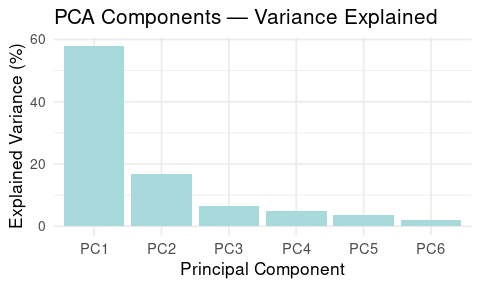

Removing External Variability from GC-IMS Data: Linear Orthogonalization
Approach
================
Tecla Duran Fort
2025-05-24

Load Peak Table

``` r
df <- read.csv("../../data/peak_table_var.csv")
```

## 1. Introduction

This document presents the implementation of a correction procedure
based on External Parameter Orthogonalization (EPO) for GC-IMS Peak
Table data. The aim is to remove systematic variability associated with
external factors such as elapsed time and batch effects, which may
obscure relevant chemical information.

The dataset under study originates from a single urine pool and is used
to illustrate the orthogonalization approach, its mathematical
foundations, R implementation, and the effect of sequential corrections
applied in different orders.

As previously discussed in the [stability analysis
report](https://github.com/tecladuran/gcims-workflows/blob/main/docs/stability_analysis.md),
both elapsed time and batch number exhibit clear linear trends across
the dataset and account for a substantial portion of the total variance.
This motivates the use of orthogonalization techniques to isolate the
relevant chemical signal from these external influences.

## 2. Theoretical Background

In line with the theoretical framework proposed by Roger et al. (2003),
the signal space $\mathcal{S}$ can be decomposed as:

$$
\mathcal{S} = \mathcal{C} \oplus \mathcal{G} \oplus \mathcal{R}
$$

where:  
- $\mathcal{C}$ corresponds to the informative signal related to
meaningful chemical variation,  
- $\mathcal{G}$ contains systematic perturbations associated with
external parameters (e.g., temperature, batch, time),  
- $\mathcal{R}$ captures noise and other residual effects, including
potential covariances.

Methods such as **External Parameter Orthogonalization (EPO)** aim to
isolate and remove $\mathcal{G}$ by projecting the data matrix $X$ onto
the orthogonal complement of the subspace spanned by external
influences. Mathematically, if an estimate $\hat{Q}$ of the projection
matrix onto $\mathcal{G}$ is available, the corrected data can be
computed as:

$$
X^* = X(I - \hat{Q})
$$

In typical EPO implementations, $\hat{Q}$ is derived from a **Principal
Component Analysis (PCA)** on difference spectra across levels of the
external variable, often requiring replicate measurements under
controlled variation.

### 2.1. Application to the urine pool dataset

In our case, all samples originate from a single **urine pool**, which
means that their initial chemical composition is expected to be
identical (the informative subspace $\mathcal{C}$ is therefore
theoretically of dimension 1).  
However, we observe progressive changes in the signal over time and
across batches. These differences may originate from various sources —
including biochemical reactions, temperature fluctuations, or
instrumental drift — and the exact contribution of each factor remains
uncertain.

This means that not all observed variability can be immediately
dismissed as noise or artefact. Some of it may reflect real chemical
transformations.  
While some of these changes might, in principle, belong to the
informative space $\mathcal{C}$, they are not associated with any
intended experimental grouping. Since they appear to follow the
acquisition order or elapsed time, we treat them as artefactual in this
context. They are therefore included in $\mathcal{G}$, as they represent
uncontrolled variability that could obscure meaningful biological
differences.

As detailed in the \[linearity analysis report\]
(<https://github.com/tecladuran/gcims-workflows/blob/main/docs/linearity_report.md>),
we observed clear linear trends in signal intensity with respect to
elapsed time and batch index. These trends suggest that the dominant
source of unwanted variability is linearly correlated with known
external variables. Consequently, rather than estimating $\mathcal{G}$
via PCA as in standard EPO, we adopt a simplified approach: we define
the external variable $v \in \mathbb{R}^n$ (e.g., elapsed time), and
directly remove the component of $X$ aligned with $v$.

The corrected matrix is obtained as:

$$
X_{\text{corr}} = (X - \bar{X}) - (v - \bar{v}) \frac{(X - \bar{X})^T (v - \bar{v})}{(v - \bar{v})^T (v - \bar{v})} + \bar{X}
$$

which is equivalent to:

$$
\hat{Q} = \frac{(v - \bar{v})(v - \bar{v})^T}{(v - \bar{v})^T (v - \bar{v})} \quad \Rightarrow \quad X_{\text{corr}} = X(I - \hat{Q})
$$

This formulation corresponds to a **linear orthogonalization** of the
signal against the direction defined by $v$, and allows us to eliminate
the influence of known external variables without estimating a full
latent space.

We are aware that other sources of variability — potentially nonlinear
or multidimensional — may also be present. However, in this case, we
explicitly target the linear component of the drift, as it is the most
evident and dominant in our dataset.

#### Methodological Considerations

It is important to note that **removing components aligned with external
variables** comes with the risk of also removing part of the signal of
interest if both lie in similar directions. While in this study we
intentionally remove time-related effects assuming all samples come from
the same pool, this consideration becomes critical when analyzing
**datasets with real biological differences between samples**.

In such cases, if the group separation of interest is **confounded**
with external trends (e.g., if all samples from one group were measured
earlier in the sequence), orthogonalization might **inadvertently remove
the relevant signal**. This underlines the importance of proper **sample
randomization** during acquisition to ensure that true group differences
are not aligned with experimental artifacts.

We will return to this point in future sections, where the preservation
of meaningful variation across groups will be essential for correct
classification and interpretation.

## 3. Implementation

The following function implements a linear orthogonalization procedure
that removes the component of the signal aligned with a known external
variable (e.g., elapsed time or batch index). This is achieved by
computing the projection of each variable onto the centered external
variable and subtracting it from the data.

The function returns both the corrected data and the removed projection
component.

``` r
orthogonal_correction <- function(data, variable){
  data_mean <- colMeans(data)
  variable_mean <- mean(variable)
  data_centered <- sweep(data, 2, data_mean, "-")
  variable_centered <- variable - variable_mean
  scores <- as.numeric(t(data_centered) %*% variable_centered / sum(variable_centered^2))
  projection <- outer(variable_centered, scores)
  corrected_data <- data_centered - projection
  corrected_data <- sweep(corrected_data, 2, data_mean, "+")
  return(list(corrected = corrected_data, projection = projection))
}
```

## 4. Application to Peak Table

The orthogonalization function is applied sequentially to the GC-IMS
peak intensity matrix. First, the effect of elapsed time is removed,
followed by batch correction on the already time-corrected data. This
stepwise approach ensures that each known source of external variability
is accounted for.

The code below applies the corrections and stores the intermediate
projections for further visualization and analysis.

``` r
intensities <- df %>% dplyr::select(starts_with("Cluster"))

# Correction for elapsed time
corr_time <- orthogonal_correction(intensities, df$elapsed_time)
intensities_time_corr <- corr_time$corrected

# Correction for batch
corr_batch <- orthogonal_correction(intensities_time_corr, df$batch)
intensities_final <- corr_batch$corrected

# Components for visualization
time_projection <- corr_time$projection
batch_projection <- corr_batch$projection
```

## 5. Method Visualization

In this section, we illustrate the step-by-step behavior of the
orthogonalization procedure on a single example signal (one cluster).
The goal is to understand how the correction operates on the raw data,
isolating and removing the components associated with elapsed time and
batch effects.

Each stage of the process is visualized separately: the original signal,
the estimated component for each external variable, and the resulting
corrected signals.

To assess the stability of the correction with respect to the order of
application, we also visualize the results of applying the same
procedure in reverse (first batch, then elapsed time).

<!-- --><!-- --><!-- --><!-- --><!-- -->

After visualizing the sequential correction (elapsed time followed by
batch), we now apply the same procedure in reverse order. This serves to
confirm whether the correction is stable and order-independent for this
dataset.

<!-- --><!-- --><!-- --><!-- --><!-- -->

The plots below demonstrate that the final corrected signal remains
consistent, regardless of the order in which external effects are
removed.

## 6. Results

### 6.1 Variance Explained

Variance explained before and after correction:

``` r
explained_variance <- function(data, variable){
  apply(data, 2, function(x){ summary(lm(x ~ variable))$r.squared }) %>% mean()
}

elapsed_original <- explained_variance(intensities, df$elapsed_time)
elapsed_corrected <- explained_variance(intensities_final, df$elapsed_time)
batch_original <- explained_variance(intensities, df$batch)
batch_corrected <- explained_variance(intensities_final, df$batch)

variance_df <- data.frame(
  Condition = c("Original", "Corrected"),
  Elapsed_Time = paste0(round(c(elapsed_original, elapsed_corrected) * 100, 2), " %"),
  Batch = paste0(round(c(batch_original, batch_corrected) * 100, 2), " %")
)


print(variance_df)
```

    ##   Condition Elapsed_Time   Batch
    ## 1  Original      29.73 % 34.82 %
    ## 2 Corrected       0.04 %     0 %

The reduction in explained variance after correction confirms the
effective removal of systematic variability due to elapsed time and
batch effects.

### 6.2 Principal Component Analysis (PCA) Visualizations

To better understand the structure of the data and the impact of the
orthogonalization steps, we perform a Principal Component Analysis (PCA)
on the cluster intensity matrix. The PCA is first computed on the
original, uncorrected data, and the resulting components are used as a
reference space for later projections.

We begin by displaying the projection of the original data on the first
two principal components, colored by elapsed time.

<div class="figure" style="text-align: center">


<p class="caption">
PCA of original data colored by elapsed time (left) and by batch (right)
</p>

</div>

<div class="figure" style="text-align: center">


<p class="caption">
Variance explained by each principal component (original data)
</p>

</div>

The following plots show how the data distribution changes after
correcting for elapsed time. The PCA components are the same as in the
original (uncorrected) analysis, and the corrected data is projected
into this fixed PCA space for comparison.

<div class="figure" style="text-align: center">


<p class="caption">
Projection before (left) and after (right) elapsed time correction, both
colored by elapsed time
</p>

</div>

The following plots show the impact of correcting for batch effects
while leaving elapsed time uncorrected. As before, both datasets are
projected into the same PCA space and colored by batch number.

<div class="figure" style="text-align: center">


<p class="caption">
Projection before (left) and after (right) batch correction, both
colored by batch
</p>

</div>

We now compare the full correction (elapsed time + batch) against the
original data. Both datasets are projected into the same PCA space.

<div class="figure" style="text-align: center">


<p class="caption">
Projection before (left) and after (right) full correction (no coloring)
</p>

</div>

Finally, we perform a new PCA using the fully corrected dataset. The
plots below show the distribution of samples in the new PCA space,
colored by elapsed time and batch, respectively. A barplot of the
explained variance is also included.

<div class="figure" style="text-align: center">


<p class="caption">
PCA of corrected data colored by elapsed time (left) and by batch
(right)
</p>

</div>

<div class="figure" style="text-align: center">


<p class="caption">
Variance explained by each principal component (corrected data)
</p>

</div>
