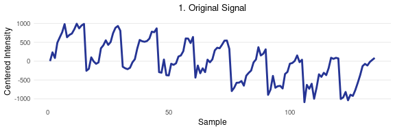
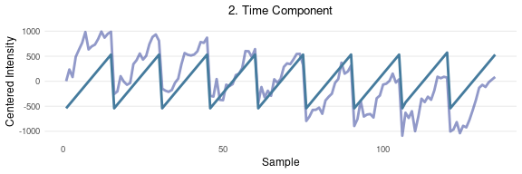
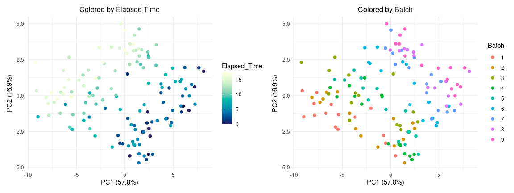
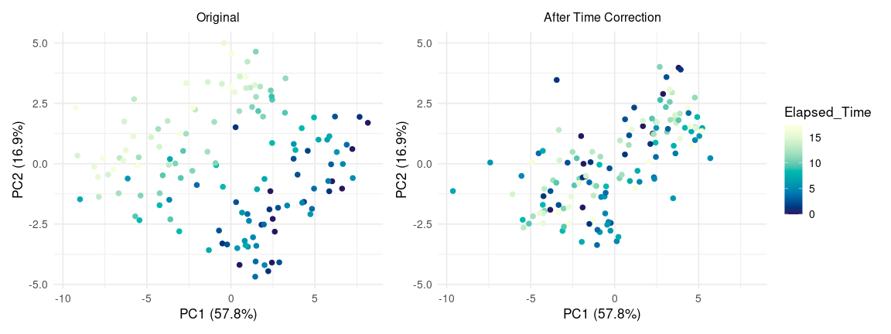

Removing External Variability from GC-IMS Data: Linear Orthogonalization
Approach
================
Tecla Duran Fort
2025-09-19

- <a href="#1-introduction" id="toc-1-introduction">1. Introduction</a>
- <a href="#2-theoretical-background" id="toc-2-theoretical-background">2.
  Theoretical Background</a>
- <a href="#3-implementation" id="toc-3-implementation">3.
  Implementation</a>
- <a href="#4-application-to-peak-table"
  id="toc-4-application-to-peak-table">4. Application to Peak Table</a>
- <a href="#5-method-visualization" id="toc-5-method-visualization">5.
  Method Visualization</a>
  - <a href="#51-sequential-correction"
    id="toc-51-sequential-correction">5.1. Sequential Correction</a>
  - <a href="#52-joint-correction" id="toc-52-joint-correction">5.2. Joint
    Correction</a>
- <a href="#6-results" id="toc-6-results">6. Results</a>
  - <a href="#61-variance-explained" id="toc-61-variance-explained">6.1
    Variance Explained</a>
  - <a href="#62-principal-component-analysis-pca-visualizations"
    id="toc-62-principal-component-analysis-pca-visualizations">6.2
    Principal Component Analysis (PCA) Visualizations</a>

Load Peak Table

``` r
df <- read.csv("../../data/peak_table_var.csv")
```

## 1. Introduction

This document presents the implementation of a correction for GC-IMS
Peak Table data. The aim is to remove systematic variability associated
with external factors such as elapsed time and batch effects, which may
obscure relevant chemical information.

The dataset under study originates from a single urine pool and is used
to illustrate the orthogonalization approach, its mathematical
foundations, R implementation, and the effect of sequential corrections
applied in different orders.

As previously discussed in the [stability analysis
report](https://github.com/tecladuran/gcims-workflows/blob/main/docs/stability_analysis.md),
both elapsed time and batch number exhibit clear linear trends across
the dataset and account for a substantial portion of the total variance.
This motivates the use of orthogonalization techniques to isolate the
relevant chemical signal from these external influences.

## 2. Theoretical Background

Orthogonal projection methods are commonly used in chemometrics and
metabolomics to remove unwanted variability from experimental data.
According to Roger et al. (2003), the signal space $\mathcal{S}$ can be
decomposed into three orthogonal components:

$$
\mathcal{S} = \mathcal{C} \oplus \mathcal{G} \oplus \mathcal{R}
$$

where $\mathcal{C}$ contains meaningful chemical information,
$\mathcal{G}$ represents systematic effects from external variables
(e.g., time, batch), and $\mathcal{R}$ captures residual noise.

The aim is to estimate $\mathcal{G}$ and project the data onto its
orthogonal complement, thereby removing the external component while
preserving the informative signal. Roger et al. (2003) describe two main
strategies to estimate this subspace:

- by identifying the part of $X$ that is orthogonal to the response
  variable $Y$ (as in OSC or O-PLS),
- or by directly modelling the subspace associated with the external
  parameter.

In the present project, we follow the second approach.

From a matrix $X \in \mathbb{R}^{n \times p}$, one can determine and use
orthogonal projections (OPs) in the **sample space** or in the **signal
space**:

- An OP in the **sample space** is an $n \times n$ matrix, which acts on
  the **rows** of $X$ and consequently **left multiplies** $X$ .
- An OP in the **signal space** is a $p \times p$ matrix, which acts on
  the **columns** of $X$ and consequently **right multiplies** $X$ .

Sample space OPs are used to separate sources of information related to
the collection of the $n$ samples. Signal space OPs are used to separate
signal features.

Corrections in the signal space are common for spectral data with fixed
variable order and include methods like External Parameter
Orthogonalisation.

However, in our case, the data consists of **peak tables**, where
features are heterogeneous, non-ordered, and dataset-dependent. Applying
projections in the signal space is thus not meaningful in this context.

Instead, we apply orthogonal projections in the **sample space**,
removing components aligned with known external variables (e.g., elapsed
time or batch).

Let $X \in \mathbb{R}^{n \times p}$ be the matrix of sample intensities
(rows = samples, columns = peaks), and let $v \in \mathbb{R}^n$ be an
external variable (e.g., elapsed time). We aim to remove from $X$ the
component that is linearly aligned with $v$.

First, we **center** both $X$ and $v$ to eliminate constant offsets:

- Let $\tilde{X} = X - \bar{X}$ (column-wise centering)
- Let $\tilde{v} = v - \bar{v}$

Then, for each column $x_j$ of $\tilde{X}$, we compute its projection
onto $\tilde{v}$ using:

$$
\text{proj}_{\tilde{v}}(x_j) = \frac{\tilde{v}^T x_j}{\tilde{v}^T \tilde{v}} \cdot \tilde{v}
$$

Stacking all projected components together:

$$
\tilde{X}_{\text{proj}} = \frac{\tilde{v} \tilde{v}^T}{\tilde{v}^T \tilde{v}} \cdot \tilde{X}
$$

This expression defines the **projection matrix** $P$:

$$
P = \frac{\tilde{v} \tilde{v}^T}{\tilde{v}^T \tilde{v}} \quad \Rightarrow \quad \tilde{X}_{\text{proj}} = P \tilde{X}
$$

The corrected data is obtained by subtracting the projection:

$$
\tilde{X}_{\text{corr}} = (I - P)\tilde{X}
$$

Finally, we add back the mean to preserve the original intensity scale:

$$
X_{\text{corr}} = \tilde{X}_{\text{corr}} + \bar{X}
$$

This sample space correction is mathematically simple, interpretable,
and especially suited for **peak table** data.

It corresponds to a **linear orthogonalization** of the data against the
external variable $v$, targeting the most dominant and evident source of
drift in the dataset.

For more than one external variable, let

$$
V \in \mathbb{R}^{n \times k}
$$

be the matrix containing the $k$ centered external variables as its
columns (e.g., elapsed time and batch). The projection matrix onto the
subspace spanned by these variables is given by

$$
P = V \,(V^{T} V)^{-1} V^{T}.
$$

Applying this projection to the centered data $\tilde{X}$ yields the
component aligned with the external variables:

$$
\tilde{X}_{\text{proj}} = P \tilde{X}.
$$

The corrected data, orthogonal to all the external variables
simultaneously, is obtained as

$$
\tilde{X}_{\text{corr}} = (I - P)\tilde{X}.
$$

Finally, the mean is added back to preserve the original scale:

$$
X_{\text{corr}} = \tilde{X}_{\text{corr}} + \bar{X}.
$$

This joint formulation directly removes all components of the data
aligned with the subspace defined by the external variables.

#### Methodological Considerations

Removing variation aligned with external variables risks discarding
relevant signal if both are correlated. In this study, all samples come
from the same pool, so time-related effects can safely be treated as
artefacts. However, in datasets with true biological differences,
**confounding** with acquisition order may lead to loss of meaningful
information. Proper **randomization** is essential to avoid this.

## 3. Implementation

The following function implements a linear orthogonalization procedure
that removes the component of the signal aligned with one or more known
external variables (e.g., elapsed time, batch index). This is achieved
by computing the projection of each feature onto the subspace spanned by
the centered external variables and subtracting it from the data.

The function returns both the corrected data and the removed projection
component.

``` r
orthogonal_correction <- function(data, variables){
  # Convert to numeric matrices
  data <- as.matrix(data)
  variables <- as.matrix(variables)
  
  # Center data
  data_mean <- colMeans(data)
  data_centered <- sweep(data, 2, data_mean, "-")
  
  # Center external variables
  V_centered <- scale(variables, center = TRUE, scale = FALSE)
  
  # Compute projection matrix P
  XtX <- crossprod(V_centered)              # k x k
  XtX_inv <- solve(XtX)                     # k x k
  P <- V_centered %*% XtX_inv %*% t(V_centered)  # n x n
  
  # Projected component (aligned with external variables)
  projection <- P %*% data_centered         # n x p
  
  # Corrected data (orthogonal part)
  corrected_data <- data_centered - projection
  corrected_data <- sweep(corrected_data, 2, data_mean, "+")
  
  return(list(corrected = corrected_data, projection = projection))
}
```

## 4. Application to Peak Table

The orthogonalization function is applied to the GC-IMS peak intensity
matrix using both elapsed time and batch variables simultaneously. This
removes the components aligned with the subspace spanned by these
external variables in a single step.

``` r
intensities <- df %>% dplyr::select(starts_with("Cluster"))

# Correction for both elapsed time and batch
corrected_intensities <- orthogonal_correction(
  intensities, 
  df %>% dplyr::select(elapsed_time, batch)
)

# Extract corrected data and projection
intensities_final <- corrected_intensities$corrected
projection_both <- corrected_intensities$projection
```

## 5. Method Visualization

Although the correction is formally implemented using both elapsed time
and batch simultaneously, it is instructive to visualize the procedure
step by step. We first show the sequential removal of elapsed time
followed by batch, and then the reverse order. These results confirm
that in this dataset the order of application does not affect the final
corrected signal, since both variables span an orthogonal subspace.
Finally, we show the equivalent correction performed in a single step,
where both effects are removed simultaneously.

### 5.1. Sequential Correction

#### Elapsed Time Followed by Batch

.

``` r
# Correction for elapsed time 
corr_time_o1 <- orthogonal_correction(intensities, df$elapsed_time)
intensities_time_corr_o1 <- corr_time_o1$corrected

# Correction for batch 
corr_batch_o1 <- orthogonal_correction(intensities_time_corr_o1, df$batch)
intensities_final_o1 <- corr_batch_o1$corrected

# Components for visualization
time_projection_o1 <- corr_time_o1$projection
batch_projection_o1 <- corr_batch_o1$projection
```

<!-- --><!-- --><!-- --><!-- --><!-- -->

#### Reverse Order

After visualizing the sequential correction (elapsed time followed by
batch), we now apply the same procedure in reverse order. This serves to
confirm whether the correction is stable and order-independent for this
dataset.

``` r
# Apply corrections in reverse order
corr_batch_o2 <- orthogonal_correction(intensities, df$batch)
intensities_batch_corr_o2 <- corr_batch_o2$corrected

corr_time_o2 <- orthogonal_correction(intensities_batch_corr_o2, df$elapsed_time)
intensities_final_o2 <- corr_time_o2$corrected

batch_projection_o2 <- corr_batch_o2$projection
time_projection_o2 <- corr_time_o2$projection
```

<!-- --><!-- --><!-- --><!-- --><!-- -->

The plots below demonstrate that the final corrected signal remains
consistent, regardless of the order in which external effects are
removed.

### 5.2. Joint Correction

<!-- --><!-- --><!-- -->

## 6. Results

### 6.1 Variance Explained

Variance explained before and after correction:

``` r
explained_variance <- function(data, variable){
  apply(data, 2, function(x){ summary(lm(x ~ variable))$r.squared }) %>% mean()
}

# Variance explained before correction
elapsed_original <- explained_variance(intensities, df$elapsed_time)
batch_original <- explained_variance(intensities, df$batch)

# Variance explained after correction (with both variables at once)
elapsed_corrected <- explained_variance(intensities_final, df$elapsed_time)
batch_corrected <- explained_variance(intensities_final, df$batch)

# Build summary dataframe
variance_df <- data.frame(
  Condition = c("Original", "Corrected (Elapsed + Batch)"),
  Elapsed_Time = paste0(round(c(elapsed_original, elapsed_corrected) * 100, 2), " %"),
  Batch = paste0(round(c(batch_original, batch_corrected) * 100, 2), " %")
)

print(variance_df)
```

    ##                     Condition Elapsed_Time   Batch
    ## 1                    Original      29.73 % 34.82 %
    ## 2 Corrected (Elapsed + Batch)          0 %     0 %

The reduction in explained variance after correction confirms the
effective removal of systematic variability due to elapsed time and
batch effects.

### 6.2 Principal Component Analysis (PCA) Visualizations

To better understand the structure of the data and the impact of the
orthogonalization steps, we perform a Principal Component Analysis (PCA)
on the cluster intensity matrix. The PCA is first computed on the
original, uncorrected data, and the resulting components are used as a
reference space for later projections.

<div class="figure" style="text-align: center">


<p class="caption">
PCA of original data colored by elapsed time (left) and by batch (right)
</p>

</div>

<div class="figure" style="text-align: center">


<p class="caption">
Variance explained by each principal component (original data)
</p>

</div>

#### Elapsed Time Correction

The first step is to correct for elapsed time. Both the original and the
time-corrected datasets are projected into the same PCA space.

<div class="figure" style="text-align: center">


<p class="caption">
Projection before (left) and after (right) elapsed time correction, both
colored by elapsed time
</p>

</div>

#### Batch Correction

We now correct for batch effects only, leaving elapsed time uncorrected.

<div class="figure" style="text-align: center">


<p class="caption">
Projection before (left) and after (right) batch correction, both
colored by batch
</p>

</div>

#### Full Correction

We now compare the full correction (elapsed time + batch) against the
original data. Both datasets are projected into the same PCA space.

<div class="figure" style="text-align: center">


<p class="caption">
Projection before (left) and after (right) full correction (no coloring)
</p>

</div>

#### PCA After Correction

Finally, we perform a new PCA using the fully corrected dataset. The
plots below show the distribution of samples in the new PCA space,
colored by elapsed time and batch, respectively. A barplot of the
explained variance is also included.

<div class="figure" style="text-align: center">


<p class="caption">
PCA of corrected data colored by elapsed time (left) and by batch
(right)
</p>

</div>

<div class="figure" style="text-align: center">


<p class="caption">
Variance explained by each principal component (corrected data)
</p>

</div>
