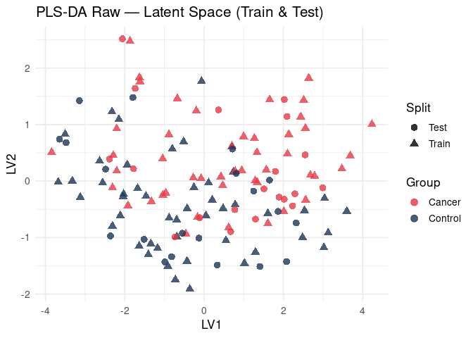
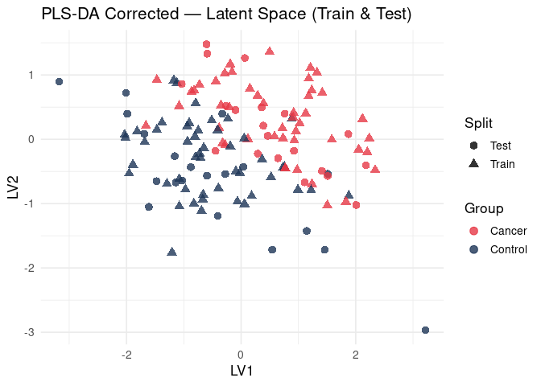

Single-Fold Evaluation of Orthogonal Correction (Cluster48, Perturbation
= 0.25)
================
Tecla Duran Fort
2025-11-13

- <a href="#1-introduction" id="toc-1-introduction">1. Introduction</a>
- <a href="#2-load-data--metadata" id="toc-2-load-data--metadata">2. Load
  Data &amp; Metadata</a>
- <a href="#3-assign-random-classes" id="toc-3-assign-random-classes">3.
  Assign Random Classes</a>
- <a href="#4-apply-controlled-perturbation-cluster48-p--025"
  id="toc-4-apply-controlled-perturbation-cluster48-p--025">4. Apply
  Controlled Perturbation (Cluster48, p = 0.25)</a>
- <a href="#5-stratified-7030-split" id="toc-5-stratified-7030-split">5.
  Stratified 70/30 Split</a>
- <a href="#6-internal-rfe--component-optimisation"
  id="toc-6-internal-rfe--component-optimisation">6. Internal RFE +
  Component Optimisation</a>
- <a href="#7-train-final-model-raw" id="toc-7-train-final-model-raw">7.
  Train Final Model (Raw)</a>
- <a href="#8-apply-orthogonal-correction"
  id="toc-8-apply-orthogonal-correction">8. Apply Orthogonal
  Correction</a>
- <a href="#9-train-final-model-corrected"
  id="toc-9-train-final-model-corrected">9. Train Final Model
  (Corrected)</a>
- <a href="#10-roc-curve-raw-vs-corrected"
  id="toc-10-roc-curve-raw-vs-corrected">10. ROC Curve (Raw vs
  Corrected)</a>
- <a href="#11-latent-space-raw" id="toc-11-latent-space-raw">11. Latent
  Space (Raw)</a>
- <a href="#12-latent-space-corrected"
  id="toc-12-latent-space-corrected">12. Latent Space (Corrected)</a>

# 1. Introduction

This document evaluates the impact of sample–space orthogonal correction
on a **single, fixed train/test split** (70/30) for:

- **Cluster48**
- **Perturbation level: 0.25**

A controlled effect is introduced in Cluster48 for the *Cancer* group. A
PLS-DA model is then trained using:

- **Recursive Feature Elimination (RFE)** inside the training set
- **Internal CV** to choose the optimal number of latent variables
- **External evaluation** on the held-out 30% test set

The procedure is repeated on **corrected data**, using orthogonal
projection w.r.t. `elapsed_time` and `batch`.

We finally compare:

1.  ROC curves (Raw vs Corrected)
2.  Latent space projections (LV1–LV2)
3.  Classification performance (AUC)

------------------------------------------------------------------------

# 2. Load Data & Metadata

# 3. Assign Random Classes

# 4. Apply Controlled Perturbation (Cluster48, p = 0.25)

------------------------------------------------------------------------

# 5. Stratified 70/30 Split

------------------------------------------------------------------------

# 6. Internal RFE + Component Optimisation

------------------------------------------------------------------------

# 7. Train Final Model (Raw)

------------------------------------------------------------------------

# 8. Apply Orthogonal Correction

------------------------------------------------------------------------

# 9. Train Final Model (Corrected)

------------------------------------------------------------------------

# 10. ROC Curve (Raw vs Corrected)

<!-- -->

------------------------------------------------------------------------

# 11. Latent Space (Raw)

<!-- -->

------------------------------------------------------------------------

# 12. Latent Space (Corrected)

<!-- -->
