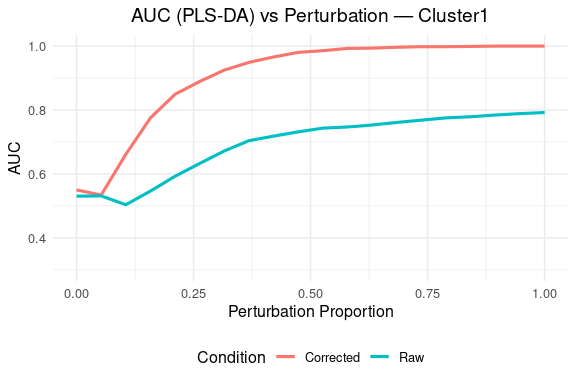
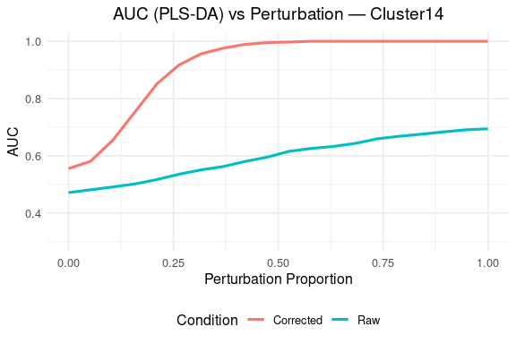
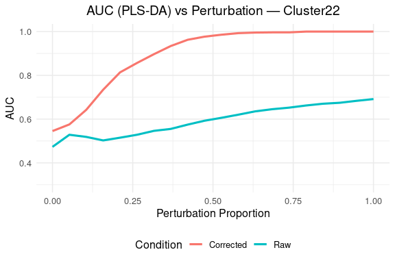
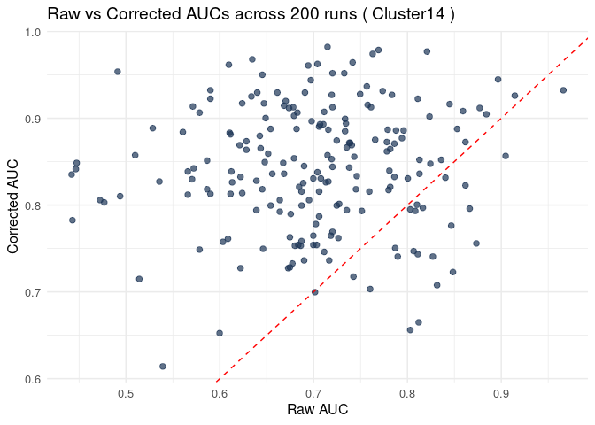

Evaluating the Impact of Orthogonal Correction on Simulated Group
Discrimination
================
Tecla Duran Fort
2025-06-09

# 1. Introduction

This document evaluates the impact of an orthogonal projection
correction applied in the sample space to GC-IMS peak table data. The
analysis is based on a dataset where a controlled perturbation is
introduced in a specific signal to simulate a potential biomarker shift.

We begin by applying this perturbation to a selected cluster and
splitting the dataset into training and test sets using stratified
sampling. A PLS-DA model is then trained on the raw data and evaluated
through ROC curves and AUC values. The same procedure is repeated after
correcting the data using a two-step orthogonal projection based on
elapsed time and batch.

To better understand the model behaviour, we visualize the latent space
projections (PLS-DA scores) before and after correction. Finally, this
process is extended to multiple clusters and perturbation levels to
assess the consistency of the correction effect, and summary statistics
are reported across all simulations.

# 2. Load Data and Metadata

The dataset used in this simulation corresponds to a peak table derived
from repeated measurements of a pooled urine sample, with external
variables `elapsed_time` and `batch` included.

To ensure reproducibility of the initial random group assignment and all
subsequent analyses, we explicitly fix the random seed at the beginning
of the workflow (`set.seed(1234)`). This allows the entire simulation
pipeline to be rerun with identical outputs.

``` r
set.seed(1234)
df <- read.csv("../../data/peak_table_var.csv")

meta <- df[, c("elapsed_time", "batch")]

# Get cluster names
clusters <- grep("^Cluster", names(df), value = TRUE)
```

## 2.1. Assign Classes

In this first step, artificial group labels are randomly assigned to the
samples. This creates a balanced division into “Control” and “Cancer”
groups, which do not correspond to any real condition but serve to
simulate a classification scenario.

This is the **initial random assignment**, used for the first round of
simulations and visualizations. In later sections, the group labels will
be reassigned multiple times with different random seeds to evaluate the
impact of random variation and ensure that results are not dependent on
a specific group configuration.

``` r
# Assign random group labels
df$Group <- sample(rep(c("Control", "Cancer"), length.out = nrow(df)))
```

## Visualizing Group vs Technical Effects

Before running the simulation, we visualize the alignment between the
randomly assigned `Group` labels and the technical variables
`elapsed_time` and `batch`. All values are scaled to the same range for
direct comparison.

<!-- -->

# 3. Function Definitions

## 3.1 Simulate Controlled Shift in One Cluster

This function modifies the values of a selected cluster in the “Cancer”
group by adding a perturbation proportional to its mean intensity. The
goal is to simulate a consistent increase in signal for one variable,
mimicking the presence of a potential biomarker.

``` r
simulate_shift <- function(df, cluster, perc) {
  df_mod <- df
  mean_val <- mean(df[[cluster]], na.rm = TRUE)
  noise <- rnorm(nrow(df_mod), mean = perc * mean_val, sd = 0.05 * mean_val)
  df_mod[[cluster]][df_mod$Group == "Cancer"] <- df_mod[[cluster]][df_mod$Group == "Cancer"] + noise[df_mod$Group == "Cancer"]
  return(as.data.frame(df_mod))
}
```

## 3.2 Compute AUC from a PLS-DA Model

This function evaluates the classification performance of a PLS-DA model
by computing the Area Under the ROC Curve (AUC). The evaluation follows
these steps:

1.  **Stratified splitting**:  
    The input labels (`y`) are used to split the dataset into a
    **training set** and a **test set**, preserving the class balance.
    This means that 50% of the samples from each class (`Control` and
    `Cancer`) are randomly selected for the test set, while the
    remaining 50% form the training set. This prevents class imbalance
    and ensures fair evaluation.

2.  **Random seed (optional)**:  
    If a value is provided for the `seed` argument, it is used to fix
    the random number generator before splitting the data. This ensures
    that the same partition is used every time the function is called
    with that seed, making the results **reproducible**. If no seed is
    provided, the split will be random and vary across runs.

3.  **Model fitting**:  
    A Partial Least Squares Discriminant Analysis (PLS-DA) model is
    trained using the training set. The number of latent variables (LVs)
    is fixed to `ncomp = 2` for all simulations, based on visual
    inspection and to ensure comparability across experiments.

4.  **Prediction**:  
    The trained model is used to predict class probabilities for the
    test samples. Specifically, the predicted score for the positive
    class (“Cancer”) is extracted.

5.  **AUC calculation**:  
    A Receiver Operating Characteristic (ROC) curve is computed based on
    the predicted probabilities and the true class labels of the test
    samples. The AUC is then used as a scalar measure of classification
    performance, ranging from 0.5 (random guessing) to 1.0 (perfect
    classification).

The function returns the AUC as a numeric value. If the class vector
does not contain exactly two levels, `NA` is returned.

``` r
compute_auc_plsda <- function(X, y, test_ratio = 0.5, ncomp = 2, seed=NULL) {
  if (!is.null(seed)) set.seed(seed)
  X <- as.matrix(X)
  y <- as.factor(y)
  classes <- levels(y)
  if (length(classes) != 2) return(NA)

  # Stratified split: preserve class balance
  idx_class1 <- which(y == classes[1])
  idx_class2 <- which(y == classes[2])
  test_class1 <- sample(idx_class1, floor(length(idx_class1) * test_ratio))
  test_class2 <- sample(idx_class2, floor(length(idx_class2) * test_ratio))
  test_idx <- c(test_class1, test_class2)
  train_idx <- setdiff(seq_along(y), test_idx)

  X_train <- X[train_idx, , drop = FALSE]
  X_test <- X[test_idx, , drop = FALSE]
  y_train <- y[train_idx]
  y_test <- y[test_idx]

  # PLS-DA with fixed LVs = 2
  pls_model <- mixOmics::plsda(X_train, y_train, ncomp = ncomp)

  # Prediction and AUC computation
  pred <- predict(pls_model, X_test, dist = "max.dist")$predict[, , ncomp]
  prob <- pred[, classes[2]]  
  roc_obj <- pROC::roc(response = y_test, predictor = prob, levels = classes)
  auc_val <- pROC::auc(roc_obj)

  return(as.numeric(auc_val))
}
```

## 3.3 Evaluate AUC Before and After Correction

This function compares the classification performance of a PLS-DA model
trained on:

1.  The original but **modified** dataset, where a controlled shift has
    been introduced in one cluster to simulate a biomarker-like effect
    in the “Cancer” group.
2.  The same dataset after applying orthogonal projection in the sample
    space to remove the influence of technical variables.

The correction method is based on a custom implementation of projection
onto the orthogonal complement of the space spanned by external
covariates. This projection is performed sequentially for:

- `elapsed_time`, to account for intra-batch variation;
- `batch`, to account for inter-batch variation.

This correction strategy is described in detail here:  
[Orthogonal Correction in the Sample
Space](https://github.com/tecladuran/gcims-workflows/blob/main/docs/Correction/orthogonal_correction.md)

### Procedure

- The matrix of cluster intensities (`X_raw`) and group labels (`y`) are
  extracted from the **synthetically altered** dataset.
- A PLS-DA model is trained on the uncorrected data using the function
  `compute_auc_plsda()` (see Section 3.2), and its AUC is calculated.
- The data is then corrected using orthogonal projections for the two
  technical covariates.
- A second PLS-DA model is trained on the corrected data, and its AUC is
  computed using the same split.

The function returns a named numeric vector with two values: - `Raw`:
AUC obtained using the modified but uncorrected data; - `Corrected`: AUC
obtained after correction.

This allows for direct evaluation of how removing technical variation
affects the detectability of a synthetic class difference.

``` r
evaluate_auc <- function(df_mod, meta, seed=NULL) {
  df_mod <- as.data.frame(df_mod)
  cluster_cols <- grep("^Cluster", names(df_mod), value = TRUE)
  X_raw <- as.matrix(df_mod[, cluster_cols])
  y <- as.factor(df_mod$Group)
  
  auc_raw <- compute_auc_plsda(X_raw, y, seed=seed)

  # Apply correction sequentially for both elapsed time and batch
  X_corr <- orthogonal_correction(orthogonal_correction(X_raw, meta$elapsed_time)$corrected,
                                  meta$batch)$corrected

  auc_corr <- compute_auc_plsda(X_corr, y, seed=seed)
  
  return(c(Raw = auc_raw, Corrected = auc_corr))
}
```

## 3.4 Compute AUC and Latent Space Projections

This function is a variant of `compute_auc_plsda()` that additionally
returns the latent variable projections (scores) for both the training
and test sets. It is used in Section 6 to generate visualizations of the
PLS-DA space before and after correction.

``` r
compute_plsda_latents <- function(X, y, test_ratio = 0.5, ncomp = 2, seed = 42) {
  set.seed(seed)
  X <- as.matrix(X)
  y <- as.factor(y)
  classes <- levels(y)

  # Stratified split
  idx_class1 <- which(y == classes[1])
  idx_class2 <- which(y == classes[2])
  test_class1 <- sample(idx_class1, floor(length(idx_class1) * test_ratio))
  test_class2 <- sample(idx_class2, floor(length(idx_class2) * test_ratio))
  test_idx <- c(test_class1, test_class2)
  train_idx <- setdiff(seq_along(y), test_idx)

  X_train <- X[train_idx, , drop = FALSE]
  X_test <- X[test_idx, , drop = FALSE]
  y_train <- y[train_idx]
  y_test <- y[test_idx]

  # PLS-DA
  model <- plsda(X_train, y_train, ncomp = ncomp)

  # AUC — use probability for positive class
  pred <- predict(model, X_test, dist = "max.dist")$predict[, , ncomp]
  prob <- pred[, classes[2]]
  auc_val <- pROC::auc(pROC::roc(response = y_test, predictor = prob, levels = classes))

  # Latent space
  train_scores <- model$variates$X
  test_scores <- predict(model, newdata = X_test, dist = "max.dist")$variates

  return(list(
    auc = as.numeric(auc_val),
    prob = prob,
    y_test = y_test,
    train_scores = train_scores,
    test_scores = test_scores,
    y_train = y_train
  ))
}
```

# 4. Case Study: Latent Structure Visualisation

In this section, a specific example is examined to visualize the effect
of the correction on latent structure.

We simulate a 25% signal increase in `Cluster24` for the “Cancer” group.
Then, using the function `compute_plsda_latents()` (defined in Section
3), we compute the AUC and extract latent projections before and after
correction.

This controlled case illustrates how the correction improves class
separation in the PLS-DA space under a known synthetic perturbation.

``` r
df_mod <- simulate_shift(df, cluster = "Cluster24", perc = 0.25)
X_raw <- as.matrix(df_mod[, clusters])
y <- as.factor(df_mod$Group)

# Raw
res_raw <- compute_plsda_latents(X_raw, y, seed = 42)

# Corrected
X_corr <- orthogonal_correction(orthogonal_correction(X_raw, meta$elapsed_time)$corrected,
                                 meta$batch)$corrected
res_corr <- compute_plsda_latents(X_corr, y, seed = 42)
```

------------------------------------------------------------------------

## 4.1 ROC Curve (Raw vs Corrected)

<!-- -->

------------------------------------------------------------------------

## 4.2 Latent Space Projection — Raw

<!-- -->

------------------------------------------------------------------------

## 4.3 Latent Space Projection — Corrected

<!-- -->

# 5. Run Simulation Across Clusters

In this step, we systematically evaluate how classification performance
changes as the simulated “biomarker” effect increases, both before and
after correction.

For each cluster and for a range of perturbation levels (from 0 to 1),
the following procedure is applied:

1.  A synthetic effect is introduced in the “Cancer” group for the
    selected cluster using `simulate_shift()`. The intensity increase is
    proportional to the cluster’s mean signal.
2.  The resulting modified dataset is passed to `evaluate_auc()`, which
    computes the AUC of a PLS-DA classifier before and after correction.
3.  This is repeated for all clusters and perturbation levels, producing
    a complete matrix of AUC values across different conditions.

To ensure reproducibility, a fixed seed (`seed = 42`) is used during
each evaluation.  
This means that the random partitioning into training and test sets is
**identical every time** the same simulation is run. As a result,
differences in performance between the raw and corrected data can be
attributed **solely to the correction itself**, not to randomness in the
group split.

The results are stored as a long-format dataframe (`auc_df`), with
columns: - `Cluster`: the cluster where the perturbation was applied -
`Percent`: the perturbation level (from 0 to 1) - `Condition`: “Raw” or
“Corrected” - `AUC`: the classification performance at that setting

This data is later used for visualizing performance trends across
clusters.

``` r
perturb_levels <- seq(0, 1, length.out = 20)
results_auc <- list()

for (cl in clusters) {
  cluster_auc <- purrr::map_dfr(perturb_levels, function(p) {
    df_mod <- simulate_shift(df, cl, p)
    aucs <- evaluate_auc(df_mod, meta, seed=42)
    tibble::tibble(Cluster = cl, Percent = p, Raw = aucs["Raw"], Corrected = aucs["Corrected"])
  })
  results_auc[[cl]] <- cluster_auc
}

auc_df <- dplyr::bind_rows(results_auc) %>%
  tidyr::pivot_longer(cols = c(Raw, Corrected), names_to = "Condition", values_to = "AUC")
```

## 5.1. Visualisation of AUC by Cluster

This section visualizes how classification performance evolves for each
cluster as the simulated perturbation increases. For every cluster, we
plot the AUC of the PLS-DA classifier as a function of the perturbation
proportion, separately for the raw and corrected datasets.

Each plot shows two lines:

- **Raw** (uncorrected data)
- **Corrected** (after orthogonal projection)

These curves allow us to see how sensitive each cluster is to the
simulated effect, and how much the correction improves detection for
each level of perturbation. Clusters where the corrected AUC rises more
steeply indicate a stronger benefit from the correction method.

Each plot is titled with the cluster ID (e.g., “Cluster16”) and uses a
consistent y-axis range from 0.3 to 1.0 for comparability across
clusters.

<!-- --><!-- --><!-- --><!-- --><!-- --><!-- --><!-- --><!-- --><!-- --><!-- --><!-- --><!-- --><!-- --><!-- --><!-- --><!-- --><!-- --><!-- --><!-- --><!-- --><!-- --><!-- --><!-- --><!-- --><!-- --><!-- --><!-- --><!-- --><!-- --><!-- --><!-- -->

# 6. Robustness Check

## 6.1. Repeated Random Assignments

To evaluate the stability of the observed AUC improvements, we repeat
the group assignment multiple times with different random seeds. This
controls for potential biases introduced by a single, lucky alignment
between group labels and technical variables.

We compute the AUC with and without orthogonal correction across 200
repetitions for a single cluster (`Cluster14`) perturbation of 30% and
visualize the distribution.

``` r
set.seed(NULL)  # No seed fixation
n_repeats <- 200
target_cluster <- "Cluster14"

robust_results <- purrr::map_dfr(1:n_repeats, function(i) {
  df$Group <- sample(rep(c("Control", "Cancer"), length.out = nrow(df)))
  df_mod <- simulate_shift(df, cluster = target_cluster, perc = 0.25)
  aucs <- evaluate_auc(df_mod, meta)
  tibble::tibble(Iteration = i, Raw = aucs["Raw"], Corrected = aucs["Corrected"])
})
```

``` r
ggplot(robust_results, aes(x = Raw, y = Corrected)) +
  geom_point(color = "#1D3557", alpha = 0.7, size = 2) +
  geom_abline(slope = 1, intercept = 0, linetype = "dashed", color = "red") +
  theme_minimal(base_size = 12) +
  labs(title = paste("Raw vs Corrected AUCs across 200 runs (", target_cluster, ")"),
       x = "Raw AUC", y = "Corrected AUC")
```

<!-- -->

## 6.2. Global Validation Across Clusters and Perturbation Levels

To confirm that the improvement provided by othogonal correction is
consistent across clusters and perturbation levels, we repeat the
simulation for all clusters and multiple perturbation levels, with
repeated random group assignments.

### Run Simulations

``` r
perturb_seq <- seq(0, 1, by = 0.05)
n_repeats <- 10  
results_global <- purrr::map_dfr(clusters, function(cl) {
  purrr::map_dfr(perturb_seq, function(p) {
    purrr::map_dfr(1:n_repeats, function(i) {
      df$Group <- sample(rep(c("Control", "Cancer"), length.out = nrow(df)))
      df_mod <- simulate_shift(df, cluster = cl, perc = p)
      aucs <- evaluate_auc(df_mod, meta)
      tibble::tibble(Cluster = cl, Perturbation = p, Rep = i,
                     Raw = aucs["Raw"], Corrected = aucs["Corrected"])
    })
  })
})
```

------------------------------------------------------------------------

### Summary Statistics by Perturbation Level

To assess whether the correction provides a statistically significant
improvement in classification performance, we perform a **one-sided
paired Wilcoxon signed-rank test** at each perturbation level.

Each perturbation level (e.g., 0.05, 0.10, …) includes results from
**multiple clusters**, and for each cluster the simulation is repeated
**10 times** using different random group assignments. As a result,
every perturbation level includes a large number of paired AUC values
comparing the raw and corrected data under the exact same conditions
(same cluster, perturbation level, and group assignment).

This non-parametric test compares the AUC values before and after
correction for each simulation run, under the null hypothesis that the
correction does **not** increase performance. The test is **paired**,
meaning that each corrected AUC is compared to its corresponding raw AUC
under the exact same conditions (same cluster, perturbation level, and
group assignment), thereby controlling for random variation.

The Wilcoxon test is well suited for AUC values, which are bounded and
may be non-normally distributed. However, due to the **large number of
simulations per condition**, the test has very high statistical power.
This means that **p-values are often extremely small**, even when the
improvement is modest.

Therefore, **what truly matters in this context is not the p-value
itself, but the size and consistency of the improvement**. For this
reason, we report: - `mean_gain`: the average AUC increase after
correction. - `prop_improved`: the proportion of simulations in which
the corrected AUC is higher than the raw AUC.

Together, these metrics help quantify the practical benefit of the
correction across a range of perturbation intensities.

``` r
summary_global <- results_global %>%
  dplyr::group_by(Perturbation) %>%
  dplyr::summarise(
    p_value = wilcox.test(Corrected, Raw, paired = TRUE, alternative = "greater")$p.value,
    mean_gain = mean(Corrected - Raw),
    prop_improved = mean(Corrected > Raw)
  )

summary_global %>%
  kable(digits = 4, caption = "Summary of Improvement After Correction") %>%
  kable_styling(full_width = FALSE, position = "center", bootstrap_options = c("striped", "hover"))
```

<table class="table table-striped table-hover" style="width: auto !important; margin-left: auto; margin-right: auto;">
<caption>
Summary of Improvement After Correction
</caption>
<thead>
<tr>
<th style="text-align:right;">
Perturbation
</th>
<th style="text-align:right;">
p_value
</th>
<th style="text-align:right;">
mean_gain
</th>
<th style="text-align:right;">
prop_improved
</th>
</tr>
</thead>
<tbody>
<tr>
<td style="text-align:right;">
0.00
</td>
<td style="text-align:right;">
0.5032
</td>
<td style="text-align:right;">
0.0008
</td>
<td style="text-align:right;">
0.4935
</td>
</tr>
<tr>
<td style="text-align:right;">
0.05
</td>
<td style="text-align:right;">
0.0008
</td>
<td style="text-align:right;">
0.0162
</td>
<td style="text-align:right;">
0.5742
</td>
</tr>
<tr>
<td style="text-align:right;">
0.10
</td>
<td style="text-align:right;">
0.0000
</td>
<td style="text-align:right;">
0.0616
</td>
<td style="text-align:right;">
0.7032
</td>
</tr>
<tr>
<td style="text-align:right;">
0.15
</td>
<td style="text-align:right;">
0.0000
</td>
<td style="text-align:right;">
0.1021
</td>
<td style="text-align:right;">
0.7903
</td>
</tr>
<tr>
<td style="text-align:right;">
0.20
</td>
<td style="text-align:right;">
0.0000
</td>
<td style="text-align:right;">
0.1062
</td>
<td style="text-align:right;">
0.7806
</td>
</tr>
<tr>
<td style="text-align:right;">
0.25
</td>
<td style="text-align:right;">
0.0000
</td>
<td style="text-align:right;">
0.1197
</td>
<td style="text-align:right;">
0.8290
</td>
</tr>
<tr>
<td style="text-align:right;">
0.30
</td>
<td style="text-align:right;">
0.0000
</td>
<td style="text-align:right;">
0.1106
</td>
<td style="text-align:right;">
0.7548
</td>
</tr>
<tr>
<td style="text-align:right;">
0.35
</td>
<td style="text-align:right;">
0.0000
</td>
<td style="text-align:right;">
0.1086
</td>
<td style="text-align:right;">
0.7806
</td>
</tr>
<tr>
<td style="text-align:right;">
0.40
</td>
<td style="text-align:right;">
0.0000
</td>
<td style="text-align:right;">
0.0881
</td>
<td style="text-align:right;">
0.7581
</td>
</tr>
<tr>
<td style="text-align:right;">
0.45
</td>
<td style="text-align:right;">
0.0000
</td>
<td style="text-align:right;">
0.0846
</td>
<td style="text-align:right;">
0.8032
</td>
</tr>
<tr>
<td style="text-align:right;">
0.50
</td>
<td style="text-align:right;">
0.0000
</td>
<td style="text-align:right;">
0.0661
</td>
<td style="text-align:right;">
0.6968
</td>
</tr>
<tr>
<td style="text-align:right;">
0.55
</td>
<td style="text-align:right;">
0.0000
</td>
<td style="text-align:right;">
0.0618
</td>
<td style="text-align:right;">
0.7097
</td>
</tr>
<tr>
<td style="text-align:right;">
0.60
</td>
<td style="text-align:right;">
0.0000
</td>
<td style="text-align:right;">
0.0532
</td>
<td style="text-align:right;">
0.6548
</td>
</tr>
<tr>
<td style="text-align:right;">
0.65
</td>
<td style="text-align:right;">
0.0000
</td>
<td style="text-align:right;">
0.0469
</td>
<td style="text-align:right;">
0.6387
</td>
</tr>
<tr>
<td style="text-align:right;">
0.70
</td>
<td style="text-align:right;">
0.0000
</td>
<td style="text-align:right;">
0.0439
</td>
<td style="text-align:right;">
0.6161
</td>
</tr>
<tr>
<td style="text-align:right;">
0.75
</td>
<td style="text-align:right;">
0.0000
</td>
<td style="text-align:right;">
0.0304
</td>
<td style="text-align:right;">
0.5548
</td>
</tr>
<tr>
<td style="text-align:right;">
0.80
</td>
<td style="text-align:right;">
0.0000
</td>
<td style="text-align:right;">
0.0344
</td>
<td style="text-align:right;">
0.5806
</td>
</tr>
<tr>
<td style="text-align:right;">
0.85
</td>
<td style="text-align:right;">
0.0000
</td>
<td style="text-align:right;">
0.0318
</td>
<td style="text-align:right;">
0.6258
</td>
</tr>
<tr>
<td style="text-align:right;">
0.90
</td>
<td style="text-align:right;">
0.0000
</td>
<td style="text-align:right;">
0.0239
</td>
<td style="text-align:right;">
0.5839
</td>
</tr>
<tr>
<td style="text-align:right;">
0.95
</td>
<td style="text-align:right;">
0.0000
</td>
<td style="text-align:right;">
0.0153
</td>
<td style="text-align:right;">
0.5484
</td>
</tr>
<tr>
<td style="text-align:right;">
1.00
</td>
<td style="text-align:right;">
0.0000
</td>
<td style="text-align:right;">
0.0286
</td>
<td style="text-align:right;">
0.5581
</td>
</tr>
</tbody>
</table>
