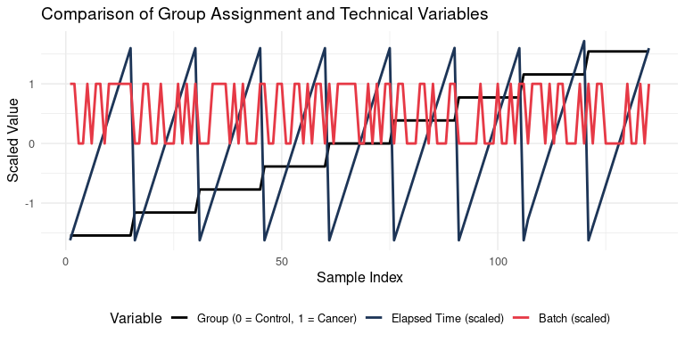
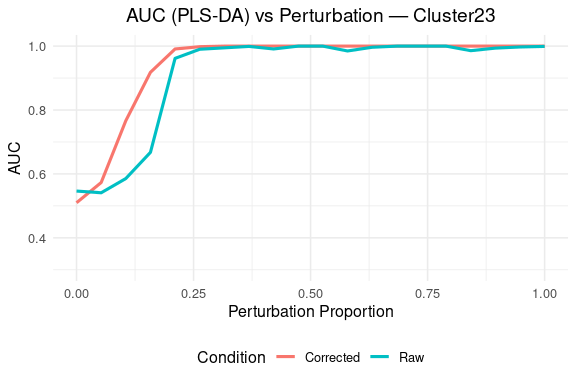
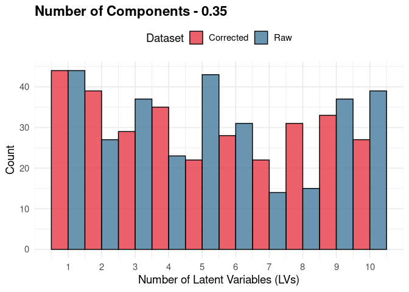

Evaluating the Impact of Orthogonal Correction on Simulated Group
Discrimination 2
================
Tecla Duran Fort
2025-06-10

# 1. Introduction

This document reproduces the simulation strategy described in the report
[**“Evaluating the Impact of Orthogonal Correction on Simulated Group
Discrimination”**](https://github.com/tecladuran/gcims-workflows/blob/main/docs/Group_Simulation/simulation_plsda.md),
but introduces an **automated tuning of the number of latent variables
(`ncomp`)** in the PLS-DA model.

Instead of fixing `ncomp` to a predefined value, this version uses
**cross-validation** to optimize the number of components in each
iteration. The optimal number is chosen based on two criteria:

- It must mark the point where **accuracy improvements between
  consecutive components fall below 5%**, indicating a plateau.
- It must reach **at least 80% of the best classification accuracy**
  observed during cross-validation, avoiding understimating the number
  of components.

This tuning procedure enhances the robustness of the results and ensures
fairer comparisons across perturbation levels and correction strategies.

The rest of the pipeline —including simulation of group differences,
classification with PLS-DA, and evaluation via AUC — remains identical
to the original version.

# 2. Load Data and Metadata

``` r
set.seed(1234)
df <- read.csv("../../data/peak_table_var.csv")

meta <- df[, c("elapsed_time", "batch")]

# Get cluster names
clusters <- grep("^Cluster", names(df), value = TRUE)
```

## 2.1. Assign Classes

``` r
# Assign random group labels
df$Group <- sample(rep(c("Control", "Cancer"), length.out = nrow(df)))
```

## Visualizing Group vs Technical Effects

<!-- -->

# 3. Function Definitions

## 3.1 Simulate Controlled Shift in One Cluster

``` r
simulate_shift <- function(df, cluster, perc) {
  df_mod <- df
  mean_val <- mean(df[[cluster]], na.rm = TRUE)
  noise <- rnorm(nrow(df_mod), mean = perc * mean_val, sd = 0.05 * mean_val)
  df_mod[[cluster]][df_mod$Group == "Cancer"] <- df_mod[[cluster]][df_mod$Group == "Cancer"] + noise[df_mod$Group == "Cancer"]
  return(as.data.frame(df_mod))
}
```

## 3.2 Compute AUC from a PLS-DA Model

This function evaluates the classification performance of a PLS-DA model
by computing the Area Under the ROC Curve (AUC). The evaluation follows
these steps:

1.  **Stratified splitting**: The input labels (`y`) are used to split
    the dataset into a **training set** and a **test set**, preserving
    the class balance. This means that 50% of the samples from each
    class (`Control` and `Cancer`) are randomly selected for the test
    set, while the remaining 50% form the training set. This prevents
    class imbalance and ensures fair evaluation.

2.  **Random seed (optional)**: If a value is provided for the `seed`
    argument, it is used to fix the random number generator before
    splitting the data. This ensures that the same partition is used
    every time the function is called with that seed, making the results
    **reproducible**. If no seed is provided, the split will be random
    and vary across runs.

3.  **Model tuning and cross-validation**: A Partial Least Squares
    Discriminant Analysis (PLS-DA) model is trained using the training
    set. Instead of fixing the number of latent variables (`ncomp`), the
    function uses **10-fold cross-validation** to assess classification
    accuracy for up to `max_ncomp` components. The optimal number of
    components is selected as the **smallest number of LVs** that
    satisfies both of the following:

    - It yields at least **80% of the maximum cross-validated
      accuracy**.
    - It marks the point beyond which accuracy improvements are **below
      5%** compared to the previous component.

    This strategy helps prevent overfitting while ensuring robust
    performance across clusters and perturbations.

4.  **Prediction**: The selected model is then fitted on the full
    training set and used to predict class probabilities for the test
    samples. Specifically, the predicted score for the positive class
    (“Cancer”) is extracted.

5.  **AUC calculation**: A Receiver Operating Characteristic (ROC) curve
    is computed based on the predicted probabilities and the true class
    labels of the test samples. The AUC is then used as a scalar measure
    of classification performance, ranging from 0.5 (random guessing) to
    1.0 (perfect classification).

The function returns a list including the AUC value, the optimal number
of latent variables, and the full vector of cross-validated accuracies.

``` r
compute_auc_plsda <- function(X, y, test_ratio = 0.5, max_ncomp = 10, seed = NULL) {
  if (!is.null(seed)) set.seed(seed)
  X <- as.matrix(X)
  y <- as.factor(y)
  classes <- levels(y)
  if (length(classes) != 2) return(NA)

  # Stratified train/test split
  idx_class1 <- which(y == classes[1])
  idx_class2 <- which(y == classes[2])
  test_class1 <- sample(idx_class1, floor(length(idx_class1) * test_ratio))
  test_class2 <- sample(idx_class2, floor(length(idx_class2) * test_ratio))
  test_idx <- c(test_class1, test_class2)
  train_idx <- setdiff(seq_along(y), test_idx)

  X_train <- X[train_idx, , drop = FALSE]
  X_test <- X[test_idx, , drop = FALSE]
  y_train <- y[train_idx]
  y_test <- y[test_idx]

  # Convert class labels to 0/1
  y_train_bin <- as.numeric(y_train == classes[2])
  y_test_bin <- as.numeric(y_test == classes[2])

  # Cross-validation
  folds <- sample(rep(1:5, length.out = length(y_train_bin)))
  acc_mat <- matrix(NA, nrow = 5, ncol = max_ncomp)

  for (fold in 1:5) {
    fold_idx <- which(folds == fold)
    X_cv_train <- X_train[-fold_idx, , drop = FALSE]
    X_cv_test  <- X_train[fold_idx, , drop = FALSE]
    y_cv_train <- y_train_bin[-fold_idx]
    y_cv_test  <- y_train_bin[fold_idx]

    model <- pls::plsr(y_cv_train ~ X_cv_train, ncomp = max_ncomp, validation = "none", method = "oscorespls")
    preds <- predict(model, newdata = X_cv_test, ncomp = 1:max_ncomp)

    for (k in 1:max_ncomp) {
      pred_labels <- as.numeric(preds[, , k] > 0.5)
      acc_mat[fold, k] <- mean(pred_labels == y_cv_test)
    }
  }

  mean_acc <- colMeans(acc_mat)
  best_acc <- max(mean_acc)

  # Consider only components with reasonably high accuracy (≥80% of the best)
  min_acceptable <- which(mean_acc >= 0.80 * best_acc)
  
  # Find the first component after which the relative improvement is <5%
  best_ncomp <- max_ncomp
  for (k in min_acceptable) {
    if (k < max_ncomp && (mean_acc[k + 1] - mean_acc[k]) / mean_acc[k] < 0.05) {
      best_ncomp <- k
      break
    }
  }
  
  # Final model training using selected number of components
  final_model <- pls::plsr(y_train_bin ~ X_train, ncomp = best_ncomp, method = "oscorespls")
  
  # Predict on the test set using the selected number of components
  preds_test <- predict(final_model, newdata = X_test, ncomp = best_ncomp)[, , 1]
  
  # Compute ROC and AUC on the test set
  roc_obj <- pROC::roc(response = y_test, predictor = preds_test, levels = classes)
  auc_val <- pROC::auc(roc_obj)
  
  # Return relevant results
  return(list(
    auc = as.numeric(auc_val),
    ncomp = best_ncomp,
    acc_cv = mean_acc,
    acc_best = best_acc
  ))
}
```

## 3.3 Evaluate AUC Before and After Correction

``` r
evaluate_auc <- function(df_mod, meta, seed = NULL) {
  df_mod <- as.data.frame(df_mod)
  cluster_cols <- grep("^Cluster", names(df_mod), value = TRUE)
  X_raw <- as.matrix(df_mod[, cluster_cols])
  y <- as.factor(df_mod$Group)

  res_raw <- compute_auc_plsda(X_raw, y, seed = seed)

  # Apply correction sequentially for both elapsed time and batch
  X_corr <- orthogonal_correction(
    orthogonal_correction(X_raw, meta$elapsed_time)$corrected,
    meta$batch
  )$corrected

  res_corr <- compute_auc_plsda(X_corr, y, seed = seed)

  return(c(
    Raw = res_raw$auc,
    Corrected = res_corr$auc,
    ncomp_raw = res_raw$ncomp,
    ncomp_corr = res_corr$ncomp
  ))
}
```

## 3.4 Compute AUC and Latent Space Projections

``` r
compute_plsda_latents <- function(X, y, test_ratio = 0.5, ncomp = 2, seed = 42) {
  set.seed(seed)
  X <- as.matrix(X)
  y <- as.factor(y)
  classes <- levels(y)

  # Stratified split
  idx_class1 <- which(y == classes[1])
  idx_class2 <- which(y == classes[2])
  test_class1 <- sample(idx_class1, floor(length(idx_class1) * test_ratio))
  test_class2 <- sample(idx_class2, floor(length(idx_class2) * test_ratio))
  test_idx <- c(test_class1, test_class2)
  train_idx <- setdiff(seq_along(y), test_idx)

  X_train <- X[train_idx, , drop = FALSE]
  X_test <- X[test_idx, , drop = FALSE]
  y_train <- y[train_idx]
  y_test <- y[test_idx]

  # PLS-DA
  model <- plsda(X_train, y_train, ncomp = ncomp)

  # AUC — use probability for positive class
  pred <- predict(model, X_test, dist = "max.dist")$predict[, , ncomp]
  prob <- pred[, classes[2]]
  auc_val <- pROC::auc(pROC::roc(response = y_test, predictor = prob, levels = classes))

  # Latent space
  train_scores <- model$variates$X
  test_scores <- predict(model, newdata = X_test, dist = "max.dist")$variates

  return(list(
    auc = as.numeric(auc_val),
    prob = prob,
    y_test = y_test,
    train_scores = train_scores,
    test_scores = test_scores,
    y_train = y_train
  ))
}
```

# 5. Run Simulation Across Clusters

``` r
perturb_levels <- seq(0, 1, length.out = 20)
results_auc <- list()

for (cl in clusters) {
  cluster_auc <- purrr::map_dfr(perturb_levels, function(p) {
    df_mod <- simulate_shift(df, cl, p)
    aucs <- evaluate_auc(df_mod, meta, seed=42)
    tibble::tibble(Cluster = cl, Percent = p, Raw = aucs["Raw"], Corrected = aucs["Corrected"])
  })
  results_auc[[cl]] <- cluster_auc
}

auc_df <- dplyr::bind_rows(results_auc) %>%
  tidyr::pivot_longer(cols = c(Raw, Corrected), names_to = "Condition", values_to = "AUC")
```

## 5.1. Visualisation of AUC by Cluster

<!-- --><!-- --><!-- --><!-- --><!-- --><!-- --><!-- --><!-- --><!-- --><!-- --><!-- --><!-- --><!-- --><!-- --><!-- --><!-- --><!-- --><!-- --><!-- --><!-- --><!-- --><!-- --><!-- --><!-- --><!-- --><!-- --><!-- --><!-- --><!-- --><!-- --><!-- -->

# 6. Robustness Check

## 6.1. Repeated Random Assignments

``` r
set.seed(NULL)  # No seed fixation
n_repeats <- 200
target_cluster <- "Cluster14"

robust_results <- purrr::map_dfr(1:n_repeats, function(i) {
  df$Group <- sample(rep(c("Control", "Cancer"), length.out = nrow(df)))
  df_mod <- simulate_shift(df, cluster = target_cluster, perc = 0.25)
  aucs <- evaluate_auc(df_mod, meta)
  tibble::tibble(Iteration = i, Raw = aucs["Raw"], Corrected = aucs["Corrected"])
})
```

``` r
ggplot(robust_results, aes(x = Raw, y = Corrected)) +
  geom_point(color = "#1D3557", alpha = 0.7, size = 2) +
  geom_abline(slope = 1, intercept = 0, linetype = "dashed", color = "red") +
  theme_minimal(base_size = 12) +
  labs(title = paste("Raw vs Corrected AUCs across 200 runs (", target_cluster, ")"),
       x = "Raw AUC", y = "Corrected AUC")
```

<!-- -->

## 6.2. Global Validation Across Clusters and Perturbation Levels

### Run Simulations

``` r
perturb_seq <- seq(0, 1, by = 0.05)
n_repeats <- 10  
robust_results <- purrr::map_dfr(clusters, function(cl) {
  purrr::map_dfr(perturb_seq, function(p) {
    purrr::map_dfr(1:n_repeats, function(i) {
      df$Group <- sample(rep(c("Control", "Cancer"), length.out = nrow(df)))
      df_mod <- simulate_shift(df, cluster = cl, perc = p)
      aucs <- evaluate_auc(df_mod, meta, seed = i)

      tibble::tibble(
        Cluster = cl,
        Perturbation = p,
        Iteration = i,
        Raw = as.numeric(aucs["Raw"]),
        Corrected = as.numeric(aucs["Corrected"]),
        ncomp_raw = as.numeric(aucs["ncomp_raw"]),
        ncomp_corr = as.numeric(aucs["ncomp_corr"])
      )
    })
  })
})
```

``` r
components_long <- robust_results %>%
  dplyr::select(ncomp_raw, ncomp_corr, Perturbation) %>%
  pivot_longer(cols = c(ncomp_raw, ncomp_corr),
               names_to = "Type",
               values_to = "ncomp") %>%
  mutate(Type = recode(Type,
                       ncomp_raw = "Raw",
                       ncomp_corr = "Corrected"))
```

``` r
library(tidyverse)

split_data <- components_long %>%
  group_split(Perturbation)

# Obtenir els noms dels grups
names(split_data) <- components_long %>%
  distinct(Perturbation) %>%
  pull(Perturbation)

# Generar una llista de figures
plots <- map2(split_data, names(split_data), function(df, perturb) {
  ggplot(df, aes(x = ncomp, fill = Type)) +
    geom_histogram(position = "dodge", binwidth = 1, color = "black", alpha = 0.8) +
    scale_x_continuous(breaks = seq(min(df$ncomp), max(df$ncomp))) +
    scale_fill_manual(values = c("Raw" = "#457b9d", "Corrected" = "#e63946")) +
    labs(title = paste("Number of Components -", perturb),
         x = "Number of Latent Variables (LVs)",
         y = "Count",
         fill = "Dataset") +
    theme_minimal(base_size = 14) +
    theme(legend.position = "top",
          plot.title = element_text(face = "bold"))
})

# Mostrar els plots un per un (a l’RStudio els pots veure manualment)
plots
```

    ## $`0`

<!-- -->

    ## 
    ## $`0.05`

<!-- -->

    ## 
    ## $`0.1`

<!-- -->

    ## 
    ## $`0.15`

<!-- -->

    ## 
    ## $`0.2`

<!-- -->

    ## 
    ## $`0.25`

<!-- -->

    ## 
    ## $`0.3`

<!-- -->

    ## 
    ## $`0.35`

<!-- -->

    ## 
    ## $`0.4`

<!-- -->

    ## 
    ## $`0.45`

<!-- -->

    ## 
    ## $`0.5`

<!-- -->

    ## 
    ## $`0.55`

<!-- -->

    ## 
    ## $`0.6`

<!-- -->

    ## 
    ## $`0.65`

<!-- -->

    ## 
    ## $`0.7`

<!-- -->

    ## 
    ## $`0.75`

<!-- -->

    ## 
    ## $`0.8`

<!-- -->

    ## 
    ## $`0.85`

<!-- -->

    ## 
    ## $`0.9`

<!-- -->

    ## 
    ## $`0.95`

<!-- -->

    ## 
    ## $`1`

<!-- -->

------------------------------------------------------------------------

### Summary Statistics by Perturbation Level

``` r
summary_global <- robust_results %>%
  dplyr::group_by(Perturbation) %>%
  dplyr::summarise(
    p_value = wilcox.test(Corrected, Raw, paired = TRUE, alternative = "greater")$p.value,
    mean_gain = mean(Corrected - Raw),
    prop_improved = mean(Corrected > Raw)
  )

summary_global %>%
  kable(digits = 4, caption = "Summary of Improvement After Correction") %>%
  kable_styling(full_width = FALSE, position = "center", bootstrap_options = c("striped", "hover"))
```

<table class="table table-striped table-hover" style="width: auto !important; margin-left: auto; margin-right: auto;">
<caption>
Summary of Improvement After Correction
</caption>
<thead>
<tr>
<th style="text-align:right;">
Perturbation
</th>
<th style="text-align:right;">
p_value
</th>
<th style="text-align:right;">
mean_gain
</th>
<th style="text-align:right;">
prop_improved
</th>
</tr>
</thead>
<tbody>
<tr>
<td style="text-align:right;">
0.00
</td>
<td style="text-align:right;">
0.0000
</td>
<td style="text-align:right;">
0.0222
</td>
<td style="text-align:right;">
0.6742
</td>
</tr>
<tr>
<td style="text-align:right;">
0.05
</td>
<td style="text-align:right;">
0.0001
</td>
<td style="text-align:right;">
0.0176
</td>
<td style="text-align:right;">
0.6258
</td>
</tr>
<tr>
<td style="text-align:right;">
0.10
</td>
<td style="text-align:right;">
0.0161
</td>
<td style="text-align:right;">
0.0104
</td>
<td style="text-align:right;">
0.5774
</td>
</tr>
<tr>
<td style="text-align:right;">
0.15
</td>
<td style="text-align:right;">
0.0005
</td>
<td style="text-align:right;">
0.0174
</td>
<td style="text-align:right;">
0.5806
</td>
</tr>
<tr>
<td style="text-align:right;">
0.20
</td>
<td style="text-align:right;">
0.0378
</td>
<td style="text-align:right;">
0.0110
</td>
<td style="text-align:right;">
0.5290
</td>
</tr>
<tr>
<td style="text-align:right;">
0.25
</td>
<td style="text-align:right;">
0.1322
</td>
<td style="text-align:right;">
0.0105
</td>
<td style="text-align:right;">
0.4903
</td>
</tr>
<tr>
<td style="text-align:right;">
0.30
</td>
<td style="text-align:right;">
0.3877
</td>
<td style="text-align:right;">
0.0052
</td>
<td style="text-align:right;">
0.4677
</td>
</tr>
<tr>
<td style="text-align:right;">
0.35
</td>
<td style="text-align:right;">
0.0237
</td>
<td style="text-align:right;">
0.0133
</td>
<td style="text-align:right;">
0.4903
</td>
</tr>
<tr>
<td style="text-align:right;">
0.40
</td>
<td style="text-align:right;">
0.0250
</td>
<td style="text-align:right;">
0.0126
</td>
<td style="text-align:right;">
0.4774
</td>
</tr>
<tr>
<td style="text-align:right;">
0.45
</td>
<td style="text-align:right;">
0.0011
</td>
<td style="text-align:right;">
0.0121
</td>
<td style="text-align:right;">
0.4806
</td>
</tr>
<tr>
<td style="text-align:right;">
0.50
</td>
<td style="text-align:right;">
0.0033
</td>
<td style="text-align:right;">
0.0066
</td>
<td style="text-align:right;">
0.4387
</td>
</tr>
<tr>
<td style="text-align:right;">
0.55
</td>
<td style="text-align:right;">
0.0586
</td>
<td style="text-align:right;">
0.0031
</td>
<td style="text-align:right;">
0.3839
</td>
</tr>
<tr>
<td style="text-align:right;">
0.60
</td>
<td style="text-align:right;">
0.2520
</td>
<td style="text-align:right;">
0.0014
</td>
<td style="text-align:right;">
0.3548
</td>
</tr>
<tr>
<td style="text-align:right;">
0.65
</td>
<td style="text-align:right;">
0.2959
</td>
<td style="text-align:right;">
0.0035
</td>
<td style="text-align:right;">
0.3097
</td>
</tr>
<tr>
<td style="text-align:right;">
0.70
</td>
<td style="text-align:right;">
0.1028
</td>
<td style="text-align:right;">
0.0068
</td>
<td style="text-align:right;">
0.3097
</td>
</tr>
<tr>
<td style="text-align:right;">
0.75
</td>
<td style="text-align:right;">
0.0373
</td>
<td style="text-align:right;">
0.0068
</td>
<td style="text-align:right;">
0.3387
</td>
</tr>
<tr>
<td style="text-align:right;">
0.80
</td>
<td style="text-align:right;">
0.0114
</td>
<td style="text-align:right;">
0.0053
</td>
<td style="text-align:right;">
0.3613
</td>
</tr>
<tr>
<td style="text-align:right;">
0.85
</td>
<td style="text-align:right;">
0.0488
</td>
<td style="text-align:right;">
0.0067
</td>
<td style="text-align:right;">
0.3290
</td>
</tr>
<tr>
<td style="text-align:right;">
0.90
</td>
<td style="text-align:right;">
0.3261
</td>
<td style="text-align:right;">
0.0013
</td>
<td style="text-align:right;">
0.3290
</td>
</tr>
<tr>
<td style="text-align:right;">
0.95
</td>
<td style="text-align:right;">
0.2094
</td>
<td style="text-align:right;">
0.0022
</td>
<td style="text-align:right;">
0.2710
</td>
</tr>
<tr>
<td style="text-align:right;">
1.00
</td>
<td style="text-align:right;">
0.1541
</td>
<td style="text-align:right;">
0.0059
</td>
<td style="text-align:right;">
0.2581
</td>
</tr>
</tbody>
</table>
