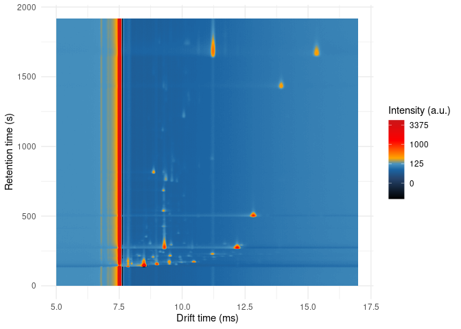
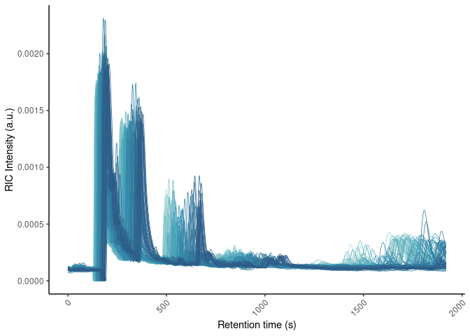
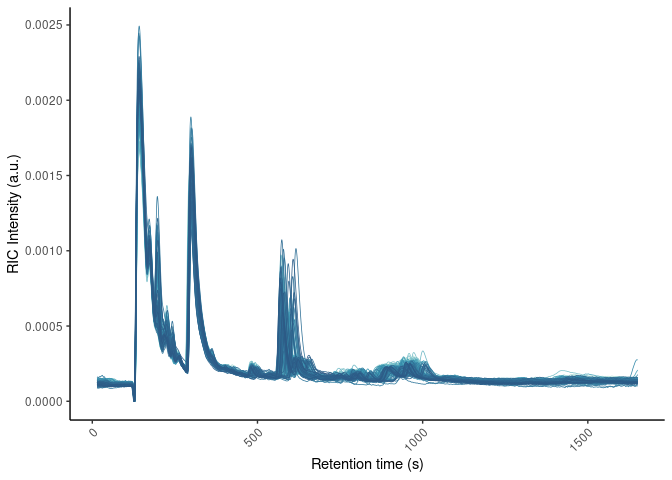
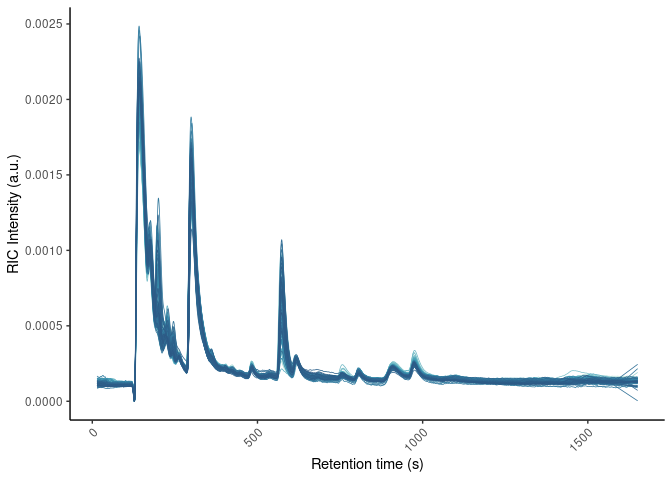

Full Workflow: From Raw Data to Peak Table
================
Tecla Duran Fort
2025-04-17

# 0. Setup

Enable or disable parallelization based on the need for detailed error
reporting or faster execution.

# 1. Dataset Creation

Creation of the dataset from the specified directory and files.

``` r
# Create annotations dataframe
samples_directory <- "/storage/projects/TargetML/Urine_Pool"
annotations <- read.csv(file.path(samples_directory, "annotations.csv"))
annotations <- annotations[which(annotations$Class=="Urine_pool"),]

# Create GCIMS dataset object
urine <- GCIMSDataset$new(
  annotations,
  base_dir = samples_directory,
  on_ram = FALSE)
urine
```

# 2. Preprocessing

## 2.1. Pre-process

Pre-processing steps include filtering, smoothing, and decimating the
data to prepare it for further analysis.

``` r
# Filter by Drift Time (Dt)
filterDt(urine, dt = c(5, 17)) # in ms

# Smooth the data
smooth(urine, rt_length_s = 3, dt_length_ms = 0.14)

# Decimate the data to reduce size
decimate(urine, rt_factor = 1, dt_factor = 2)
urine$realize()
```



## 2.2. Alignment

Alignment of the samples based on the reference sample to standardize
the data across different runs.
<<<<<<< HEAD


``` r
reference <- 104
align(urine, reference_sample_idx = reference, align_dt = TRUE, 
      align_ip = TRUE, method_rt = "none") 
align(urine, reference_sample_idx = reference, align_dt = FALSE, 
      align_ip = FALSE, method_rt = "ptw", ploynomial_order= 2)
urine$realize()

# PTW adjustment to correct small mismatches in sample dimensions
filterDt(urine, dt_range = c(min(dtime(urine)),max(dtime(urine))))
filterRt(urine, rt_range = c(min(rtime(urine)),max(rtime(urine))))
```




Further alignment using a new method to ensure accurate peak detection.

``` r
# Align using new method with specified parameters
percentage_movement <- 0.2
align_pks_ds(urine, 104, percentage_movement)
urine$realize()
filterDt(urine, dt = c(5, 14)) # in ms
```




## 2.3. Peak Detection and Clustering

Peak detection and clustering to identify significant features in the
data.

``` r
findPeaks(
  urine,
  rt_length_s = 3,
  dt_length_ms = 0.14,
  verbose = TRUE,
  dt_peakwidth_range_ms = c(0.15, 0.4),
  rt_peakwidth_range_s = c(10, 25),
  dt_peakDetectionCWTParams = list(exclude0scaleAmpThresh = TRUE),
  rt_peakDetectionCWTParams = list(exclude0scaleAmpThresh = TRUE),
  dt_extension_factor = 0,
  rt_extension_factor = 0,
  exclude_rip = TRUE,
  iou_overlap_threshold = 0.2
)
peak_list <- peaks(urine)
```

``` r
peak_clustering <- clusterPeaks(
  peak_list,
  distance_method = "euclidean",
  dt_cluster_spread_ms = 0.1,
  rt_cluster_spread_s = 20,
  clustering = list(method = "hclust")
)
peak_list_clustered <- peak_clustering$peak_list_clustered
```

Creating and refining the peak table to include only relevant peaks
based on their representation across the samples.

``` r
integratePeaks(
  urine, 
  peak_clustering$peak_list, 
  integration_size_method = "fixed_size", 
  rip_saturation_threshold = 0.1
)
peak_list <- peaks(urine)
peak_table <- peakTable(peak_list, aggregate_conflicting_peaks = max)
```

## 2.4. Removing Underrepresented Clusters

Removing underrepresented clusters to maintain data reliability.

``` r
# Count non-NA values per cluster and determine their percentage representation
counts <- peak_table$peak_table %>%
  mutate(Count = rowSums(!is.na(across(-cluster)))) %>%
  select(cluster, Count)

counts <- counts %>%
  mutate(Percentage = (Count / nrow(annotations)) * 100)

threshold <- 25  

selected_clusters <- counts %>%
  filter(Percentage > threshold) %>%
  pull(cluster)  

peak_list <- peak_list %>% filter(cluster %in% selected_clusters)
peak_table <- peakTable(peak_list, aggregate_conflicting_peaks = max)
```

## 2.5. Impute Peak Table

In order to obtain a complete peak table with values for all clusters
across all samples, we apply the function `imputePeakTable()`. This step
fills in missing peak intensities by directly integrating the signal
within the fixed Region of Interest (ROI) defined for each cluster, even
in samples where no peak was originally detected.

The ROI coordinates used for imputation are stored in `cluster_stats`,
which contains the consensus boundaries assigned during clustering. The
result is a dense peak table where all clusters are consistently
represented.

``` r
peak_table_imputed <- imputePeakTable(
  peak_table$peak_table_matrix,
  urine,
  peak_clustering$cluster_stats
)
```

## 2.6. Correcting Baseline Affecting The Peak Table

During peak integration in GC-IMS, the signal is quantified over a fixed
Region of Interest (ROI), which may include background signal not
related to the actual compound. This can lead to systematic
overestimation of peak volumes and misrepresent the true stability of
the signals.

To correct for this effect, we apply a cluster-specific baseline
correction based on an expanded ROI window that captures the local
background. The corrected values are obtained by subtracting this
estimated baseline from the imputed peak table.

Details of the method are described in the [baseline correction
report](https://github.com/tecladuran/gcims-workflows/blob/main/docs/baseline_correction.pdf).

``` r
peak_table_corrected <- correctBaseline(
  dataset = urine,
  peak_list = peak_list,
  cluster_stats = peak_clustering$cluster_stats,
  ampliation = 200
)
```
