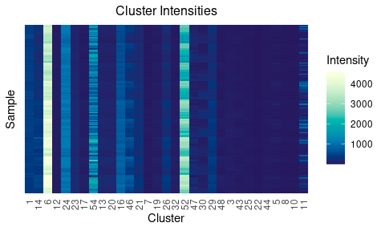
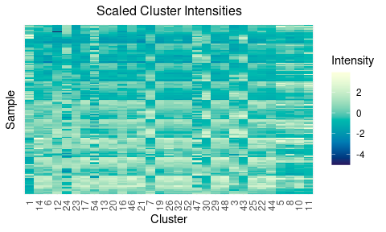
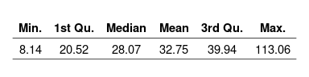
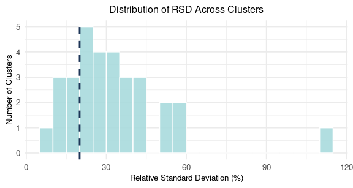

Analysis of GC-IMS Peak Table Stability
================
Tecla Duran Fort
2025-06-18

# 1. Load Peak Table

``` r
df <- read.csv("../../data/peak_table_pool.csv")
df <- df %>% rename(SampleID = 1)
```

## 1.1. Visualisation

<div class="figure" style="text-align: center">


<p class="caption">
Cluster intensity values across samples
</p>

</div>

<div class="figure" style="text-align: center">


<p class="caption">
Scaled Cluster intensity values across samples
</p>

</div>

**Scaling:** (`scale(x, center = TRUE, scale = TRUE)`) is done by: -
**Centering** by subtracting the column means - **Scaling** by dividing
the (centered) columns of x by their standard deviations.

# 2. Stability of the Peaks

This analysis builds upon two previous reports: the [linearity
analysis](https://github.com/tecladuran/gcims-workflows/blob/main/docs/linearity_report.md),
which demonstrated strong temporal trends in signal intensity and
motivated the use of `batch` as an ordinal numeric variable; and the
[baseline correction
report](https://github.com/tecladuran/gcims-workflows/blob/main/docs/baseline_correction.pdf),
which addressed signal overestimation due to background effects in
GC-IMS data. These preprocessing steps form the foundation for the
current evaluation of signal stability across sessions.

## 2.1. Relative Standard Deviation (RSD)

In this section, we assess the technical variability of each cluster by
computing the Relative Standard Deviation (RSD) of its intensity values
across repeated measurements:

$$
RSD (\%) = \frac{\text{Standard Deviation}}{\text{Mean}} \times 100
$$

Relative Standard Deviation (RSD), or Coefficient of Variation (CV),
which are typically considered equivalent in this context, are commonly
used to quantify the variability of a given feature—such as the
intensity of a detected compound—across replicate measurements (e.g.,
repeated injections or pooled QC samples in metabolomics studies) (Zhang
et al., 2020; Schiffman et al., 2019; Sarmad et al., 2022).

### 2.1.1. Computing the RSD per cluster

In GC-IMS data analysis, peaks detected across different samples can be
grouped into clusters when they are assumed to originate from the same
compound (see the previous [preprocessing
workflow](https://github.com/tecladuran/gcims-workflows/blob/80be09c30e45e30f9927c6f2b151663f54e35963/docs/Full_workflow.md)
with GCIMS package) . Their intensity values in each sample reflect the
abundance or concentration of the corresponding compound. Therefore, the
**intensity of each cluster across samples** becomes the **feature we
evaluate when assessing technical stability across replicate
measurements.**

To do so, we compute the Relative Standard Deviation (RSD) for each
cluster across all 135 samples. The RSD expresses the variation of a
signal relative to its average intensity, allowing us to identify
clusters that show stable responses across the dataset versus those
affected by technical variability.

**Summary Statistics of RSD Values**

<div class="figure" style="text-align: center">


<p class="caption">
Summary statistics of RSD values
</p>

</div>

#### RSD Values Distribution

.

<div class="figure" style="text-align: center">


<p class="caption">
Distribution of RSD values across all clusters
</p>

</div>

The histogram shows the distribution of RSD values across all clusters
in the corrected peak table. Most clusters exhibit RSD values between
15% and 50%, although some extend beyond this range, with one exceeding
100%. A dashed vertical line marks the 20% threshold, which we use as a
reference point based on common practices in metabolomics (as further
discussed below).

## 2.2. Assessment of Stable Clusters Based on RSD

In the context of metabolomics data analysis, it is common practice to
filter out features that exhibit excessive variability from the dataset:
features with a CV above **20–30%** are typically filtered out to retain
only reproducible signals (Zhang et al., 2020; Schiffman et al., 2019;
Sarmad et al., 2022).

Although our experimental context differs, we adopt a **20% RSD
threshold** as an **orientative reference** to evaluate **how many
clusters exhibit variability levels in line with those considered
acceptable in similar contexts**. This threshold is not applied as a
strict filter, but rather as a descriptive benchmark for technical
stability.

<div class="figure" style="text-align: center">


<p class="caption">
Summary of cluster stability
</p>

</div>

Only 22.6% of the clusters exhibit a relative standard deviation below
20%, suggesting that a small subset of the clusters, which likely
correspond to specific metabolites, are stable across the dataset and
may be considered for further analysis. This highlights the presence of
substantial variability among many features.

# 3. References

- Zhang, X., Dong, J., & Raftery, D. (2020). *Five Easy Metrics of Data
  Quality for LC–MS-Based Global Metabolomics*. Analytical Chemistry,
  92(17), 12925–12933. <https://doi.org/10.1021/acs.analchem.0c01493>

- Schiffman, C. et al. (2019). *Filtering procedures for untargeted
  LC-MS metabolomics data.* BMC Bioinformatics, 20, 334.
  <https://doi.org/10.1186/s12859-019-2871-9>

- Sarmad, S., Viant, M. R., Dunn, W. B., Goodacre, R., Wilson, I. D.,
  Chappell, K. E., Griffin, J. L., O’Donnell, V. B., Naicker, B.,
  Lewis, M. R., Suzuki, T., & UK Consortium on Metabolic Phenotyping
  (MAP/UK). (2022). *A proposed framework to evaluate the quality and
  reliability of targeted metabolomics assays from the UK Consortium on
  Metabolic Phenotyping (MAP/UK)*. Nature Protocols, 17(7), 1808–1820.
  <https://doi.org/10.1038/s41596-022-00801-8>
