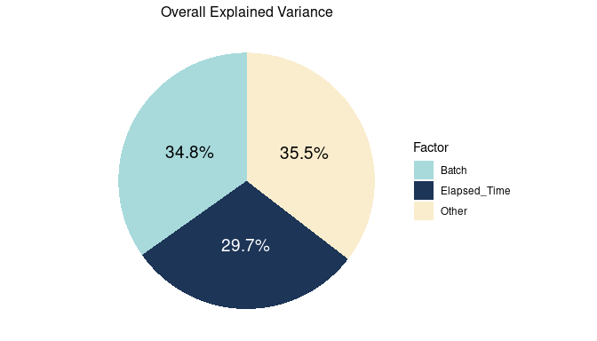

Analysis of Variability Sources: Batch and Elapsed Time
================
Tecla Duran Fort
2025-06-06

**Load Peak Table**

``` r
df <- read.csv("../../data/peak_table_pool.csv")
df <- df %>% rename(SampleID = 1)
```

# 1. Compute Time Variables

## 1.1. Extract Datetime from SampleID

``` r
df$datetime <- as.POSIXct(substr(df$SampleID, 1, 13), format = "%y%m%d_%H%M%S")
head(df[, c("SampleID", "datetime")])
```

    ##        SampleID            datetime
    ## 1 240319_132915 2024-03-19 13:29:15
    ## 2 240319_144050 2024-03-19 14:40:50
    ## 3 240319_155225 2024-03-19 15:52:25
    ## 4 240319_170400 2024-03-19 17:04:00
    ## 5 240319_181535 2024-03-19 18:15:35
    ## 6 240319_192710 2024-03-19 19:27:10

## 1.2. Compute *Batch* and *Elapsed Time* Variables

``` r
df$batch <- rep(1:9, each = 15)
df <- df %>%
  group_by(batch) %>%
  mutate(
    elapsed_time = as.numeric(difftime(datetime, min(datetime), units = "secs")) / 3600
  ) %>%
  ungroup()

head(df[, c("SampleID", "datetime", "batch", "elapsed_time")])
```

    ## # A tibble: 6 × 4
    ##   SampleID      datetime            batch elapsed_time
    ##   <chr>         <dttm>              <int>        <dbl>
    ## 1 240319_132915 2024-03-19 13:29:15     1         0   
    ## 2 240319_144050 2024-03-19 14:40:50     1         1.19
    ## 3 240319_155225 2024-03-19 15:52:25     1         2.39
    ## 4 240319_170400 2024-03-19 17:04:00     1         3.58
    ## 5 240319_181535 2024-03-19 18:15:35     1         4.77
    ## 6 240319_192710 2024-03-19 19:27:10     1         5.97

# 2. Association with Elapsed Time and Batch

## 2.1. Technical Variability in GC-IMS Data

In GC-IMS data analysis, technical factors such as **instrumental
drift** and **batch effects** can significantly impact the
reproducibility of measurements. These effects can arise from variations
in **environmental conditions** (e.g., temperature, pressure) and
**instrumental tolerances** (e.g., column aging, contamination). Such
variability can introduce noise and misalign data, making it crucial to
assess how these factors influence the stability of the clusters in the
dataset (Rodríguez-Pérez et al., 2018; Fernández et al., 2019).

## 2.2. Methodology

We evaluate the influence of **elapsed time** (the time between the
start of the batch and the analysis of a given sample) and the **batch
number** (grouping of samples analyzed together) on the **intensity of
the clusters**.

### Elapsed Time

Due to the way the study was conducted, **elapsed time** is indirectly
related to the time a sample remained at ambient temperature before
analysis, as samples were initially stored frozen. This variable
reflects the potential degradation or changes in sample composition due
to temperature exposure over time.

### Batch Number

**Batch number** encodes both the measurement day and the grouping of
samples processed together. This captures: - Possible differences in
instrumental conditions between days, - The number of measurement cycles
(i.e., how many times the instrument was restarted or calibrated), - The
time elapsed since sample collection, as all samples were originally
collected simultaneously but processed in separate batches.

Together, these variables represent **temporal and procedural sources of
variability** that may influence the measured signal intensities.

### Quantifying Explained Variance with $R^2$

To evaluate the extent to which each variable explains the variation in
cluster intensity, we compute the **coefficient of determination** $R^2$
for each column (i.e., the intensity of each cluster across samples)
separately, using two independent linear models: - One with **elapsed
time** as the predictor, - One with **batch number** as the predictor.

The $R^2$ value is defined as:

$$
R^2 = 1 - \frac{SS_{\text{res}}}{SS_{\text{tot}}}
$$

where: - $SS_{\text{tot}} = \sum_{i=1}^{n} (y_i - \bar{y})^2$ is the
total sum of squares, representing the overall variance in the observed
values. - $SS_{\text{res}} = \sum_{i=1}^{n} (y_i - \hat{y}_i)^2$ is the
residual sum of squares, quantifying the part of the variance not
explained by the model.

Since both quantities are expressed in the same units, the ratio
$SS_{\text{res}} / SS_{\text{tot}}$ represents the proportion of
unexplained variance. Subtracting this from 1 yields the proportion of
variance explained by the model. Therefore, the $R^2$ value indicates
how much of the variability in cluster intensity is attributable to the
explanatory variable.

$$
R^2 = \frac{\text{Explained Variance}}{\text{Total Variance}}
$$

> **Note:** This approach captures only the **linear influence** of the
> explanatory variables on cluster intensities because the $R^2$
> computed here reflects how well a **linear model** can explain the
> variability in the data. Specifically, it quantifies the proportion of
> variance in signal intensity that is aligned with a **linear trend**
> in elapsed time or batch number. As such, the $R^2$ is closely related
> to the **squared Pearson correlation coefficient** between the
> predictor and the response variable. This means that only **linear
> associations** contribute to the explained variance, while **nonlinear
> effects**, **threshold behaviors**, or **interactions** are not
> captured. A more detailed justification for using linear models,
> including a discussion of their limitations and possible alternatives,
> is available in a supplementary document:
> [link-to-model-diagnostics.Rmd](https://github.com/username/project-name/blob/main/model-diagnostics.Rmd).

### Independence of Elapsed Time and Batch Number

To confirm that the two explanatory variables are statistically
independent, we compute the **Pearson correlation coefficient** between
**elapsed time** and **batch number**:

``` r
cor(df$elapsed_time, df$batch, method = "pearson")
```

    ## [1] 0.0144859

The result ($r = 0.01$) indicates negligible linear correlation,
justifying the separate analysis of these two factors.

### Analysis Procedure

1.  **Model fitting and R² computation**:
    - For each cluster, two univariate linear models are fitted:
      - One with **elapsed time** as the predictor,
      - One with **batch number** as the predictor.
    - The corresponding $R^2$ values indicate the proportion of variance
      in cluster intensity explained by each variable.
2.  **Estimation of residual variance**:
    - The remaining variance is approximated as: $$
      1 - (R^2_{\text{elapsed time}} + R^2_{\text{batch number}})
      $$
    - This residual variance captures the portion of variability not
      explained by the modeled variables, which may include instrumental
      noise, uncontrolled experimental factors, or latent sources of
      variability.

## 2.3. Visualization of Explained Variance

We present the results in a stacked bar chart, where each cluster is
represented by a bar. The different sections of each bar correspond to
the proportion of variance explained by **elapsed time**, **batch
number**, and **other factors**.


### Overall Contribution of Each Factor

To evaluate the overall contribution of each factor, we compute the
**mean $R^2$** across all clusters. Since each $R^2$ value represents
the proportion of variance explained in one cluster, taking the average
is equivalent to **summing the explained variance across all clusters
and dividing by the total variance**. In other words, the mean $R^2$
reflects the **overall fraction of variance in the dataset** that can be
attributed to each factor.

This approach gives a clear and interpretable summary of how much signal
variability is explained by **elapsed time**, **batch number**, and
**other factors** when considering the dataset as a whole.


<div class="figure" style="text-align: center">


<p class="caption">
Overall variance explained by elapsed time, batch number, and residual
sources
</p>

</div>

## 2.4. Conclusion

Based on the mean R² values, we can draw the following conclusions:

1.  **Elapsed Time** explains approximately **29.7%** of the variance in
    the intensities.

2.  **Batch Number** accounts for **34.8%** of the variance,

3.  The remaining **35.5%** of the variance is attributed to **Other
    factors**, which might include environmental influences,
    instrumental factors, or unmeasured variables.

If we were to remove the influence of Elapsed Time and Batch Number, we
would remove a combined 64.5% of the variance in the data. Since these
two factors are not correlated between them, their effects are additive,
meaning the total explained variance by Elapsed Time and Batch Number is
the sum of their individual contributions.

# 3. Principal Component Analysis

We will use Principal Component Analysis (PCA) as an **exploratory
tool** to assess how **elapsed time** and **batch number** influence the
intensity variations of the clusters.

We will plot the first two principal components (PC1 and PC2), which
capture the most significant variance in the data. If we observe clear
patterns or separations in the plots, it suggests that these factors are
influencing the measurements.

Additionally, we will evaluate the explained variance by the first few
components to understand how much of the overall variability in the data
is captured by each component.

<div class="figure" style="text-align: center">


<p class="caption">
PCA plot of cluster intensities colored by elapsed time
</p>

</div>

<div class="figure" style="text-align: center">


<p class="caption">
PCA plot of cluster intensities colored by batch number
</p>

</div>

<div class="figure" style="text-align: center">


<p class="caption">
Percentage of total variance explained by the first five principal
components
</p>

</div>

**Interpretation**

The PCA plots reveal how **elapsed time** and **batch number** impact
the data variability. The explained variance plot shows how much of the
total variance is explained by the first components.

# 4. References

- Rodríguez-Pérez, R., Cortés, R., Guamán, A., Pardo, A., Torralba, Y.,
  Gómez, F., Roca, J., Barberà, J. A., Cascante, M., & Marco, S. (2018).
  *Instrumental drift removal in GC-MS data for breath analysis: the
  short-term and long-term temporal validation of putative biomarkers
  for COPD*. Journal of Breath Research, 12(3), 036007.
  <https://doi.org/10.1088/1752-7163/aaa492>

- Fernandez, L., Blanco, A., Mallafré-Muro, C., & Marco, S. (n.d.).
  *Towards batch correction for GC-IMS data*. Department of Electronic
  and Biomedical Engineering, University of Barcelona; The Institute for
  Bioengineering of Catalonia.
