Cluster-Specific Baseline Correction in GC-IMS Data
================
Tecla Duran Fort
2025-04-13

# 0. Preprocessing

## 0.1. Setup

Enable or disable parallelization based on the need for detailed error
reporting or faster execution.

## 0.2. Dataset Creation

Creation of the dataset from the specified directory and files.

``` r
# Create annotations dataframe
samples_directory <- "/storage/projects/TargetML/Urine_Pool"
annotations <- read.csv(file.path(samples_directory, "annotations.csv"))
annotations <- annotations[which(annotations$Class=="Urine_pool"),]

# Create GCIMS dataset object
urine <- GCIMSDataset$new(
  annotations,
  base_dir = samples_directory,
  on_ram = FALSE)
urine
```

## 0.3. Pre-process

Pre-processing steps include filtering, smoothing, and decimating the
data to prepare it for further analysis.

``` r
# Filter by Drift Time (Dt)
filterDt(urine, dt = c(5, 17)) # in ms

# Smooth the data
smooth(urine, rt_length_s = 3, dt_length_ms = 0.14)

# Decimate the data to reduce size
decimate(urine, rt_factor = 1, dt_factor = 2)
urine$realize()
```

## 0.4. Alignment

Alignment of the samples based on the reference sample to standardize
the data across different runs.

``` r
reference <- 104
align(urine, reference_sample_idx = reference, align_dt = TRUE, 
      align_ip = TRUE, method_rt = "none") 
align(urine, reference_sample_idx = reference, align_dt = FALSE, 
      align_ip = FALSE, method_rt = "ptw", ploynomial_order= 2)
urine$realize()

# PTW adjustment to correct small mismatches in sample dimensions
filterDt(urine, dt_range = c(min(dtime(urine)),max(dtime(urine))))
filterRt(urine, rt_range = c(min(rtime(urine)),max(rtime(urine))))
```

Further alignment using a new method to ensure accurate peak detection.

``` r
# Align using new method with specified parameters
percentage_movement <- 0.2
align_pks_ds(urine, 104, percentage_movement)
urine$realize()
filterDt(urine, dt = c(5, 14)) # in ms
```

## 0.5. Peak Detection and Clustering

Peak detection and clustering to identify significant features in the
data.

``` r
findPeaks(
  urine,
  rt_length_s = 3,
  dt_length_ms = 0.14,
  verbose = TRUE,
  dt_peakwidth_range_ms = c(0.15, 0.4),
  rt_peakwidth_range_s = c(10, 25),
  dt_peakDetectionCWTParams = list(exclude0scaleAmpThresh = TRUE),
  rt_peakDetectionCWTParams = list(exclude0scaleAmpThresh = TRUE),
  dt_extension_factor = 0,
  rt_extension_factor = 0,
  exclude_rip = TRUE,
  iou_overlap_threshold = 0.2
)
peak_list <- peaks(urine)
```

``` r
peak_clustering <- clusterPeaks(
  peak_list,
  distance_method = "euclidean",
  dt_cluster_spread_ms = 0.1,
  rt_cluster_spread_s = 20,
  clustering = list(method = "hclust")
)
peak_list_clustered <- peak_clustering$peak_list_clustered
```

Creating and refining the peak table to include only relevant peaks
based on their representation across the samples.

``` r
integratePeaks(
  urine, 
  peak_clustering$peak_list, 
  integration_size_method = "fixed_size", 
  rip_saturation_threshold = 0.1
)
peak_list <- peaks(urine)
peak_table <- peakTable(peak_list, aggregate_conflicting_peaks = max)
```

## 0.6. Removing Underrepresented Clusters

Removing underrepresented clusters to maintain data reliability.

``` r
# Count non-NA values per cluster and determine their percentage representation
counts <- peak_table$peak_table %>%
  mutate(Count = rowSums(!is.na(across(-cluster)))) %>%
  select(cluster, Count)

counts <- counts %>%
  mutate(Percentage = (Count / nrow(annotations)) * 100)

threshold <- 25  

selected_clusters <- counts %>%
  filter(Percentage > threshold) %>%
  pull(cluster)  

peak_list <- peak_list %>% filter(cluster %in% selected_clusters)
peak_table <- peakTable(peak_list, aggregate_conflicting_peaks = max)
```

## 0.7. Impute Peak Table

In order to obtain a complete peak table with values for all clusters
across all samples, we apply the function `imputePeakTable()`. This step
fills in missing peak intensities by directly integrating the signal
within the fixed Region of Interest (ROI) defined for each cluster, even
in samples where no peak was originally detected.

The ROI coordinates used for imputation are stored in `cluster_stats`,
which contains the consensus boundaries assigned during clustering. The
result is a dense peak table where all clusters are consistently
represented.

``` r
peak_table_imputed <- imputePeakTable(
  peak_table$peak_table_matrix,
  urine,
  peak_clustering$cluster_stats
)
```

# 1. Correcting Baseline Affecting The Peak Table

In this section, we address the process of baseline correction, a
crucial step in accurate peak quantification in GC-IMS data analysis.
During peak integration, there is typically an overestimation of peak
volume because the peak does not start from zero but has a certain
background/baseline noise level. This overestimation can significantly
impact subsequent analyses, either because the overestimation is not
uniform across all peaks or, which is the actual case, it can lead to an
exaggerated perception of peak stability. Although various baseline
correction methods exist, this report focuses on removing this
background by optimizing a window around each peak and assuming it
constant (like an additive offset) within this window. This window is
adjusted relative to the fixed size of the Region of Interest (ROI) to
effectively contain and correct for the baseline noise.

## 1.1. Optimizing Patch Size for Baseline Removing

When detecting peaks in GC-IMS data, each peak is initially assigned
**fixed drift and retention time limits** (`fixedsize_dt_min_ms`,
`fixedsize_dt_max_ms`, `fixedsize_rt_min_s`, `fixedsize_rt_max_s`),
which is common in all the peaks belonging to the same cluster. However,
these predefined ranges might not fully capture the **baseline
intensity**, which is needed for proper signal correction.

We want to determine **how much to expand the peak detection range** to
ensure that the **baseline is included**, but **without making it larger
than necessary**.

- **The baseline is reached when the intensity stabilizes** (i.e., it
  stops decreasing with expansion).
- **A smaller patch is preferable**, as we assume the baseline is
  constant and larger patches could introduce unwanted variability.

Instead of taking the **minimum intensity**, we compute the **median of
the lowest 10% of intensity values** using `quantile()` function. This
provides a more robust estimation of the baseline.

Additionally, if the computed **MinValue is negative**, it is set to
**0** to avoid unrealistic values (it actually happens in one of the
clusters).

### Functions

##### `extractMinValues`

- Iterates through all samples and retrieves their detected peaks.
- Expands the peak’s drift and retention time ranges by `ampliation`.
- Extracts the intensity values in this **expanded patch** and computes
  the **median of the lower 10% quantile** `quantile(patch, 0.05)`.
- **Ensures MinValue is not negative** (sets negative values to 0).
- Returns `peak_list` with an updated `MinValue` column.

##### `extractMinValues_2`

- Works similarly but focuses on a **specific cluster** and a set number
  of samples (`n_samples`).
- Returns a **vector of MinValues**, without modifying `peak_list`.

#### Plot

- **X-axis:** Expansion percentage (`ampliation`).
- **Y-axis:** Baseline intensity (median of lower decile, with no
  negative values).
- **Lines:** Each sample’s intensity evolution.

By analyzing these curves, we identify the **minimum necessary
expansion** to capture the baseline **without excessive enlargement**.

### Visualisation In Specific Clusters

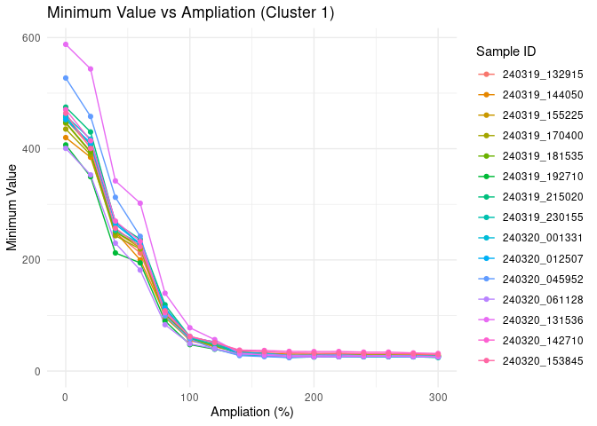

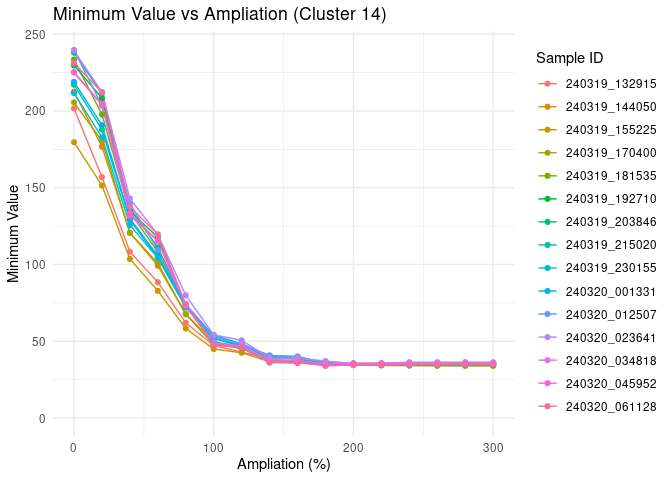

### Deciding a common ampliation

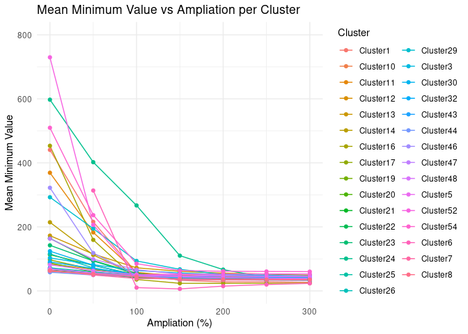

Based on these plots, we will adopt the **200%** ampliation value (i.e.,
double the size of the ROI), as most clusters appear to have stabilized
at a value that we will consider the baseline.

## 1.2. Correcting Baseline

During peak integration in GC-IMS data, a rectangular Region of Interest
(ROI) is used to quantify the signal associated with each peak. However,
the signal within this region may include a contribution from the
baseline, which can lead to overestimated peak volumes.

To correct this effect, we implement a baseline correction that
estimates the background signal for each cluster and subtracts it from
the imputed peak table. Although all steps are available as a standalone
function (`correctBaseline()`), we first describe the full procedure in
detail.

### 1.2.1. Calculating Fixed Size Area

During GC-IMS data analysis, each detected peak initially has its own
boundaries in retention time (rt) and drift time (dt). However, when
peaks are clustered using `clusterPeaks()`, a consensus Region of
Interest (ROI) is defined for each cluster.

If the `integration_size_method = "fixed_size"` is selected, this
fixed-size ROI is applied uniformly to all samples when integrating the
signal of that cluster — even if the individual peak shapes or positions
vary.

To estimate how much of the integrated volume may come from baseline
signal, we compute the *fixedsize_Area* of each ROI, which is common to
all peaks of the same cluster:

    fixedsize_Area = (fixedsize_dt_max_ms - fixedsize_dt_min_ms) × (fixedsize_rt_max_s - fixedsize_rt_min_s)

``` r
peak_list <- peak_list %>%
  mutate(
    fixedsize_Area = (fixedsize_dt_max_ms - fixedsize_dt_min_ms) * (fixedsize_rt_max_s - fixedsize_rt_min_s)
  )
```

This area is used to convert the estimated baseline intensity into a
volume contribution (intensity × area), which is then subtracted from
the imputed peak table.

Note: The existing `Area` column in the `peak_list` shows the size of
each individual peak’s rectangle. When using the `fixed_size` method,
integration is done over a common rectangle per cluster, so `Area` does
not match the region actually used for integration.

### 1.2.2. Estimating the Residual Volume

Once we have the fixed-size area, we estimate the residual volume — the
portion of signal attributable to the baseline — for each cluster in
each sample. This is done using the function `computeResidualVolume()`,
which performs the following steps:

- **Iterates through all clusters and samples**.
- **Expands** the fixed integration region by a given percentage
  (`ampliation`) to capture more surrounding baseline.
- **Extracts** the intensity values from the expanded region and
  computes the median of the lowest 10% (5th percentile).
- If no peak is detected in a given sample, it falls back to using
  global `cluster_stats` information to define the ROI.
- **Multiplies** the estimated background intensity by the fixed-size
  area to compute the residual volume.
- Returns a matrix-like dataframe with residual volume values for each
  cluster-sample pair.

``` r
residual_volume_df <- computeResidualVolume(
  dataset = urine,
  peak_list = peak_list,
  cluster_stats = peak_clustering$cluster_stats,
  ampliation = 200
)
residual_volume_df <- as.data.frame(t(residual_volume_df))
```

### 1.2.3. Correcting the Peak Table

We now apply the baseline correction by subtracting the residual volumes
from the peak table:

``` r
peak_table_imputed_df <- as.data.frame(peak_table_imputed)
peak_table_corrected <- peak_table_imputed_df - residual_volume_df
```

### 1.2.4. Full Correction with `correctBaseline()`

To simplify and reproduce the full baseline correction workflow, all the
steps above can be executed in a single function:

``` r
peak_table_corrected <- correctBaseline(
  dataset = urine,
  peak_list = peak_list,
  cluster_stats = peak_clustering$cluster_stats,
  ampliation = 200
)
```

This function internally performs the fixed-size area calculation,
residual volume estimation, imputation, and subtraction.

### 1.2.5. Visualizing the Effect of Baseline Correction

We can compare the imputed vs. baseline-corrected values across
clusters:

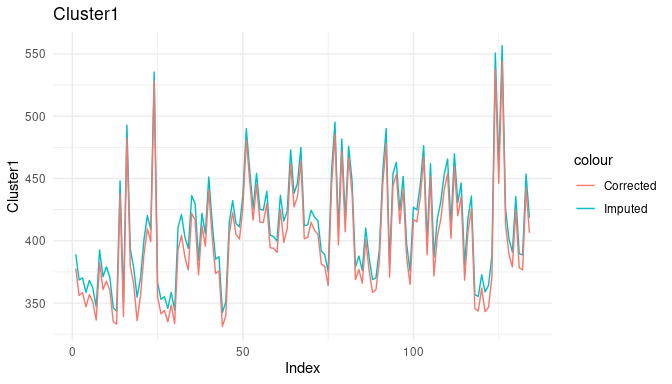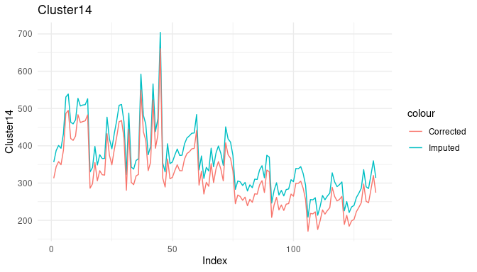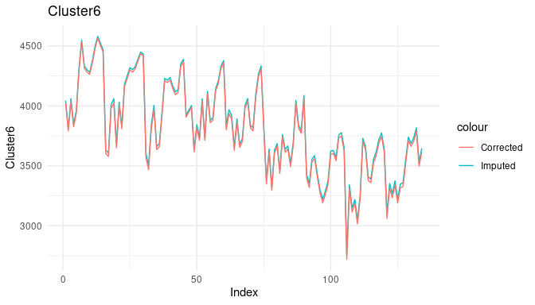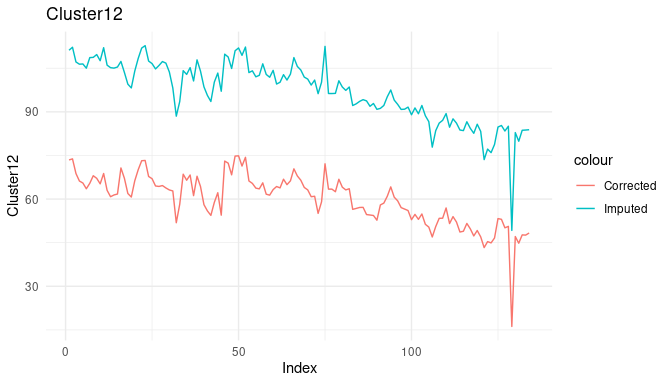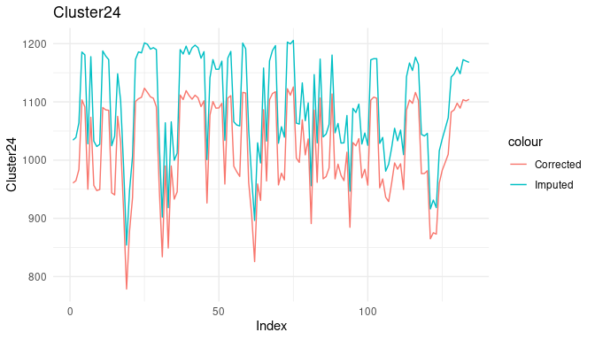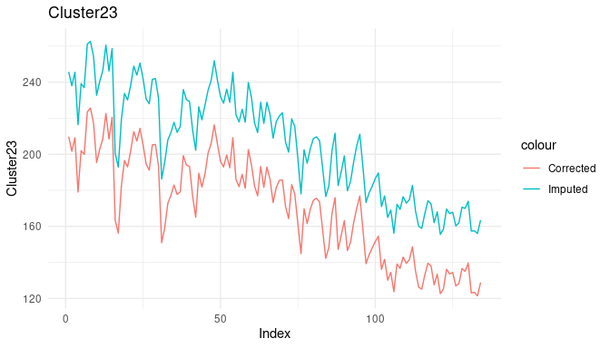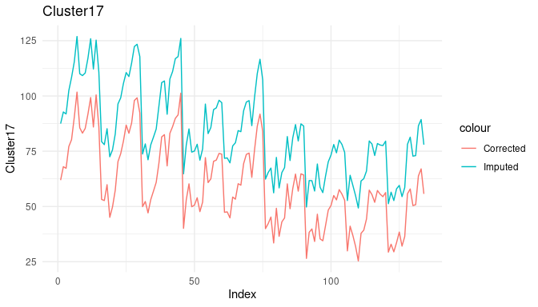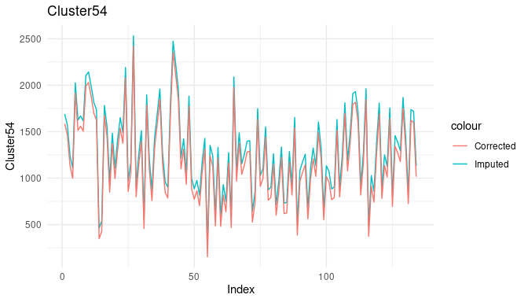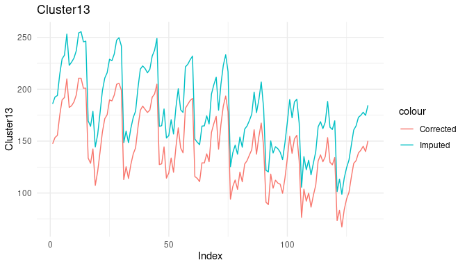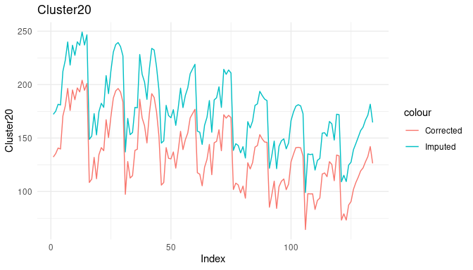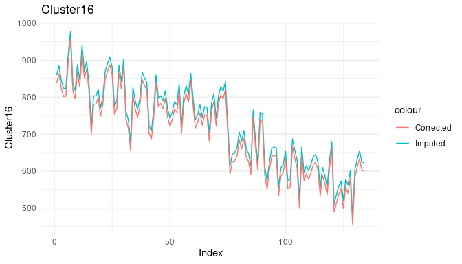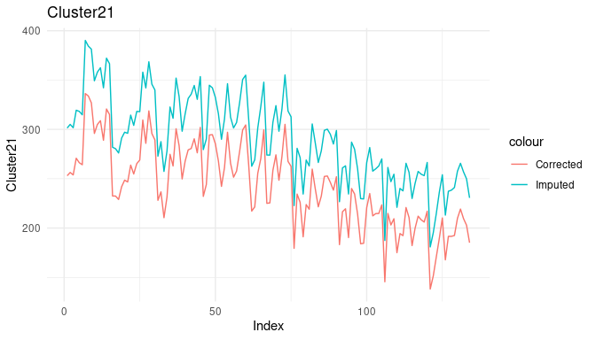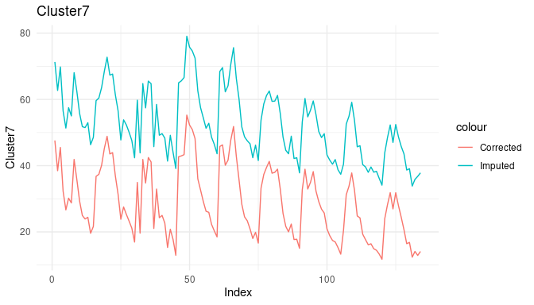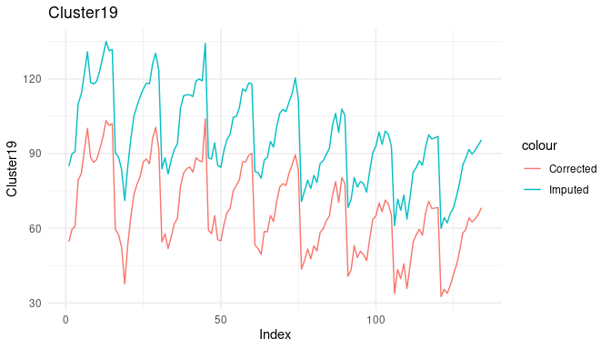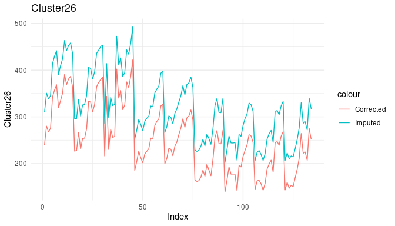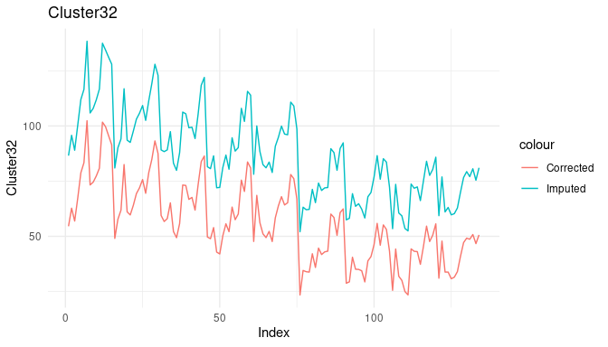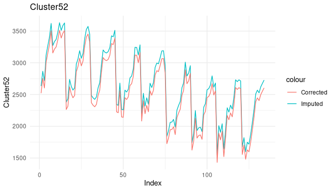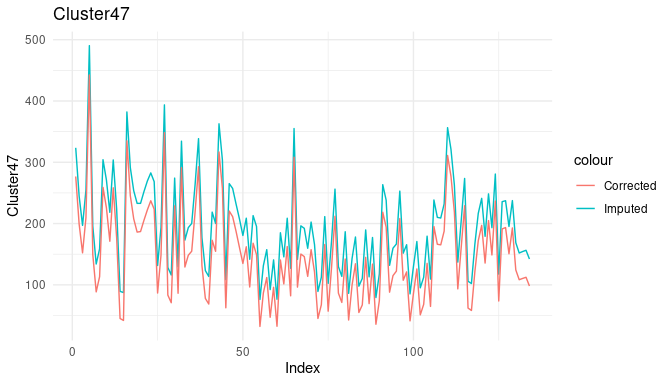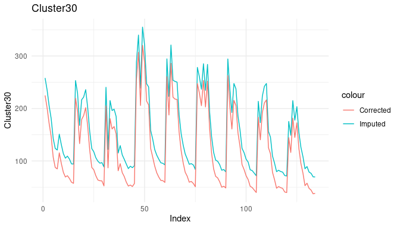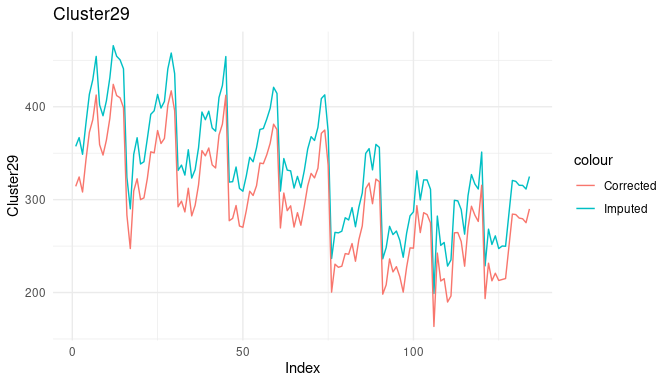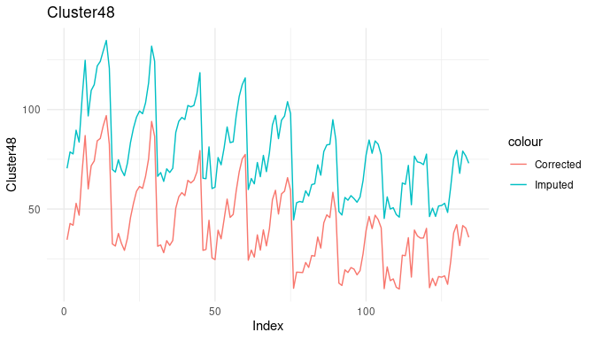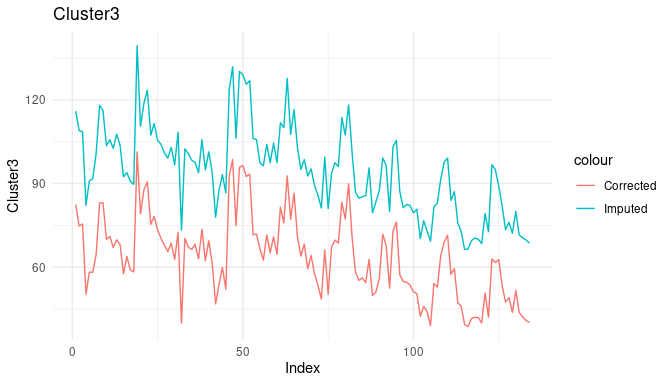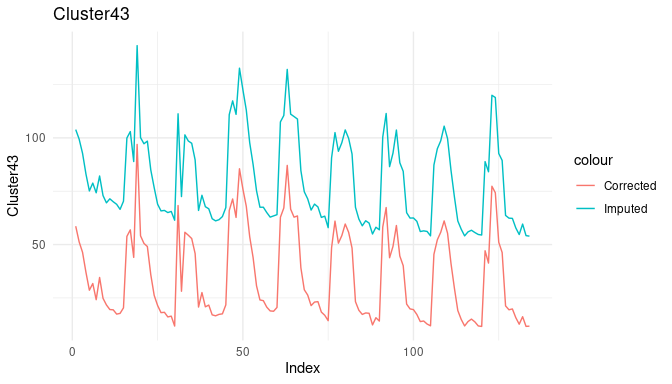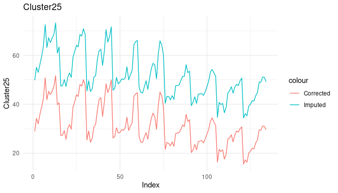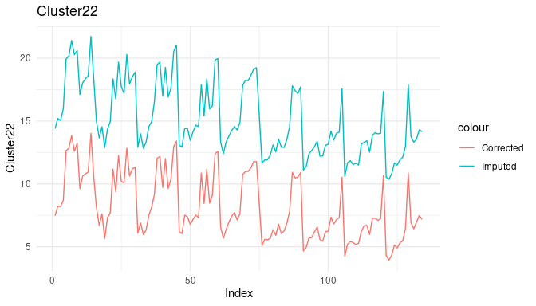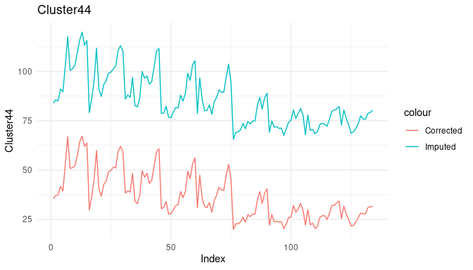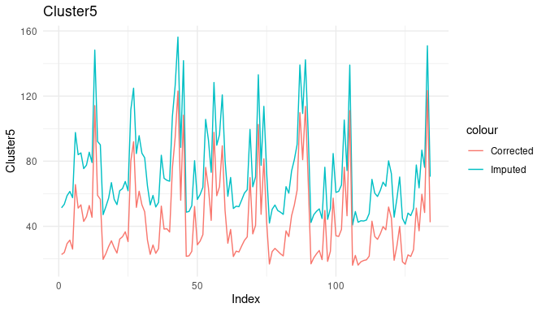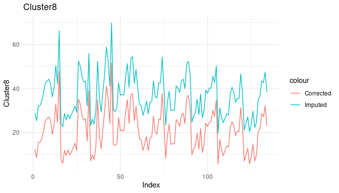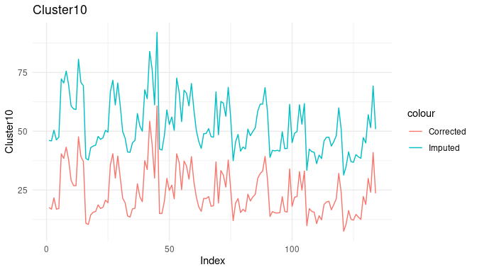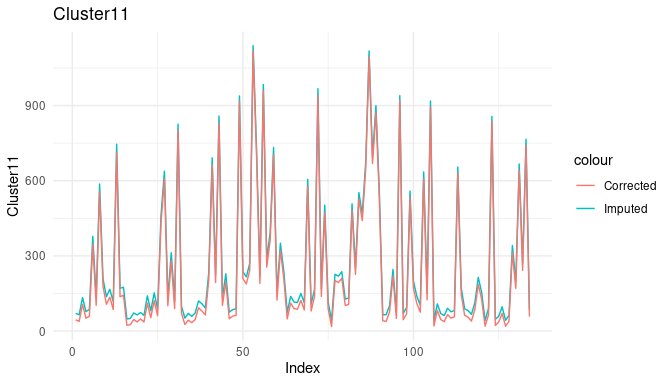
