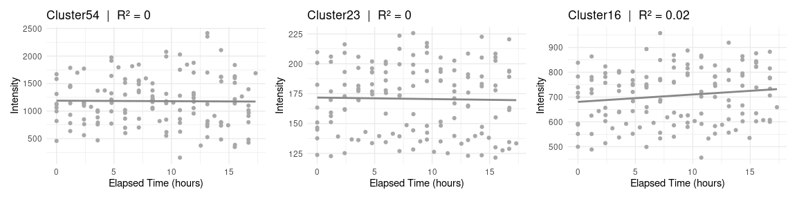

Linear Association Analysis in GC-IMS Data
================
Tecla Duran Fort
2025-04-16

# 1. Intra-batch linearity

This section focuses on **within-session trends**, assessing whether
intensity drifts during a batch (e.g. due to instrument drift or
temperature rise over time).

## Linear association with `elapsed_time`

We analyse the potential **intra-day variability** in signal intensity
by measuring how well it correlates with `elapsed_time`.

This variable indicates the time (in **hours**) that has passed since
the beginning of the measurement session (**i.e., since the start of the
batch**) until each sample was analysed. It captures whether the
position of a sample within a batch has a linear effect on signal
intensity, for example due to chemical degradation at ambient
temperature or instrumental drift.

Since `elapsed_time` and intensity are both continuous variables defined
at **sample level**, we directly apply a linear model without any
aggregation.

### Higher $R^2$

### Lower $R^2$

# 2. Inter-batch linearity

This section investigates **between-day linear trends** by testing
whether signal intensities vary systematically across measurement
sessions (batches).

## 2.1. Linear association with batch index

Now we explore **inter-day variability**, using the variable `batch` as
a proxy for measurement session.

Although `batch` is a discrete index, it reflects an underlying
**temporal order**, with each batch corresponding to a different day or
instrumental session. Thus, we model it as a continuous ordinal variable
to test whether signal intensities change systematically across
sessions.

### Higher $R^2$

### Lower $R^2$

## 2.2. Linearity with batch index **(mean intensity)**

While the batch index reflects a temporal sequence, it is inherently a
**categorical variable**, and assuming a linear relationship with
intensity is not straightforward. Although a linear trend has been
observed empirically, we seek to determine **whether modeling `batch` as
a numeric, temporally ordered variable is meaningful**, or whether
alternative methods treating it as categorical would be more
appropriate.

To support this evaluation, we apply a **batch-wise averaging
strategy**, which reduces intra-batch noise and helps reveal whether
signal intensities evolve systematically across measurement sessions.

We then calculate $R^2$ values from linear models fitted on these mean
intensities:

### Higher $R^2$

### Lower $R^2$

The histogram shows that a large proportion of clusters exhibit a strong
linear association between mean intensity and batch index. This
consistent trend across sessions supports the decision to treat `batch`
as a **numeric ordinal variable** in subsequent analyses, as it
effectively captures a systematic temporal component in the data.

### Methodological justification

Using `batch` as a numeric variable enables the detection of linear
trends across sessions. Treating it as a categorical factor would
require as many coefficients as batches, increasing model complexity and
making interpretation difficult.

## 2.3. Linear association with storage time

Batch numbers do not represent equally spaced time intervals. To account
for potential degradation over time, we define `storage_time` as the
number of days between the first measurement and each sample’s analysis
date. Since all samples were collected on the same day, this variable
captures differences in storage duration across sessions.

As with the batch analysis, we compute **mean intensities per batch**
and assess their linear relationship with `storage_time`.

#### Higher $R^2$

#### Lower $R^2$

## 2.4 Comparison of R² Distributions

To evaluate whether **batch index** or **storage time** better explains
the variability in signal intensity, we compare the distributions of
their corresponding $R^2$ values. Both variables are temporally
structured, but differ in nature: `storage_time` is continuous and
absolute, while `batch` is an ordinal index tied to measurement
sessions.

We observe that the distribution of $R^2$ values for `batch` is clearly
shifted towards higher values. This indicates that modeling intensity as
a function of `batch` yields **stronger and more consistent linear
relationships** across clusters.

## 2.5. Summary and Decision

We conclude that the batch index captures not only temporal drift, but
also additional session-specific effects that are not fully explained by
storage duration alone. In subsequent analyses, **we will use the batch
index as a numeric proxy to assess inter-session variability and account
for systematic differences across measurement days.**
