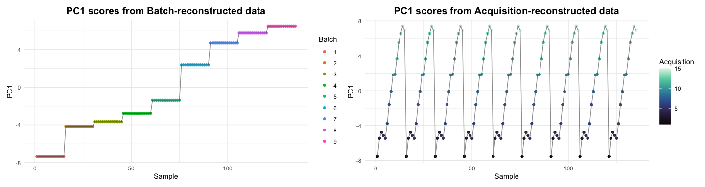
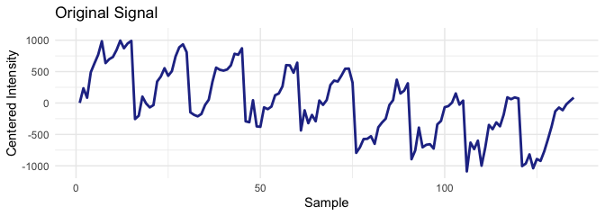
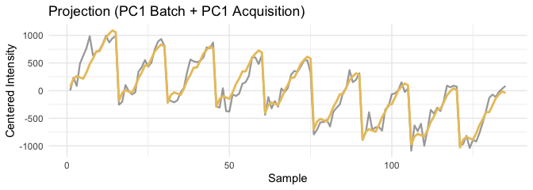
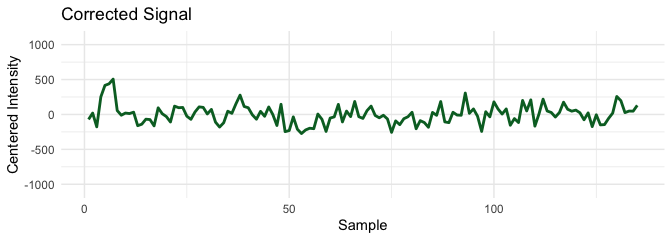

Joint Orthogonal Correction using PC1 of Batch and Order Effects
================
Tecla Duran Fort
2025-09-26

- <a href="#1-load-data" id="toc-1-load-data">1. Load Data</a>
- <a href="#2-design-matrices" id="toc-2-design-matrices">2. Design
  Matrices</a>
- <a href="#3-pca-of-batch-and-order-reconstructions"
  id="toc-3-pca-of-batch-and-order-reconstructions">3. PCA of Batch and
  Order Reconstructions</a>
  - <a href="#visualize-pc1-scores" id="toc-visualize-pc1-scores">Visualize
    PC1 Scores</a>
- <a href="#4-joint-orthogonal-correction"
  id="toc-4-joint-orthogonal-correction">4. Joint Orthogonal
  Correction</a>
- <a href="#5-visualization-of-correction"
  id="toc-5-visualization-of-correction">5. Visualization of
  Correction</a>
- <a href="#6-pca-before-and-after-correction"
  id="toc-6-pca-before-and-after-correction">6. PCA Before and After
  Correction</a>

# 1. Load Data

``` r
df <- read.csv("../../data/peak_table_var.csv")

# Intensity matrix
X <- as.matrix(df %>% dplyr::select(starts_with("Cluster")))
```

# 2. Design Matrices

``` r
# One-hot encoding for batch
B <- model.matrix(~ 0 + factor(df$batch))
colnames(B) <- paste0("Batch_", sort(unique(df$batch)))

# Order index per batch
df <- df %>%
  arrange(batch, elapsed_time) %>%
  group_by(batch) %>%
  mutate(order_in_batch = row_number()) %>%
  ungroup()

# One-hot encoding for order
O <- model.matrix(~ 0 + factor(df$order_in_batch))
colnames(O) <- paste0("Ord_", 1:max(df$order_in_batch))
```

# 3. PCA of Batch and Order Reconstructions

``` r
# Batch means and PCA
X_batch_means <- B %*% (solve(t(B)%*%B) %*% t(B) %*% X)
pca_batch <- prcomp(X_batch_means, scale. = TRUE)
pc1_batch <- pca_batch$x[,1, drop=FALSE]

# Order means and PCA
X_order_means <- O %*% (solve(t(O)%*%O) %*% t(O) %*% X)
pca_order <- prcomp(X_order_means, scale. = TRUE)
pc1_order <- pca_order$x[,1, drop=FALSE]
```

## Visualize PC1 Scores

<!-- -->

# 4. Joint Orthogonal Correction

``` r
# Apply correction jointly with both directions as external variables
joint_corr <- orthogonal_correction(X, cbind(pc1_batch, pc1_order))

X_corr_joint <- joint_corr$corrected
proj_joint   <- joint_corr$projection
```

# 5. Visualization of Correction

<!-- --><!-- --><!-- -->

# 6. PCA Before and After Correction

<!-- -->
