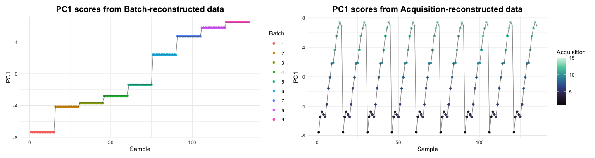
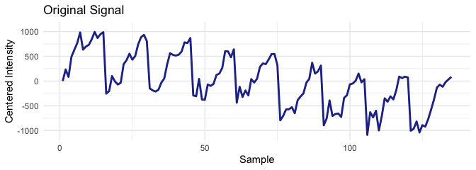
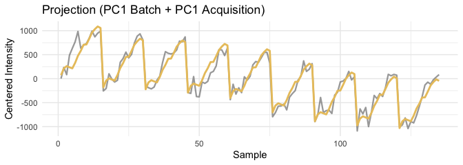
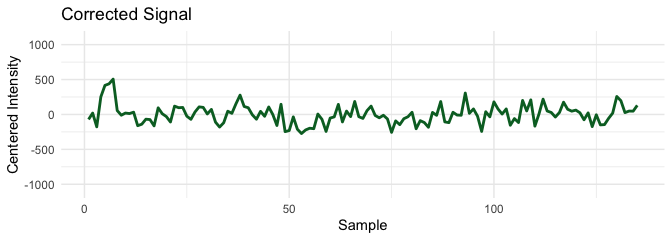
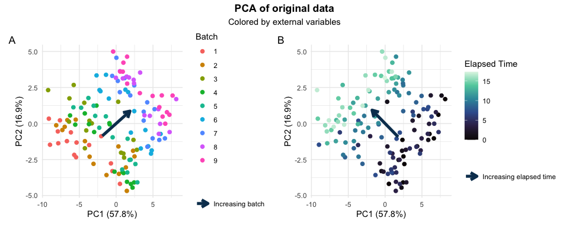
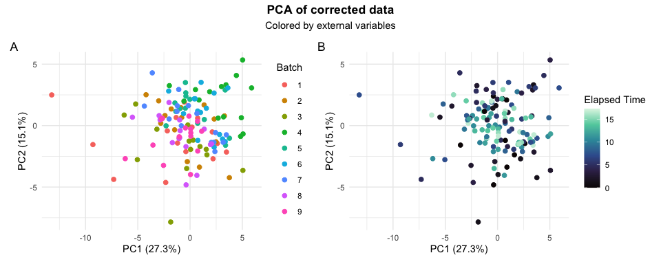

Orthogonal Correction using PC1 of Batch and Acquisition Effects
================
Tecla Duran Fort
2026-03-05

- [1. Load Data](#1-load-data)
- [2. Design Matrices](#2-design-matrices)
- [3. PCA of Batch and Acquisition
  Reconstructions](#3-pca-of-batch-and-acquisition-reconstructions)
  - [Visualize PC1 Scores](#visualize-pc1-scores)
- [4. Orthogonal Correction](#4-orthogonal-correction)
- [5. Visualization of Correction](#5-visualization-of-correction)
- [6. PCA Before and After
  Correction](#6-pca-before-and-after-correction)

# 1. Load Data

``` r
df <- read.csv("../../data/peak_table_var.csv")

# Intensity matrix
X <- as.matrix(df %>% dplyr::select(starts_with("Cluster")))
```

# 2. Design Matrices

``` r
# One-hot encoding for batch
B <- model.matrix(~ 0 + factor(df$batch))
colnames(B) <- paste0("Batch_", sort(unique(df$batch)))

# Acquisition index per batch
df <- df %>%
  arrange(batch, elapsed_time) %>%
  group_by(batch) %>%
  mutate(acquisition_index = row_number()) %>%
  ungroup()

# One-hot encoding for acquisition index
A <- model.matrix(~ 0 + factor(df$acquisition_index))
colnames(A) <- paste0("Acq_", 1:max(df$acquisition_index))
```

# 3. PCA of Batch and Acquisition Reconstructions

``` r
# Batch means and PCA
X_batch_means <- B %*% (solve(t(B)%*%B) %*% t(B) %*% X)
pca_batch <- prcomp(X_batch_means, scale. = TRUE)
pc1_batch <- pca_batch$x[,1, drop=FALSE]

# Acquisition means and PCA
X_acq_means <- A %*% (solve(t(A)%*%A) %*% t(A) %*% X)
pca_acq <- prcomp(X_acq_means, scale. = TRUE)
pc1_acq <- pca_acq$x[,1, drop=FALSE]
```

## Visualize PC1 Scores

<!-- -->

# 4. Orthogonal Correction

``` r
# Apply correction jointly with both directions as external variables
joint_corr <- orthogonal_correction(X, cbind(pc1_batch, pc1_acq))

X_corr_joint <- joint_corr$corrected
proj_joint   <- joint_corr$projection
```

# 5. Visualization of Correction

<!-- --><!-- --><!-- -->

# 6. PCA Before and After Correction

<!-- -->

<!-- -->
