Stability After Batch Correction: 1 PC vs 2 PCs
================
Tecla Duran Fort
2025-09-05

- <a href="#load-data" id="toc-load-data">Load Data</a>
- <a href="#correcting-only-batch"
  id="toc-correcting-only-batch">Correcting Only Batch</a>
  - <a href="#setup" id="toc-setup">Setup</a>
  - <a href="#build-1-pc-and-2-pc-batch-corrections"
    id="toc-build-1-pc-and-2-pc-batch-corrections">Build 1-PC and 2-PC Batch
    Corrections</a>
  - <a href="#results" id="toc-results">Results</a>
    - <a href="#stability-rsd-before-vs-after"
      id="toc-stability-rsd-before-vs-after">Stability (RSD) Before vs
      After</a>
    - <a href="#pca-colored-by-batch" id="toc-pca-colored-by-batch">PCA
      Colored by Batch</a>
- <a href="#results-correcting-order-time-first"
  id="toc-results-correcting-order-time-first">Results Correcting Order
  (time) First</a>

# Load Data

``` r
df <- read.csv("../../data/peak_table_var.csv")

# Peak table matrix (samples x peaks)
X <- as.matrix(df %>% dplyr::select(starts_with("Cluster")))
stopifnot(nrow(X) == nrow(df))

# Batch encoding
batch <- df$batch
nbatch <- length(unique(batch))
B <- model.matrix(~ 0 + factor(batch))
colnames(B) <- paste0("Batch_", sort(unique(batch)))

# (Kept same initialization style; order/time not used further here)
```

# Correcting Only Batch

## Setup

``` r
# Batch-wise means (samples -> batches)
batch_sizes <- as.vector(t(B) %*% rep(1, nrow(X)))
batch_sums  <- t(B) %*% X
M           <- sweep(batch_sums, 1, batch_sizes, "/")  # (nbatch x nvars)

# Map means back to sample space (scores live in sample space)
X_batch_means <- B %*% M

# PCA on batch-wise mean intensities
pca_batch <- prcomp(X_batch_means, scale. = TRUE)
pc_scores <- pca_batch$x            # (samples x PCs) -> sample-space PCs
pc_axis   <- axis_labels_from_pca(pca_batch)
```

## Build 1-PC and 2-PC Batch Corrections

``` r
# 1 PC removal: project out PC1 from X
X_batch_1PC <- orthogonal_correction(X, pc_scores[,1])$corrected

# 2 PCs removal: sequentially remove PC1 then PC2
X_batch_2PC <- orthogonal_correction(orthogonal_correction(X, pc_scores[,1])$corrected, pc_scores[,2])$corrected
```

## Results

### Stability (RSD) Before vs After

``` r
# RSD per peak (column-wise)
rsd_before   <- apply(X,            2, rsd_vec)
rsd_after_1  <- apply(X_batch_1PC,  2, rsd_vec)
rsd_after_2  <- apply(X_batch_2PC,  2, rsd_vec)

rsd_long <- tibble(
  peak = colnames(X),
  Original = rsd_before,
  `Batch-1PC` = rsd_after_1,
  `Batch-2PC` = rsd_after_2
) |>
  pivot_longer(-peak, names_to = "State", values_to = "RSD") |>
  filter(!is.na(RSD))
rsd_long$State <- factor(rsd_long$State,
                         levels = c("Original", "Batch-1PC", "Batch-2PC"))
# Quick summary table
rsd_summary <- rsd_long |>
  group_by(State) |>
  summarize(
    n = n(),
    median_RSD = median(RSD),
    mean_RSD = mean(RSD),
    pct_RSD_lt_20 = mean(RSD < 20)*100,
    .groups = "drop"
  )

kable(rsd_summary, digits = 2, caption = "RSD summary by state") |>
  kable_styling(full_width = FALSE, position = "center")
```

<table class="table" style="width: auto !important; margin-left: auto; margin-right: auto;">
<caption>
RSD summary by state
</caption>
<thead>
<tr>
<th style="text-align:left;">
State
</th>
<th style="text-align:right;">
n
</th>
<th style="text-align:right;">
median_RSD
</th>
<th style="text-align:right;">
mean_RSD
</th>
<th style="text-align:right;">
pct_RSD_lt_20
</th>
</tr>
</thead>
<tbody>
<tr>
<td style="text-align:left;">
Original
</td>
<td style="text-align:right;">
31
</td>
<td style="text-align:right;">
28.07
</td>
<td style="text-align:right;">
32.75
</td>
<td style="text-align:right;">
22.58
</td>
</tr>
<tr>
<td style="text-align:left;">
Batch-1PC
</td>
<td style="text-align:right;">
31
</td>
<td style="text-align:right;">
20.70
</td>
<td style="text-align:right;">
27.39
</td>
<td style="text-align:right;">
41.94
</td>
</tr>
<tr>
<td style="text-align:left;">
Batch-2PC
</td>
<td style="text-align:right;">
31
</td>
<td style="text-align:right;">
20.31
</td>
<td style="text-align:right;">
26.55
</td>
<td style="text-align:right;">
45.16
</td>
</tr>
</tbody>
</table>

#### Histograms

``` r
ggplot(rsd_long, aes(x = RSD, fill = State)) +
  geom_histogram(position = "identity", alpha = 0.45, bins = 30) +
  scale_fill_manual(values = pal3) +
  theme_minimal() +
  labs(title = "Peak-wise RSD distributions",
       x = "RSD (%)", y = "Count", fill = "State")
```

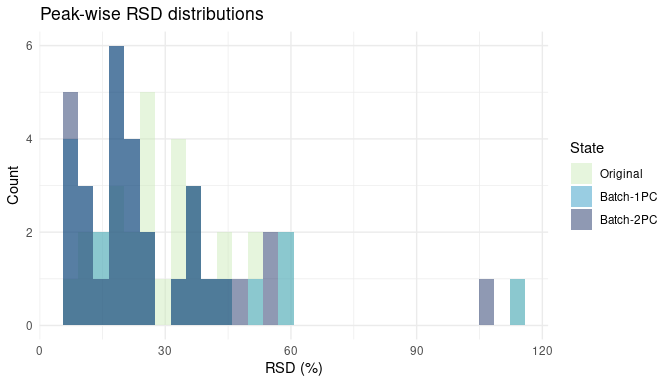<!-- -->

``` r
ggplot(rsd_long, aes(x = RSD, fill = State)) +
  geom_histogram(alpha = 0.7, bins = 20, color = "white") +
  scale_fill_manual(values = pal3) +
  facet_wrap(~State, nrow = 1) +
  theme_minimal(base_size = 11) +
  labs(title = "Peak-wise RSD distributions by state",
       x = "RSD (%)", y = "Count")
```

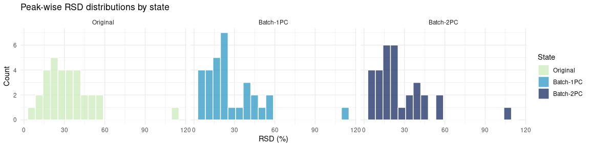<!-- -->

#### Violin plots

``` r
ggplot(rsd_long, aes(x = State, y = RSD, fill = State)) +
  geom_violin(trim = FALSE, alpha = 0.5, color = NA) +
  geom_boxplot(width = 0.12, outlier.size = 0.7, alpha = 0.6) +
  scale_fill_manual(values = pal3) +
  theme_minimal(base_size = 11) +
  labs(title = "Peak-wise RSD distributions",
       x = "State", y = "RSD (%)") +
  theme(legend.position = "none")
```

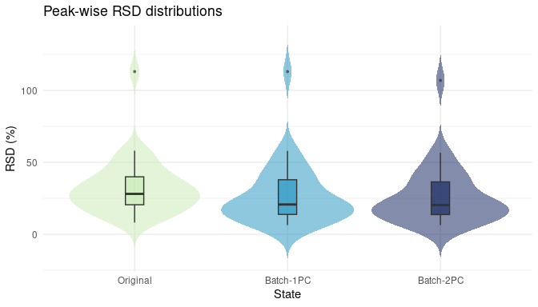<!-- -->

### PCA Colored by Batch

``` r
pca_orig <- prcomp(X, scale. = TRUE)
scores_orig <- as.data.frame(pca_orig$x)[,1:2]
colnames(scores_orig) <- c("PC1","PC2")
scores_orig$batch <- factor(batch)
attr(scores_orig, "axis_labels") <- axis_labels_from_pca(pca_orig)

plot_pca(scores_orig, "batch", "PCA (Original) — colored by Batch", scale_batch)
```

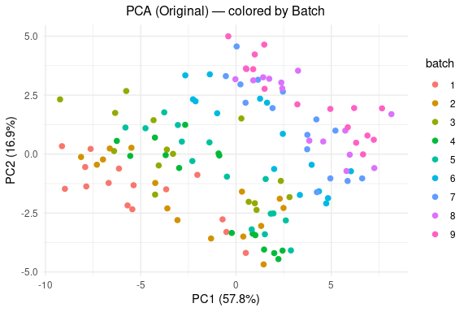<!-- -->

``` r
pca_1 <- prcomp(X_batch_1PC, scale. = TRUE)
scores_1 <- as.data.frame(pca_1$x)[,1:2]
colnames(scores_1) <- c("PC1","PC2")
scores_1$batch <- factor(batch)
attr(scores_1, "axis_labels") <- axis_labels_from_pca(pca_1)

plot_pca(scores_1, "batch", "PCA (Batch correction: remove 1 PC)", scale_batch)
```

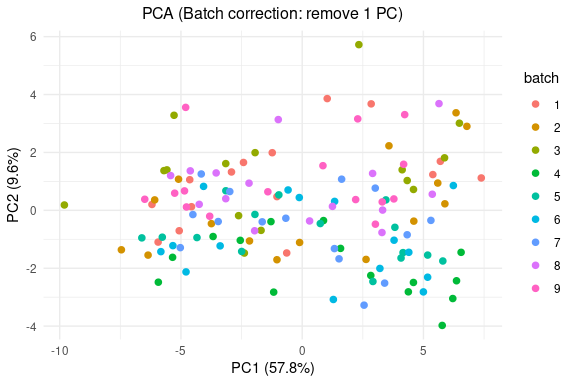<!-- -->

``` r
pca_2 <- prcomp(X_batch_2PC, scale. = TRUE)
scores_2 <- as.data.frame(pca_2$x)[,1:2]
colnames(scores_2) <- c("PC1","PC2")
scores_2$batch <- factor(batch)
attr(scores_2, "axis_labels") <- axis_labels_from_pca(pca_2)

plot_pca(scores_2, "batch", "PCA (Batch correction: remove 2 PCs)", scale_batch)
```

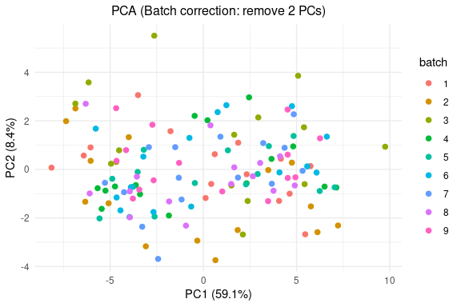<!-- -->

# Results Correcting Order (time) First

<table class="table" style="width: auto !important; margin-left: auto; margin-right: auto;">
<caption>
RSD summary (Original, After Order, Order+Batch-1PC, Order+Batch-2PC)
</caption>
<thead>
<tr>
<th style="text-align:left;">
State
</th>
<th style="text-align:right;">
n
</th>
<th style="text-align:right;">
median_RSD
</th>
<th style="text-align:right;">
mean_RSD
</th>
<th style="text-align:right;">
pct_under_20
</th>
</tr>
</thead>
<tbody>
<tr>
<td style="text-align:left;">
Original
</td>
<td style="text-align:right;">
31
</td>
<td style="text-align:right;">
28.07
</td>
<td style="text-align:right;">
32.75
</td>
<td style="text-align:right;">
22.58
</td>
</tr>
<tr>
<td style="text-align:left;">
After Order
</td>
<td style="text-align:right;">
31
</td>
<td style="text-align:right;">
23.64
</td>
<td style="text-align:right;">
26.14
</td>
<td style="text-align:right;">
38.71
</td>
</tr>
<tr>
<td style="text-align:left;">
Order+Batch-1PC
</td>
<td style="text-align:right;">
31
</td>
<td style="text-align:right;">
12.21
</td>
<td style="text-align:right;">
18.80
</td>
<td style="text-align:right;">
74.19
</td>
</tr>
<tr>
<td style="text-align:left;">
Order+Batch-2PC
</td>
<td style="text-align:right;">
31
</td>
<td style="text-align:right;">
11.34
</td>
<td style="text-align:right;">
17.66
</td>
<td style="text-align:right;">
74.19
</td>
</tr>
</tbody>
</table>

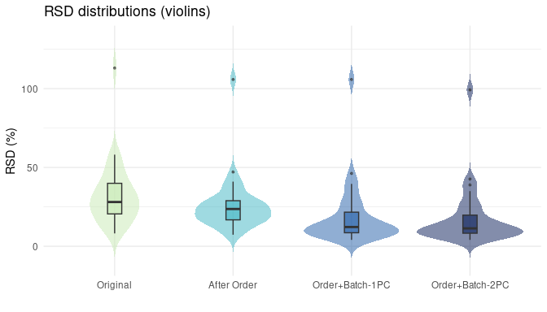<!-- -->

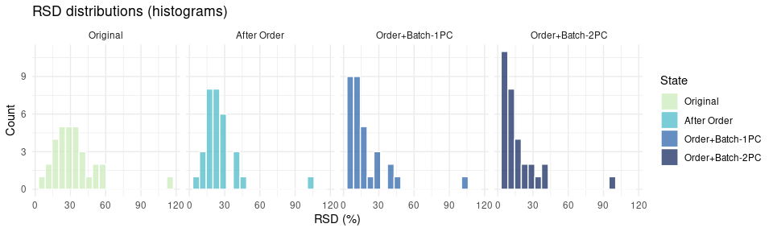<!-- -->

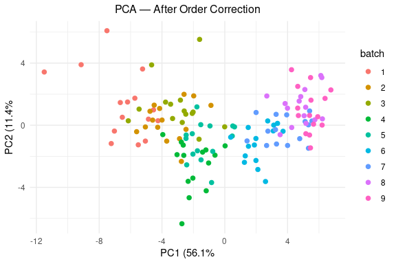<!-- -->

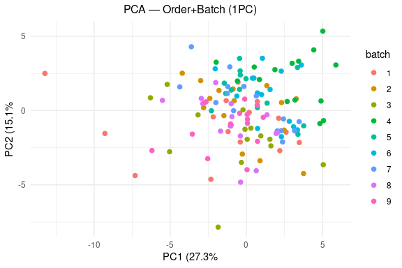<!-- -->

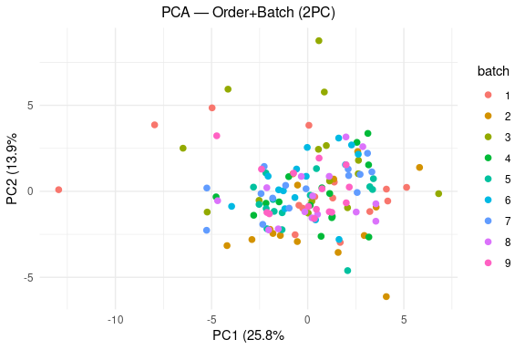<!-- -->
