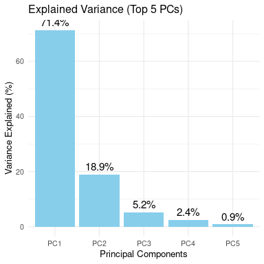
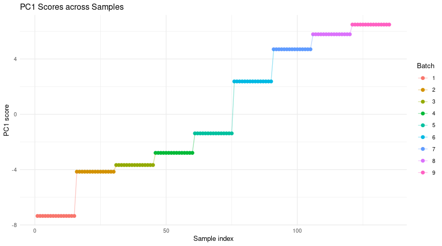
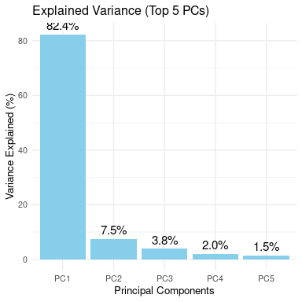
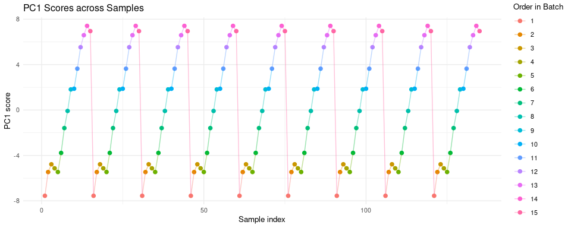
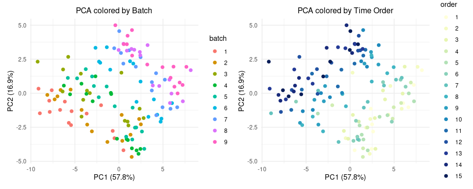
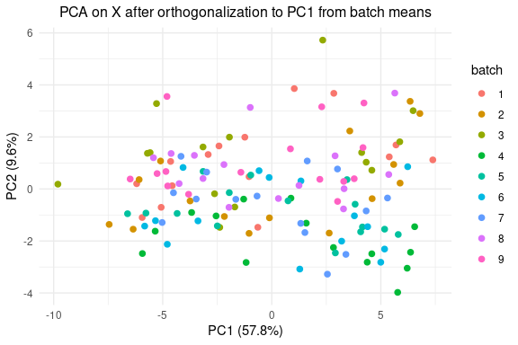
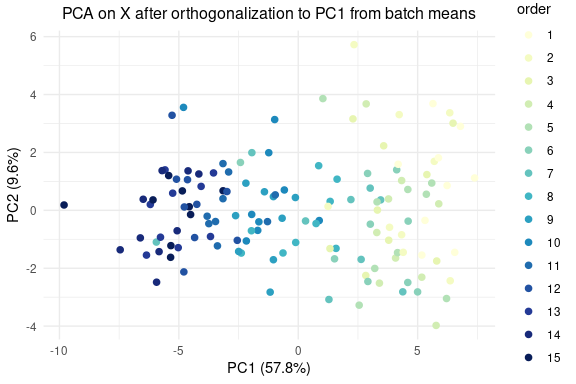
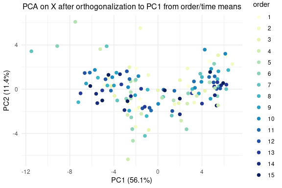
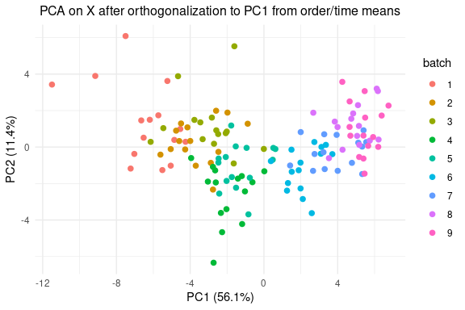
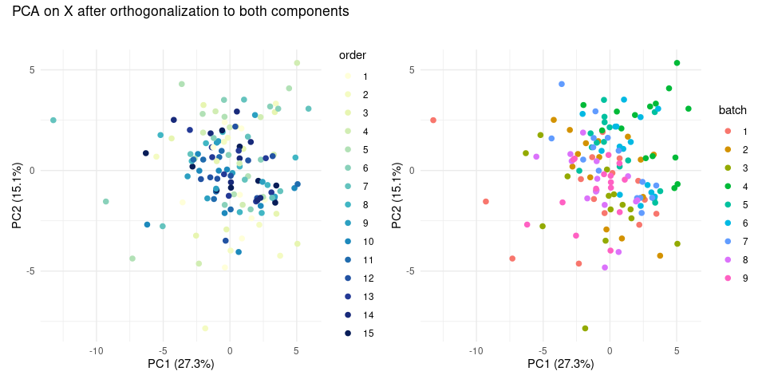

New Method For Finding Variable Influence and Orthogonalising
================
Tecla Duran Fort
2025-09-04

- <a href="#load-data" id="toc-load-data">Load Data</a>
- <a href="#batch-correction" id="toc-batch-correction">Batch
  Correction</a>
  - <a href="#batch-wise-mean-intensity-calculation"
    id="toc-batch-wise-mean-intensity-calculation">Batch-wise Mean Intensity
    Calculation</a>
  - <a href="#pca-on-batch-wise-mean-intensities"
    id="toc-pca-on-batch-wise-mean-intensities">PCA on Batch-wise Mean
    Intensities</a>
- <a href="#timeorder-correction" id="toc-timeorder-correction">Time/Order
  Correction</a>
  - <a href="#order-wise-mean-intensity-calculation"
    id="toc-order-wise-mean-intensity-calculation">Order-wise Mean Intensity
    Calculation</a>
  - <a href="#pca-on-order-wise-mean-intensities"
    id="toc-pca-on-order-wise-mean-intensities">PCA on Order-wise Mean
    Intensities</a>
- <a href="#results" id="toc-results">Results</a>
  - <a href="#pca-before" id="toc-pca-before">PCA Before</a>
  - <a href="#pca-after-batch-correction-order-remaining"
    id="toc-pca-after-batch-correction-order-remaining">PCA After Batch
    Correction (Order remaining)</a>
  - <a href="#pca-after-time--order-correction-batch-remaining"
    id="toc-pca-after-time--order-correction-batch-remaining">PCA After Time
    / Order Correction (batch remaining)</a>
  - <a href="#pca-after-both-corrections"
    id="toc-pca-after-both-corrections">PCA After Both Corrections</a>
- <a href="#discussion" id="toc-discussion">Discussion</a>
  - <a
    href="#percentage-of-variance-eliminated-old-method-direct-orthogonalisation-vs-new-pc1-based"
    id="toc-percentage-of-variance-eliminated-old-method-direct-orthogonalisation-vs-new-pc1-based">Percentage
    of Variance eliminated: old method (direct orthogonalisation) vs new
    (PC1-based)</a>

# Load Data

``` r
df <- read.csv("../../data/peak_table_var.csv")

# Prepare Matrices

# PEAK TABLE
X <- as.matrix(df %>% dplyr::select(starts_with("Cluster")))

# VARIABLES

# Vector batch (samples x 1)
batch <- df$batch

# Matriu B: one-hot encoding (samples x nbatches)
nbatch <- length(unique(batch))
B <- model.matrix(~ 0 + factor(batch))   # 135 x nbatch
colnames(B) <- paste0("Batch_", sort(unique(batch)))


# Índex d'ordre dins de cada batch (1, 2, 3, ...)
df <- df %>%
  arrange(batch, elapsed_time) %>%
  group_by(batch) %>%
  mutate(order_in_batch = row_number()) %>%
  ungroup()

order_in_batch <- df$order_in_batch

# One-hot encoding
max_order <- max(order_in_batch)

O <- model.matrix(~ 0 + factor(order_in_batch, levels = 1:max_order))
colnames(O) <- paste0("Ord_", 1:max_order)
```

# Batch Correction

## Batch-wise Mean Intensity Calculation

``` r
batch_sizes <- as.vector(t(B) %*% rep(1, nrow(X))) # vector de llargada 9
batch_sums <- t(B) %*% X # 9 x 50

M <- sweep(batch_sums, 1, batch_sizes, "/")   # 9 x 50
rownames(M) <- colnames(B)  
colnames(M) <- colnames(X)    

X_batch_means <- B %*% M   # 135 x 50
rownames(X_batch_means) <- rownames(X)
colnames(X_batch_means) <- colnames(X)
```

## PCA on Batch-wise Mean Intensities

``` r
# PCA sobre la matriu de mitjanes per batch
pca_batch <- prcomp(X_batch_means, scale. = TRUE)

# Scores (coordenades de les mostres en PC1, PC2, ...)
scores <- pca_batch$x

# Loadings (direccions dels compostos)
loadings <- pca_batch$rotation
```

<!-- -->

``` r
# Agafem els scores del PCA
scores <- as.data.frame(pca_batch$x)

# Afegim info de batch per acolorir
scores$Sample <- 1:nrow(scores)
scores$Batch <- df$batch

# Gràfic PC1 vs mostra
ggplot(scores, aes(x = Sample, y = PC1, color = factor(Batch))) +
  geom_point(size = 2) +
  geom_line(aes(group = 1), alpha = 0.4) +
  labs(title = "PC1 Scores across Samples",
       x = "Sample index",
       y = "PC1 score",
       color = "Batch") +
  theme_minimal(base_size = 10)
```

<!-- -->

``` r
# PC1 (direcció sobre la qual ferem la correccio ortogonal)
pc1_batch_means <- scores$PC1
```

# Time/Order Correction

## Order-wise Mean Intensity Calculation

``` r
order_sizes <- as.vector(t(O) %*% rep(1, nrow(X))) # vector de llargada 9
order_sums <- t(O) %*% X # 9 x 50

M <- sweep(order_sums, 1, batch_sizes, "/")   # 9 x 50
rownames(M) <- colnames(O)  
colnames(M) <- colnames(X)    

X_order_means <- O %*% M   # 135 x 50
rownames(X_batch_means) <- rownames(X)
colnames(X_batch_means) <- colnames(X)
```

## PCA on Order-wise Mean Intensities

``` r
# PCA sobre la matriu de mitjanes per ordre
pca_order <- prcomp(X_order_means, scale. = TRUE)


# Scores (coordenades de les mostres en PC1, PC2, ...)
scores <- pca_order$x

# Loadings (direccions dels compostos)
loadings <- pca_order$rotation
```

<!-- -->

<!-- -->

``` r
# PC1 (direcció sobre la qual ferem la correccio ortogonal)
pc1_order_means <- scores$PC1
```

# Results

## PCA Before

<!-- -->

## PCA After Batch Correction (Order remaining)

``` r
# Batch Correction: Orthogonalising to PC1)
batch_corr <- orthogonal_correction(X, pc1_batch_means)$corrected
```

<!-- -->
<!-- -->

## PCA After Time / Order Correction (batch remaining)

``` r
order_corr <- orthogonal_correction(X, pc1_order_means)$corrected
```

<!-- -->

``` r
p_after_2 <- plot_pca(plot_df_after, "batch",
                    "PCA on X after orthogonalization to PC1 from order/time means",
                    scale_batch)
print(p_after_2)
```

<!-- -->

**Comentari**: Es deixa de diferenciar en el PCA la variable que treiem,
i l’altra es continua diferenciant i a més sembla paral·lela al nou PC1
en tots dos casos.

## PCA After Both Corrections

``` r
X_corrected <- orthogonal_correction(
  (orthogonal_correction(X, pc1_batch_means)$corrected), 
  pc1_order_means)$corrected
```

<!-- --> \##
Percentage of Variance eliminated

``` r
# Funció auxiliar: suma de quadrats (variància total)
total_var <- function(mat) {
  mat_centered <- scale(mat, center = TRUE, scale = FALSE)
  sum(mat_centered^2)
}

# Variància original
var_orig <- total_var(X)

# Correcció per batch
oc_batch <- orthogonal_correction(X, pc1_batch_means)
var_batch_corr <- total_var(oc_batch$corrected)
var_batch_proj <- total_var(oc_batch$projection)

# Correcció per ordre
oc_order <- orthogonal_correction(X, pc1_order_means)
var_order_corr <- total_var(oc_order$corrected)
var_order_proj <- total_var(oc_order$projection)

# Correcció combinada
oc_both <- orthogonal_correction(oc_batch$corrected, pc1_order_means)
var_both_corr <- total_var(oc_both$corrected)
var_both_proj <- total_var(oc_batch$projection) + total_var(oc_both$projection)

# Resultats en %
perc_batch <- 100 * var_batch_proj / var_orig
perc_order <- 100 * var_order_proj / var_orig
perc_both  <- 100 * var_both_proj  / var_orig

data.frame(
  Correction = c("Batch", "Order", "Both"),
  Variance_removed_percent = c(perc_batch, perc_order, perc_both)
)
```

    ##   Correction Variance_removed_percent
    ## 1      Batch                 34.16357
    ## 2      Order                 23.56383
    ## 3       Both                 57.72740

# Discussion

## Percentage of Variance eliminated: old method (direct orthogonalisation) vs new (PC1-based)

<table class="table" style="width: auto !important; margin-left: auto; margin-right: auto;">
<caption>
Old method (direct orthogonalization)
</caption>
<thead>
<tr>
<th style="text-align:left;">
Component
</th>
<th style="text-align:right;">
Variance_removed_percent
</th>
</tr>
</thead>
<tbody>
<tr>
<td style="text-align:left;">
Batch
</td>
<td style="text-align:right;">
33.41
</td>
</tr>
<tr>
<td style="text-align:left;">
Elapsed time
</td>
<td style="text-align:right;">
22.00
</td>
</tr>
<tr>
<td style="text-align:left;">
Both
</td>
<td style="text-align:right;">
56.13
</td>
</tr>
</tbody>
</table>
<table class="table" style="width: auto !important; margin-left: auto; margin-right: auto;">
<caption>
New method (PC1-based orthogonalization)
</caption>
<thead>
<tr>
<th style="text-align:left;">
Component
</th>
<th style="text-align:right;">
Variance_removed_percent
</th>
</tr>
</thead>
<tbody>
<tr>
<td style="text-align:left;">
Batch
</td>
<td style="text-align:right;">
65.84
</td>
</tr>
<tr>
<td style="text-align:left;">
Order
</td>
<td style="text-align:right;">
23.56
</td>
</tr>
<tr>
<td style="text-align:left;">
Both
</td>
<td style="text-align:right;">
57.73
</td>
</tr>
</tbody>
</table>

**=\> Millorem lleugerament els resultats respecte el mètode anterior**
