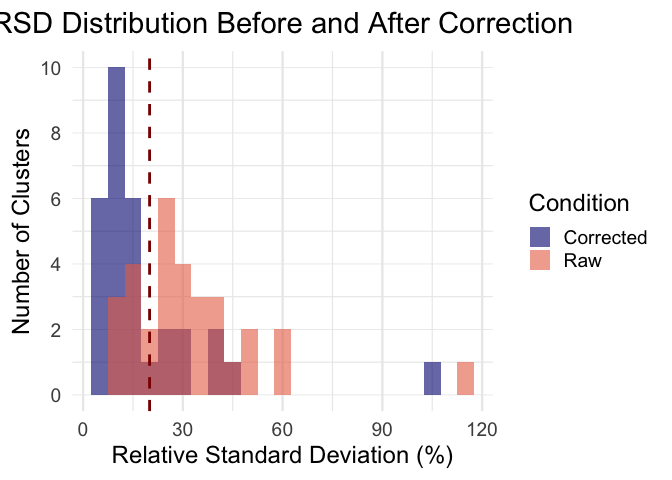
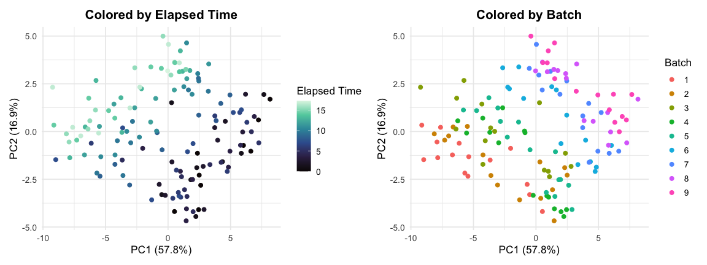
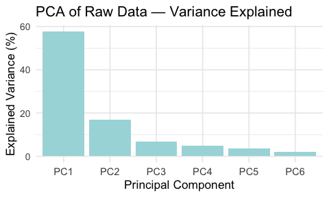
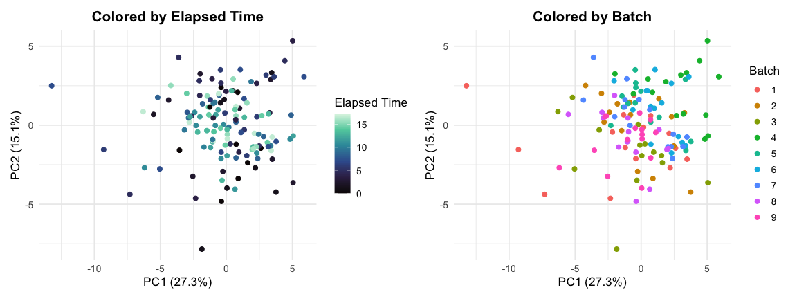
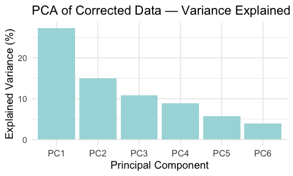
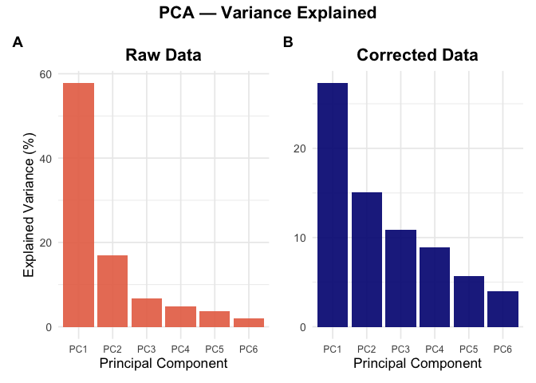

Comparison of Raw and Corrected GC-IMS Data
================
Tecla Duran Fort
2026-03-03

- [1. Introduction](#1-introduction)
- [2. Apply Correction](#2-apply-correction)
- [3. Relative Standard Deviation
  (RSD)](#3-relative-standard-deviation-rsd)
- [4. Cluster Stability](#4-cluster-stability)
- [5. Principal Component Analysis
  (PCA)](#5-principal-component-analysis-pca)
  - [5.1 PCA of Raw Data](#51-pca-of-raw-data)
  - [5.2. PCA of Corrected Data](#52-pca-of-corrected-data)
- [7. Conclusion](#7-conclusion)

## 1. Introduction

This report compares the **raw** and **corrected** GC-IMS Peak Table
using the same evaluation metrics presented in the [Stability
Analysis](https://github.com/tecladuran/gcims-workflows/blob/main/docs/stability_analysis.md),
namely **Relative Standard Deviation (RSD)** and **variance explained by
external factors**.

The correction applied is based on a joint orthogonalization strategy
that removes the directions defined by the **first principal component
(PC1)** of the **batch effect** and the **within-batch acquisition
effect**. Rather than repeating theoretical explanations, this document
focuses on quantifying the improvement in signal stability and reduction
of unwanted variability after correction.

------------------------------------------------------------------------

## 2. Apply Correction

``` r
df <- read.csv("../../data/peak_table_var.csv")
X <- as.matrix(df %>% dplyr::select(starts_with("Cluster")))

# One-hot encoding for batch
B <- model.matrix(~ 0 + factor(df$batch))
colnames(B) <- paste0("Batch_", sort(unique(df$batch)))

# Acquisition index per batch
df <- df %>%
  arrange(batch, elapsed_time) %>%
  group_by(batch) %>%
  mutate(acquisition_index = row_number()) %>%
  ungroup()

# One-hot encoding for acquisition index
A <- model.matrix(~ 0 + factor(df$acquisition_index))
colnames(A) <- paste0("Acq_", 1:max(df$acquisition_index))

# Batch reconstruction and PC1
X_batch_means <- B %*% (solve(t(B)%*%B) %*% t(B) %*% X)
pca_batch <- prcomp(X_batch_means, scale. = TRUE)
pc1_batch <- pca_batch$x[,1, drop=FALSE]

# Acquisition reconstruction and PC1
X_acq_means <- A %*% (solve(t(A)%*%A) %*% t(A) %*% X)
pca_acq <- prcomp(X_acq_means, scale. = TRUE)
pc1_acq <- pca_acq$x[,1, drop=FALSE]

# Joint correction using both directions
joint_corr <- orthogonal_correction(X, cbind(pc1_batch, pc1_acq))

X_corr_joint <- joint_corr$corrected
proj_joint   <- joint_corr$projection

intensities <- as.data.frame(X)
intensities_final <- as.data.frame(X_corr_joint)
```

------------------------------------------------------------------------

## 3. Relative Standard Deviation (RSD)

<!-- -->

------------------------------------------------------------------------

## 4. Cluster Stability

To evaluate how much the correction improves the technical robustness of
the dataset, we compute the number of clusters whose Relative Standard
Deviation (RSD) falls below the 20% threshold, both **before** and
**after** correction. This threshold is commonly used as an orientative
benchmark in metabolomics quality control.

<div class="figure" style="text-align: center">


<p class="caption">

Proportion of clusters with RSD below 20%, before and after correction
</p>

</div>

The correction process increases the proportion of stable clusters from
**22.6%** to **74.2%**, confirming that the removal of dominant batch
and acquisition directions improves overall signal reliability.

------------------------------------------------------------------------

## 5. Principal Component Analysis (PCA)

We now perform a new PCA on the corrected data to explore whether the
dominant sources of variation are still aligned with external variables.
The PCA on raw data already showed strong trends related to
`elapsed_time` and `batch`, as shown in previous reports.

### 5.1 PCA of Raw Data

<div class="figure" style="text-align: center">


<p class="caption">

PCA of raw data colored by elapsed time (left) and by batch (right)
</p>

</div>

<div class="figure" style="text-align: center">


<p class="caption">

Explained variance by the first six PCA components (raw data)
</p>

</div>

------------------------------------------------------------------------

### 5.2. PCA of Corrected Data

<div class="figure" style="text-align: center">


<p class="caption">

PCA of corrected data colored by elapsed time (left) and by batch
(right)
</p>

</div>

<div class="figure" style="text-align: center">


<p class="caption">

Variance explained by the first six PCA components (corrected data)
</p>

</div>

Compared to the PCA of the raw data, the corrected data shows a more
homogeneous distribution of variance across components, and no evident
separation or gradient is observed when coloring by elapsed time or
batch. This suggests that external influences no longer dominate the
variance structure after correction.

``` r
# Data frames
var_df_corr <- data.frame(PC = paste0("PC", 1:6),
                          Variance = explained_corr[1:6])
var_df_raw <- data.frame(PC = paste0("PC", 1:6),
                         Variance = explained_var_raw[1:6])

# Plots
p_raw <- ggplot(var_df_raw, aes(x = PC, y = Variance)) +
  geom_col(fill = "#E76F51", alpha = 0.9) +
  theme_minimal(base_size = 13) +
  labs(title = "Raw Data",
       x = "Principal Component", 
       y = "Explained Variance (%)") +
  theme(axis.text.x = element_text(size = 9),
        plot.title = element_text(hjust = 0.5))

p_corr <- ggplot(var_df_corr, aes(x = PC, y = Variance)) +
  geom_col(fill = "navy", alpha = 0.9) +
  theme_minimal(base_size = 13) +
  labs(title = "Corrected Data",
       x = "Principal Component", 
       y = NULL) +
  theme(axis.text.x = element_text(size = 9),
        axis.title.y = element_blank(),
        plot.title = element_text(hjust = 0.5))

# Combine with panel labels and bold title
final_plot <- (p_raw | p_corr) +
  plot_annotation(
    title = "PCA — Variance Explained",
    tag_levels = "A"
  ) &
  theme(
    plot.title = element_text(size = 16, hjust = 0.5, face = "bold"),
    plot.tag = element_text(size = 14, face = "bold")
  )

final_plot
```

<!-- -->

------------------------------------------------------------------------

## 7. Conclusion

The applied correction successfully reduces the influence of time and
batch effects. The PCA projection confirms that corrected data no longer
follows the acquisition order. This confirms the effectiveness of the
orthogonalization strategy when applied directly to the raw intensity
matrix.
