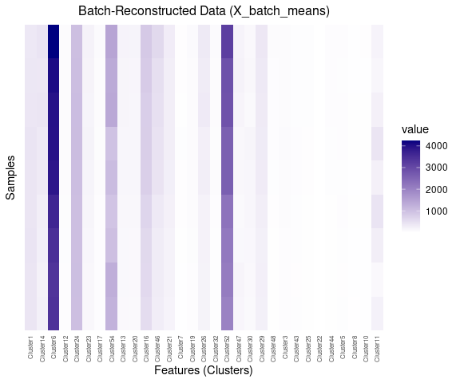
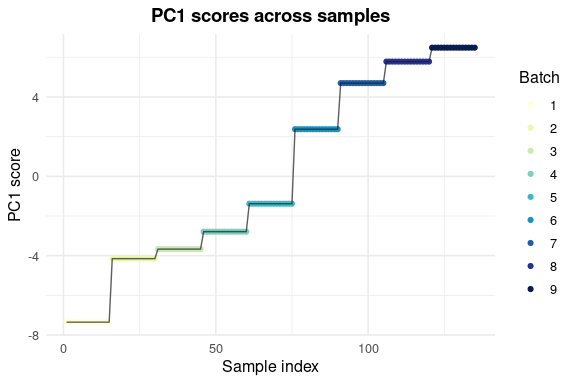
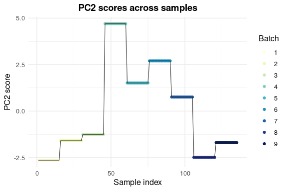
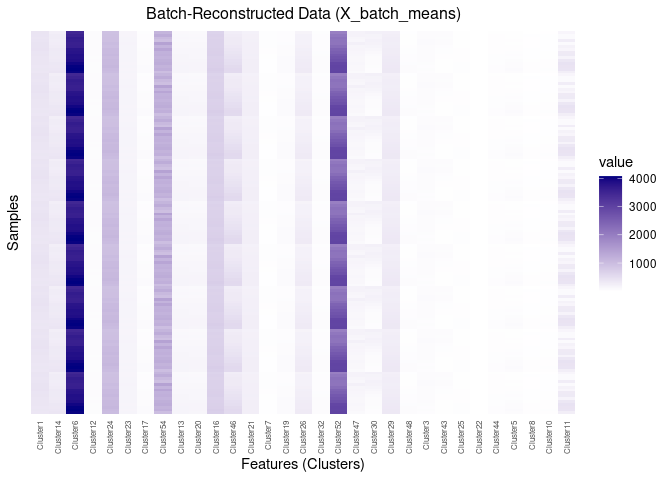
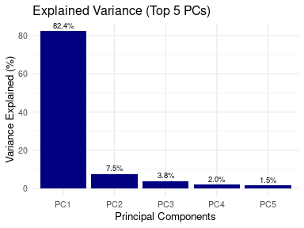
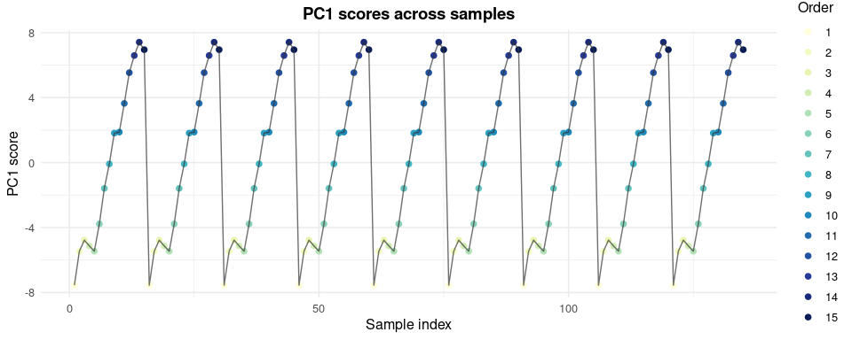

Mean-based Estimation of Acquisition Effects in GC-IMS Data
================
Tecla Duran Fort
2025-09-26

- <a href="#set-up" id="toc-set-up">Set Up</a>
  - <a href="#load-data" id="toc-load-data">Load Data</a>
  - <a href="#prepare-matrices" id="toc-prepare-matrices">Prepare
    Matrices</a>
- <a href="#batch-effect" id="toc-batch-effect">Batch Effect</a>
  - <a href="#batch-wise-mean-intensity-calculation"
    id="toc-batch-wise-mean-intensity-calculation">Batch-wise Mean Intensity
    Calculation</a>
  - <a href="#pca-of-batch-reconstructed-data"
    id="toc-pca-of-batch-reconstructed-data">PCA of Batch-Reconstructed
    Data</a>
  - <a href="#variance-explained" id="toc-variance-explained">Variance
    Explained</a>
    - <a href="#total-variance-explained-by-batch-wise-means"
      id="toc-total-variance-explained-by-batch-wise-means">Total variance
      explained by batch-wise means</a>
    - <a href="#variance-explained-by-the-first-principal-component"
      id="toc-variance-explained-by-the-first-principal-component">Variance
      explained by the first principal component</a>
    - <a href="#variance-explained-across-components"
      id="toc-variance-explained-across-components">Variance explained across
      components</a>
- <a href="#timeorder-effect" id="toc-timeorder-effect">Time/Order
  Effect</a>
  - <a href="#order-wise-mean-intensity-calculation"
    id="toc-order-wise-mean-intensity-calculation">Order-wise Mean Intensity
    Calculation</a>
  - <a href="#pca-of-order-reconstructed-data"
    id="toc-pca-of-order-reconstructed-data">PCA of Order-Reconstructed
    Data</a>
  - <a href="#variance-explained-1" id="toc-variance-explained-1">Variance
    Explained</a>
    - <a href="#total-variance-explained-by-order-wise-means"
      id="toc-total-variance-explained-by-order-wise-means">Total variance
      explained by order-wise means</a>
    - <a href="#variance-explained-by-the-first-principal-component-1"
      id="toc-variance-explained-by-the-first-principal-component-1">Variance
      explained by the first principal component</a>
    - <a href="#variance-explained-across-components-1"
      id="toc-variance-explained-across-components-1">Variance explained
      across components</a>

# Set Up

## Load Data

``` r
df <- read.csv("../../data/peak_table_var.csv")
```

## Prepare Matrices

``` r
# Prepare Matrices

# PEAK TABLE
X <- as.matrix(df %>% dplyr::select(starts_with("Cluster")))

# VARIABLES

# Vector batch (samples x 1)
batch <- df$batch

# B: one-hot encoding (samples x nbatches)
nbatch <- length(unique(batch))
B <- model.matrix(~ 0 + factor(batch))   # 135 x nbatch
colnames(B) <- paste0("Batch_", sort(unique(batch)))


# Order Index
df <- df %>%
  arrange(batch, elapsed_time) %>%
  group_by(batch) %>%
  mutate(order_in_batch = row_number()) %>%
  ungroup()

order_in_batch <- df$order_in_batch

# One-hot encoding
max_order <- max(order_in_batch)

O <- model.matrix(~ 0 + factor(order_in_batch, levels = 1:max_order))
colnames(O) <- paste0("Ord_", 1:max_order)
```

<!-- -->
<!-- -->

# Batch Effect

## Batch-wise Mean Intensity Calculation

``` r
batch_sizes <- as.vector(t(B) %*% rep(1, nrow(X))) # vector de llargada 9
batch_sums <- t(B) %*% X # 9 x 50

M <- sweep(batch_sums, 1, batch_sizes, "/")   # 9 x 50
rownames(M) <- colnames(B)  
colnames(M) <- colnames(X)    

X_batch_means <- B %*% M   # 135 x 50
rownames(X_batch_means) <- rownames(X)
colnames(X_batch_means) <- colnames(X)
```

<!-- -->

## PCA of Batch-Reconstructed Data

PCA is applied to the batch-reconstructed dataset (`X_batch_means`) in
order to analyse the common batch effect.

- By construction, this matrix only contains the **average batch
  profile**, i.e. the part of the signal shared by all samples within
  the same batch.
- The **scores** (`pca_batch$x`) show how samples are separated along
  the principal components, reflecting the strength and direction of the
  batch influence.
- The **loadings** (`pca_batch$rotation`) reveal whether the batch
  effect is distributed uniformly across all compounds or if it is
  driven by specific features.

This analysis helps to determine if the batch effect acts as a global
shift in intensity or if it affects certain compounds more strongly than
others.

``` r
# PCA on the matrix of batch-wise means
pca_batch <- prcomp(X_batch_means, scale. = TRUE)

# Scores (coordinates of the samples in PC1, PC2, ...)
scores_batch <- pca_batch$x

# Loadings (directions of the clusters/features)
loadings <- pca_batch$rotation
```

``` r
# Variance Explained by the PCs
var_pca_batch <- pca_batch$sdev^2 / sum(pca_batch$sdev^2)
```

<!-- -->

<!-- --><!-- -->

## Variance Explained

### Total variance explained by batch-wise means

This calculation shows the fraction of the total variance in the peak
table that can be reconstructed using only batch-wise averages.It
quantifies the overall batch effect as a percentage of the total
variance.

``` r
# Total Variance in the original data
var_total <- sum(apply(X, 2, var))

# Total Variance in the reconstructed batch-wise means data
var_batch_means <- sum(apply(X_batch_means, 2, var))

# Percentage explained
perc_explained_batch <- 100 * var_batch_means / var_total
```

    ## Variance explained by batch-wise means: 40.06%

### Variance explained by the first principal component

Here we compute how much of the total variance in `X` is explained when
projecting the original data onto the direction of the first principal
component (obtained from the batch-wise means, in the sample space).

``` r
# First PC 
t1 <- scores_batch[,1, drop=FALSE]
# Normalization
t1 <- t1 / sqrt(sum(t1^2))

# Center X
X_centered <- scale(X, center = TRUE, scale = FALSE)

# Project X to PC1 in sample space
proj1 <- t1 %*% t(t1) %*% X_centered

# Explained Variance
var_explained_pc1 <- sum(apply(proj1, 2, var))
```

    ## PC1 explains 34.16% of variance in X.

### Variance explained across components

The following comparison is shown for the first eight principal
components: - **PCA**: variance explained according to the standard PCA
of the batch means. - **In X**: variance explained when these components
are applied to the original data matrix `X`.

Only eight components are reported because, after centering, the batch
design matrix has a rank of *nbatch – 1*.  
With nine batches in total, this subspace can have at most eight
linearly independent directions of variability.  
Consequently, the batch effect can be decomposed into a maximum of eight
non-zero principal components.

``` r
# Variance explained in the original data (sample space)
scores_batch_norm <- apply(scores_batch, 2, function(t) t / sqrt(sum(t^2)))

explained_in_X <- sapply(1:8, function(i) {
  T <- scores_batch_norm[, i, drop = FALSE]
  proj <- T %*% t(T) %*% X_centered
  sum(apply(proj, 2, var)) / var_total * 100
})
```

<!-- -->

# Time/Order Effect

## Order-wise Mean Intensity Calculation

``` r
order_sizes <- as.vector(t(O) %*% rep(1, nrow(X)))
order_sums <- t(O) %*% X

M <- sweep(order_sums, 1, order_sizes, "/") 
rownames(M) <- colnames(O)  
colnames(M) <- colnames(X)    

X_order_means <- O %*% M  
rownames(X_order_means) <- rownames(X)
colnames(X_order_means) <- colnames(X)
```

<!-- -->

## PCA of Order-Reconstructed Data

PCA is applied to the order-reconstructed dataset (`X_order_means`) in
order to analyse the common order effect.

``` r
# PCA on the matrix of order-wise means
pca_order <- prcomp(X_order_means, scale. = TRUE)

# Scores 
scores_order <- pca_order$x

# Loadings (directions of the clusters/features)
loadings <- pca_order$rotation
```

``` r
# Variance Explained by the PCs
var_pca_order <- pca_order$sdev^2 / sum(pca_order$sdev^2)
```

<!-- -->
<!-- -->

## Variance Explained

### Total variance explained by order-wise means

This calculation shows the fraction of the total variance in the peak
table that can be reconstructed using only order-wise averages. It
quantifies the overall order effect as a percentage of the total
variance.

``` r
# Total Variance in the reconstructed order-wise means data
var_order_means <- sum(apply(X_order_means, 2, var))

# Percentage explained
perc_explained_order <- 100 * var_order_means / var_total
```

    ## Variance explained by order-wise means: 26.60%

### Variance explained by the first principal component

Here we compute how much of the total variance in `X` is explained when
projecting the original data onto the direction of the first principal
component (obtained from the order-wise means, in the sample space).

``` r
# First PC 
t1 <- scores_order[,1, drop=FALSE]

# Normalization
t1 <- t1 / sqrt(sum(t1^2))

# Center X
X_centered <- scale(X, center = TRUE, scale = FALSE)

# Project X to PC1 in sample space
proj1 <- t1 %*% t(t1) %*% X_centered

# Explained variance
var_explained_pc1 <- sum(apply(proj1, 2, var))
```

    ## PC1 explains 23.56% of variance in X.

### Variance explained across components

``` r
# Variance explained in the original data (sample space)
scores_order_norm <- apply(scores_order, 2, function(t) t / sqrt(sum(t^2)))

explained_in_X <- sapply(1:14, function(i) {
  T <- scores_order_norm[, i, drop = FALSE]
  proj <- T %*% t(T) %*% X_centered
  sum(apply(proj, 2, var)) / var_total * 100
})
```

<!-- -->
